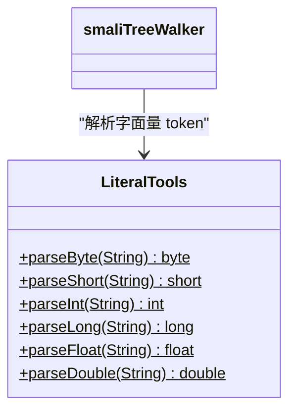

# 🔢 LiteralTools

> smali 语法中所有数值字面量的字符串解析工具，支持十进制、十六进制、八进制和浮点格式。

| 属性 | 值 |
|---|---|
| 完整类名 | `org.jf.smali.LiteralTools` |
| 源码链接 | [LiteralTools.java](https://github.com/android-security-engineer/ZjDroid-skills/blob/master/src/org/jf/smali/LiteralTools.java) |
| 类型 | 工具类（纯静态方法） |

---

## 🎯 职责

smali 语法中字面量的表示形式非常丰富：

- 整数：`0x1`（十六进制）、`010`（八进制）、`10`（十进制），可带 `-` 前缀
- 字节：末尾 `t`/`T` 后缀，如 `0x1t`
- 短整数：末尾 `s`/`S` 后缀，如 `100s`
- 长整数：末尾 `l`/`L` 后缀，如 `0xFFFFFFFFL`
- 浮点：标准 Java float/double 格式

`LiteralTools` 提供这些格式的安全解析，越界时抛出 `NumberFormatException`。

---

## 🧠 关键实现

**parseByte — 带后缀 t 的字节解析**

```java
public static byte parseByte(String byteLiteral) throws NumberFormatException {
    // 去掉可选的 t/T 后缀
    char[] byteChars;
    if (byteLiteral.toUpperCase().endsWith("T")) {
        byteChars = byteLiteral.substring(0, byteLiteral.length()-1).toCharArray();
    } else {
        byteChars = byteLiteral.toCharArray();
    }

    int position = 0;
    int radix = 10;
    boolean negative = false;
    if (byteChars[position] == '-') {
        position++;
        negative = true;
    }
    if (byteChars[position] == '0') {
        // 0x → 16进制，0 → 8进制
        // ...
    }
    // 解析数值 + 范围检查
}
```

**smali 字面量格式规范**

| 类型 | 示例 | 解析方法 |
|---|---|---|
| byte | `0x1t`、`-5t` | `parseByte()` |
| short | `100s`、`0x1As` | `parseShort()` |
| int | `0x1`、`-10`、`010` | `parseInt()` |
| long | `0xFFFFFFFFL`、`100L` | `parseLong()` |
| float | `3.14f`、`0x1.8p0f` | `parseFloat()` |
| double | `3.14`、`0x1.8p0` | `parseDouble()` |

---

## 🔗 关系



---

## 📌 小结

`LiteralTools` 是汇编阶段**语义值提取**的关键工具，由 `smaliTreeWalker` 在遍历 AST 时调用，将字面量 token 文本转换为 Java 数值，再传入 `DexBuilder` API。其特点是严格的范围检查（byte 范围 `-128~127`，short 范围 `-32768~32767`），解析失败时通过 `SemanticException` 报告错误位置。
