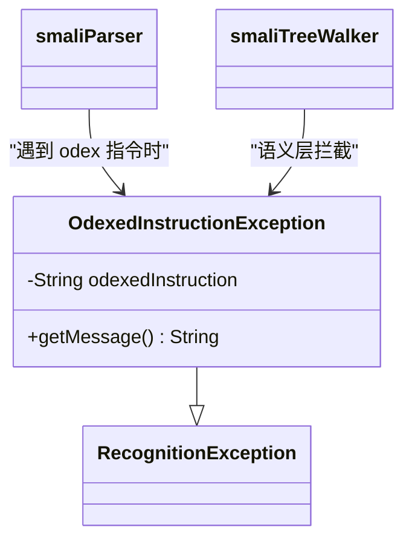

# 🚫 OdexedInstructionException

> 当尝试将含 odex 专有指令的 smali 文本重新汇编时抛出的错误，提醒用户需要先 deodex。

| 属性 | 值 |
|---|---|
| 完整类名 | `org.jf.smali.OdexedInstructionException` |
| 源码链接 | [OdexedInstructionException.java](https://github.com/android-security-engineer/ZjDroid-skills/blob/master/src/org/jf/smali/OdexedInstructionException.java) |
| 继承 | `RecognitionException`（ANTLR） |

---

## 🎯 职责

Dalvik 的 ODEX 格式包含一批优化指令（如 `invoke-virtual-quick`、`iget-quick`），这些指令依赖虚表偏移（vtable index）和字段偏移（field offset），无法在没有原始 DEX 和类加载信息的情况下还原为标准指令。

当 smali 汇编器在 `allowOdex == false` 的配置下遇到这类指令时，`smaliParser` 或 `smaliTreeWalker` 抛出 `OdexedInstructionException`，终止汇编并给出明确提示。

---

## 🧠 关键实现

**完整类体**

```java
public class OdexedInstructionException extends RecognitionException {
    private String odexedInstruction;

    OdexedInstructionException(IntStream input, String odexedInstruction) {
        super(input);
        this.odexedInstruction = odexedInstruction;
    }

    public String getMessage() {
        return odexedInstruction + " is an odexed instruction. You cannot reassemble a disassembled odex file " +
                "unless it has been deodexed.";
    }
}
```

---

## 🔗 关系



---

## 📌 小结

`OdexedInstructionException` 是 smali 的"安全门"——它防止用户将 baksmali 反汇编 ODEX 文件得到的（含注释掉的 odex 指令的）smali 文件直接重新汇编，避免生成无效 DEX。在 ZjDroid 脱壳场景中，若脱壳的 DEX 来自 ODEX 格式（Android 4.x 设备），需要先通过 `baksmali --deodex` 还原指令，才能用 smali 重新汇编。

::: warning 脱壳注意事项
Android 4.x 的系统 app 通常以 ODEX 格式存储。ZjDroid 脱壳此类 app 时，需要在 `baksmaliOptions` 中设置 `deodex = true` 以触发 `MethodAnalyzer` 进行指令还原，否则重汇编时会遇到此异常。
:::
