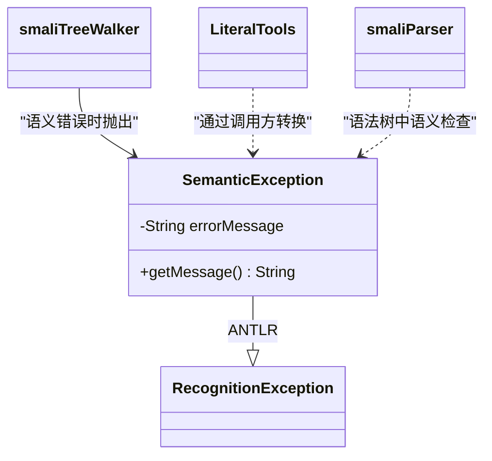

# ⚠️ SemanticException

> 携带 token 位置信息的语义错误异常，用于在 smali 汇编过程中报告类型不匹配、值越界等语义错误。

| 属性 | 值 |
|---|---|
| 完整类名 | `org.jf.smali.SemanticException` |
| 源码链接 | [SemanticException.java](https://github.com/android-security-engineer/ZjDroid-skills/blob/master/src/org/jf/smali/SemanticException.java) |
| 继承 | `RecognitionException`（ANTLR） |

---

## 🎯 职责

`SemanticException` 扩展了 ANTLR 的 `RecognitionException`，添加了：

1. **格式化错误消息**：接受 `String.format()` 风格的消息模板和参数
2. **多种位置信息来源**：支持从 `IntStream`、`CommonTree`、`Token` 三种不同来源提取行号和列号
3. **统一 ANTLR 错误系统**：作为 `RecognitionException` 子类，可以被 `smaliTreeWalker` 的 `reportError()` 自动处理并计入语法错误计数

---

## 🧠 关键实现

**三个构造函数**

```java
// 仅凭输入流（行/列从流的当前位置获取）
SemanticException(IntStream input, String errorMessage, Object... messageArguments) {
    super(input);
    this.errorMessage = String.format(errorMessage, messageArguments);
}

// 从 Exception 包装（将底层异常的 message 作为错误消息）
SemanticException(IntStream input, Exception ex) {
    super(input);
    this.errorMessage = ex.getMessage();
}

// 从 AST 节点提取位置信息
SemanticException(IntStream input, CommonTree tree, String errorMessage, Object... messageArguments) {
    super();
    this.input = input;
    this.token = tree.getToken();
    this.index = tree.getTokenStartIndex();
    this.line = token.getLine();
    this.charPositionInLine = token.getCharPositionInLine();
    this.errorMessage = String.format(errorMessage, messageArguments);
}

// 从 Token 提取位置信息（最精确）
SemanticException(IntStream input, Token token, String errorMessage, Object... messageArguments) {
    super();
    this.input = input;
    this.token = token;
    this.index = ((CommonToken)token).getStartIndex();
    this.line = token.getLine();
    this.charPositionInLine = token.getCharPositionInLine();
    this.errorMessage = String.format(errorMessage, messageArguments);
}

public String getMessage() {
    return errorMessage;
}
```

---

## 🔗 关系



---

## 📌 小结

`SemanticException` 的设计遵循了 ANTLR 的错误处理约定——继承 `RecognitionException` 使其能被 `TreeWalker` 的 `reportError()` 机制自动处理，错误计数自动累加，不需要在每个调用处手动 try-catch。携带精确行列信息使错误消息对开发者友好，这在 ZjDroid 汇编失败时的调试中非常有价值。
