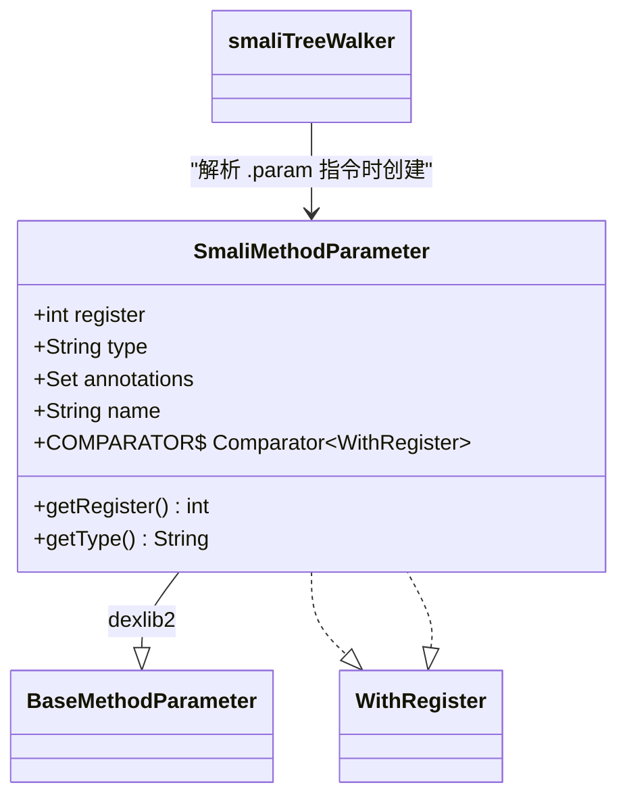

# 📌 SmaliMethodParameter

> 在 smali 汇编过程中，将 smali 文本中的方法参数（带寄存器号）封装为 dexlib2 的 `MethodParameter` 实现。

| 属性 | 值 |
|---|---|
| 完整类名 | `org.jf.smali.SmaliMethodParameter` |
| 源码链接 | [SmaliMethodParameter.java](https://github.com/android-security-engineer/ZjDroid-skills/blob/master/src/org/jf/smali/SmaliMethodParameter.java) |
| 继承 | `BaseMethodParameter`（dexlib2） |
| 实现接口 | `WithRegister` |

---

## 🎯 职责

smali 的 `.param` 指令携带寄存器编号（如 `.param p1, "count":I`），但 dexlib2 的 `MethodParameter` 接口不包含寄存器信息。`SmaliMethodParameter` 通过同时实现 `BaseMethodParameter` 和 `WithRegister` 来桥接这两个需求：

1. **dexlib2 兼容**：实现 `getType()`、`getAnnotations()`、`getName()`、`getSignature()` 供 `DexBuilder` 使用
2. **寄存器追踪**：实现 `WithRegister.getRegister()` 供 `smaliTreeWalker` 内部排序和验证使用

---

## 🧠 关键实现

**类定义与字段**

```java
public class SmaliMethodParameter extends BaseMethodParameter implements WithRegister {
    public final int register;
    @Nonnull public final String type;
    @Nonnull public Set<? extends Annotation> annotations;
    @Nullable public String name;

    public SmaliMethodParameter(int register, @Nonnull String type) {
        this.register = register;
        this.type = type;
        this.annotations = ImmutableSet.of();
    }

    @Override public int getRegister() { return register; }
    @Nonnull @Override public String getType() { return type; }
    @Nonnull @Override public Set<? extends Annotation> getAnnotations() { return annotations; }
    @Nullable @Override public String getName() { return name; }
    @Nullable @Override public String getSignature() { return null; }
}
```

**寄存器比较器**

```java
public static final Comparator<WithRegister> COMPARATOR = new Comparator<WithRegister>() {
    @Override public int compare(WithRegister o1, WithRegister o2) {
        return Ints.compare(o1.getRegister(), o2.getRegister());
    }
};
```

该 `Comparator` 用于对方法参数按寄存器编号排序，确保汇编结果中参数顺序正确（smali 文件中 `.param` 指令顺序可能与实际寄存器顺序不同）。

---

## 🔗 关系



---

## 📌 小结

`SmaliMethodParameter` 是 smali 汇编器与 dexlib2 API 之间的数据桥接对象。它的 `register` 字段是汇编器内部使用的额外信息，不会写入最终的 DEX 文件（DEX 格式中方法参数靠位置而非寄存器编号标识），但在汇编阶段验证寄存器使用是否合法时不可或缺。
