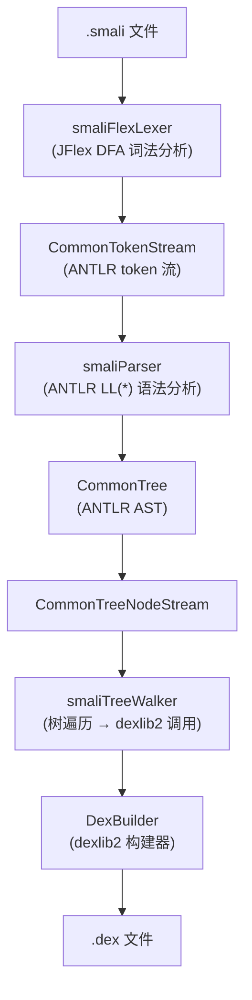
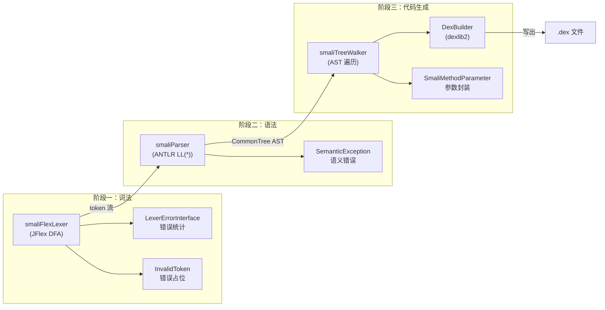

# 🔨 smali — smali 文本汇编器内部原理

smali 是 ZjDroid 内嵌的 smali 文本 → DEX 汇编引擎，同样由 Ben Gruver（JesusFreke）开发，与 baksmali 相互配套。ZjDroid 在 [`DexFileBuilder`](/source/smali/DexFileBuilder) 中调用 smali 的汇编逻辑，将修改后的 smali 代码重新打包为 DEX 文件。

---

## 📦 包结构

```
org.jf.smali/
├── main.java                # 命令行前端（含汇编主流程）
├── smaliFlexLexer.java      # JFlex 生成的词法分析器
├── LexerErrorInterface.java # 词法错误接口（ANTLR 桥接）
├── InvalidToken.java        # 错误 token 表示
├── smaliParser.java         # ANTLR 生成的语法分析器（smali 语法）
├── smaliTreeWalker.java     # ANTLR 树遍历器（生成 dexlib2 对象）
├── LiteralTools.java        # 字面量解析工具（byte/short/int/long/float/double）
├── SemanticException.java   # 语义错误异常（附带 token 位置信息）
├── OdexedInstructionException.java # odex 指令错误
├── SmaliMethodParameter.java       # 方法参数表示（含寄存器号）
└── WithRegister.java               # 携带寄存器号的接口
```

---

## 🔄 汇编流水线



::: tip ZjDroid 调用点
[`DexFileBuilder`](/source/smali/DexFileBuilder) 通过 `main.assembleSmaliFile()` 方法批量处理修改后的 smali 文件，最终将重组的 DEX 写入磁盘，供后续注入/替换使用。
:::

---

## 📋 关键类清单

| 类名 | 源码链接 | 职责 |
|---|---|---|
| `main` | [main.java](https://github.com/android-security-engineer/ZjDroid-skills/blob/master/src/org/jf/smali/main.java) | 命令行入口 + 汇编主流程协调 |
| `smaliFlexLexer` | [smaliFlexLexer.java](https://github.com/android-security-engineer/ZjDroid-skills/blob/master/src/org/jf/smali/smaliFlexLexer.java) | JFlex 生成的 DFA 词法分析器 |
| `LexerErrorInterface` | [LexerErrorInterface.java](https://github.com/android-security-engineer/ZjDroid-skills/blob/master/src/org/jf/smali/LexerErrorInterface.java) | 词法错误统计接口（ANTLR 桥接） |
| `smaliParser` | [smaliParser.java](https://github.com/android-security-engineer/ZjDroid-skills/blob/master/src/org/jf/smali/smaliParser.java) | ANTLR 生成的 LL(*) 语法分析器 |
| `smaliTreeWalker` | [smaliTreeWalker.java](https://github.com/android-security-engineer/ZjDroid-skills/blob/master/src/org/jf/smali/smaliTreeWalker.java) | AST 遍历器，调用 dexlib2 DexBuilder |
| `LiteralTools` | [LiteralTools.java](https://github.com/android-security-engineer/ZjDroid-skills/blob/master/src/org/jf/smali/LiteralTools.java) | 各类字面量字符串 → 数值解析 |
| `SemanticException` | [SemanticException.java](https://github.com/android-security-engineer/ZjDroid-skills/blob/master/src/org/jf/smali/SemanticException.java) | 语义错误（类型不匹配、越界等） |
| `InvalidToken` | [InvalidToken.java](https://github.com/android-security-engineer/ZjDroid-skills/blob/master/src/org/jf/smali/InvalidToken.java) | 词法错误的 token 占位 |
| `SmaliMethodParameter` | [SmaliMethodParameter.java](https://github.com/android-security-engineer/ZjDroid-skills/blob/master/src/org/jf/smali/SmaliMethodParameter.java) | 方法参数（含寄存器号）的 dexlib2 实现 |
| `OdexedInstructionException` | [OdexedInstructionException.java](https://github.com/android-security-engineer/ZjDroid-skills/blob/master/src/org/jf/smali/OdexedInstructionException.java) | 不允许重汇编 odex 指令时的错误 |
| `WithRegister` | [WithRegister.java](https://github.com/android-security-engineer/ZjDroid-skills/blob/master/src/org/jf/smali/WithRegister.java) | 携带寄存器号的标记接口 |

---

## 🏗️ 三阶段编译架构



---

## 🔗 相关文档

- [main — 汇编主流程](./main)
- [smaliFlexLexer — 词法分析器](./smaliFlexLexer)
- [LexerErrorInterface — 词法错误接口](./LexerErrorInterface)
- [LiteralTools — 字面量解析](./LiteralTools)
- [SemanticException — 语义错误](./SemanticException)
- [SmaliMethodParameter — 方法参数](./SmaliMethodParameter)
- [OdexedInstructionException — odex 错误](./OdexedInstructionException)
- [baksmali 反汇编器](/internals/baksmali/)
- [ZjDroid DexFileBuilder](/source/smali/DexFileBuilder)
- [脱壳流水线](/architecture/unpacking-pipeline)
