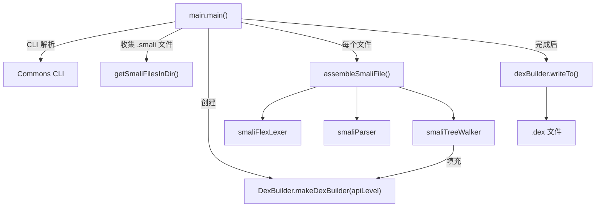

# 🚀 main

> smali 汇编器的命令行前端与汇编主流程协调类，负责从文件输入到 DEX 输出的全程控制。

| 属性 | 值 |
|---|---|
| 完整类名 | `org.jf.smali.main` |
| 源码链接 | [main.java](https://github.com/android-security-engineer/ZjDroid-skills/blob/master/src/org/jf/smali/main.java) |
| 关键依赖 | `smaliFlexLexer`、`smaliParser`、`smaliTreeWalker`、`DexBuilder` |

---

## 🎯 职责

`main` 类承担两个层次的工作：

1. **命令行解析**（`main()` 方法）：使用 Apache Commons CLI 解析 `-o`、`-a`、`-j` 等选项，收集待汇编的 `.smali` 文件列表
2. **汇编协调**（`assembleSmaliFile()` 方法）：对单个 `.smali` 文件执行完整的三阶段编译

---

## 🧠 关键实现

**汇编主流程 assembleSmaliFile()**

```java
private static boolean assembleSmaliFile(File smaliFile, DexBuilder dexBuilder, boolean verboseErrors,
                                         boolean printTokens, boolean allowOdex, int apiLevel)
        throws Exception {
    CommonTokenStream tokens;
    LexerErrorInterface lexer;

    // 1. 词法分析
    FileInputStream fis = new FileInputStream(smaliFile.getAbsolutePath());
    InputStreamReader reader = new InputStreamReader(fis, "UTF-8");
    lexer = new smaliFlexLexer(reader);
    ((smaliFlexLexer)lexer).setSourceFile(smaliFile);
    tokens = new CommonTokenStream((TokenSource)lexer);

    // 2. 语法分析
    smaliParser parser = new smaliParser(tokens);
    parser.setVerboseErrors(verboseErrors);
    parser.setAllowOdex(allowOdex);
    parser.setApiLevel(apiLevel);
    smaliParser.smali_file_return result = parser.smali_file();

    if (parser.getNumberOfSyntaxErrors() > 0 || lexer.getNumberOfSyntaxErrors() > 0) {
        return false;
    }

    // 3. 代码生成（AST 树遍历）
    CommonTree t = result.getTree();
    CommonTreeNodeStream treeStream = new CommonTreeNodeStream(t);
    treeStream.setTokenStream(tokens);

    smaliTreeWalker dexGen = new smaliTreeWalker(treeStream);
    dexGen.setVerboseErrors(verboseErrors);
    dexGen.setDexBuilder(dexBuilder);
    dexGen.smali_file();

    return dexGen.getNumberOfSyntaxErrors() == 0;
}
```

**线程池并发汇编**

```java
final DexBuilder dexBuilder = DexBuilder.makeDexBuilder(apiLevel);
ExecutorService executor = Executors.newFixedThreadPool(jobs);
List<Future<Boolean>> tasks = Lists.newArrayList();

for (final File file: filesToProcess) {
    tasks.add(executor.submit(new Callable<Boolean>() {
        @Override public Boolean call() throws Exception {
            return assembleSmaliFile(file, dexBuilder, ...);
        }
    }));
}
// ... 等待所有任务完成 ...
dexBuilder.writeTo(new FileDataStore(new File(outputDexFile)));
```

注意 `DexBuilder` 是**所有线程共享**的单个实例——dexlib2 的 `DexBuilder` 内部通过锁保证线程安全。

**递归收集 smali 文件**

```java
private static void getSmaliFilesInDir(@Nonnull File dir, @Nonnull Set<File> smaliFiles) {
    File[] files = dir.listFiles();
    if (files != null) {
        for(File file: files) {
            if (file.isDirectory()) {
                getSmaliFilesInDir(file, smaliFiles);
            } else if (file.getName().endsWith(".smali")) {
                smaliFiles.add(file);
            }
        }
    }
}
```

**CLI 选项**

| 选项 | 长格式 | 含义 |
|---|---|---|
| `-o` | `--output` | 输出 DEX 文件路径（默认 `out.dex`） |
| `-a` | `--api-level` | 目标 API 级别（默认 15） |
| `-j` | `--jobs` | 并发线程数（默认 CPU 核心数，最多 6） |
| `-x` | `--allow-odex-instructions` | 允许 odex 指令 |
| `-V` | `--verbose-errors` | 详细错误输出 |
| `-T` | `--print-tokens` | 打印 token 列表（调试用） |

---

## 🔗 关系



---

## 📌 小结

`main` 类是 smali 的"指挥中心"。其 `assembleSmaliFile()` 方法清晰地展示了编译器三阶段架构（lexer → parser → tree walker），每个阶段的错误数量都被独立统计，任意阶段出错即提前返回 `false`，保证输出 DEX 的正确性。

ZjDroid 的 [`DexFileBuilder`](/source/smali/DexFileBuilder) 可以直接复用 `assembleSmaliFile()` 的逻辑（或其等效形式），绕过 CLI 解析层，直接传入已有的 `DexBuilder` 实例来处理内存中的 smali 内容。

::: info CPU 核心数上限
`jobs` 默认 `min(CPU cores, 6)`，这是对 Android 设备的保守估计——过多线程可能导致 GC 压力过大。
:::
