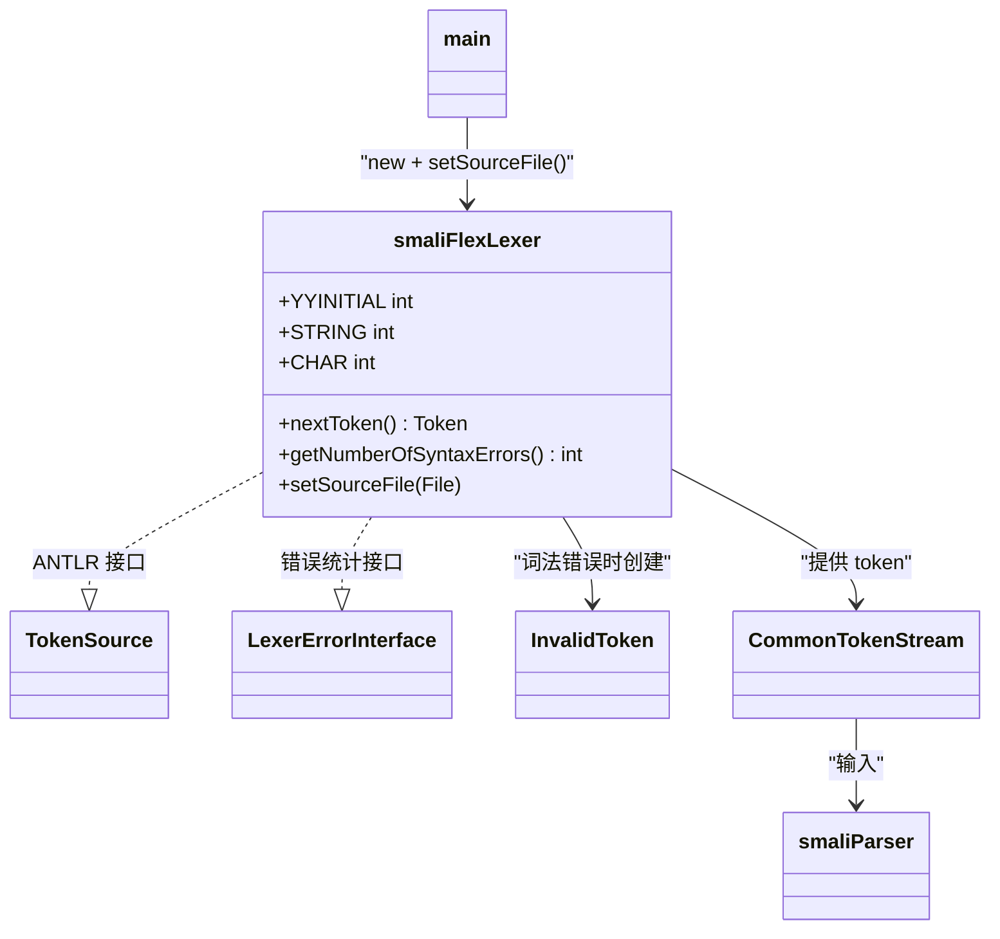

# 🔤 smaliFlexLexer

> JFlex 自动生成的 smali 词法分析器，将 smali 源文本转换为 ANTLR token 流。

| 属性 | 值 |
|---|---|
| 完整类名 | `org.jf.smali.smaliFlexLexer` |
| 源码链接 | [smaliFlexLexer.java](https://github.com/android-security-engineer/ZjDroid-skills/blob/master/src/org/jf/smali/smaliFlexLexer.java) |
| 生成工具 | JFlex 1.5.1（从 `smaliLexer.flex` 生成） |
| 实现接口 | `TokenSource`（ANTLR）、`LexerErrorInterface` |

---

## 🎯 职责

`smaliFlexLexer` 是 smali 编译器的**词法分析**阶段，负责将 `.smali` 文件的字符流转换为 ANTLR `Token` 序列：

1. **DFA 驱动**：通过压缩的 DFA 状态机（`ZZ_TRANS`、`ZZ_ROWMAP` 等查表数组）识别所有 smali token 类型
2. **多词法状态**：支持 `YYINITIAL`（正常状态）、`STRING`（字符串字面量）、`CHAR`（字符字面量）三种状态
3. **错误处理**：遇到无法识别的字符时生成 `InvalidToken`，通过 `ERROR_CHANNEL` 传递给 parser

---

## 🧠 关键实现

**三种词法状态**

```java
public static final int YYINITIAL = 0;  // 主扫描状态
public static final int STRING = 2;      // 字符串 "..." 内部
public static final int CHAR = 4;        // 字符 '.' 内部
```

进入 `STRING` 状态后，lexer 会识别转义序列（`\n`、`\t`、`\uXXXX` 等），直到遇到未转义的 `"` 才退出。

**DFA 状态机（JFlex 生成的核心）**

```java
private static final String ZZ_CMAP_PACKED = 
    "\11\0\1\115\1\64\1\116\1\116\1\64\22\0\1\50\1\0\1\62"+
    // ... 大量压缩状态转换数据 ...
```

`ZZ_CMAP` 将 Unicode 字符映射到字符类；`ZZ_TRANS` 和 `ZZ_ROWMAP` 编码 DFA 状态转换；`ZZ_ATTRPACKET` 指示每个状态是否为接受状态。JFlex 将 `.flex` 规范文件中的正则表达式自动编译为这些表格。

**错误处理接口实现**

```java
implements TokenSource, LexerErrorInterface
```

`smaliFlexLexer` 同时实现 ANTLR 的 `TokenSource`（提供 `nextToken()`）和自定义的 `LexerErrorInterface`（提供 `getNumberOfSyntaxErrors()`），使得 `main.assembleSmaliFile()` 可以统一检查两个错误计数：

```java
if (parser.getNumberOfSyntaxErrors() > 0 || lexer.getNumberOfSyntaxErrors() > 0) {
    return false;
}
```

**源文件追踪**

```java
((smaliFlexLexer)lexer).setSourceFile(smaliFile);
```

将源文件信息注入 lexer，使生成的 token 携带正确的文件名，便于错误消息定位。

---

## 🔗 关系



---

## 📌 小结

`smaliFlexLexer` 是由工具生成的代码，直接阅读源文件意义有限（几千行 DFA 表格）。关键理解点是：

1. 它实现了 `LexerErrorInterface`，让错误统计与 ANTLR parser 统一检查
2. 它支持三种词法状态，正确处理字符串/字符字面量内的转义
3. 它生成的 `InvalidToken`（通过 `ERROR_CHANNEL`）不会直接导致崩溃，而是让 parser 在后续语法分析时产生更友好的错误

::: warning 不要手动修改
`smaliFlexLexer.java` 是由 JFlex 从 `smaliLexer.flex` 自动生成的。若需要修改词法规则，应修改 `.flex` 文件后重新生成，直接修改 `.java` 会在下次生成时被覆盖。
:::
