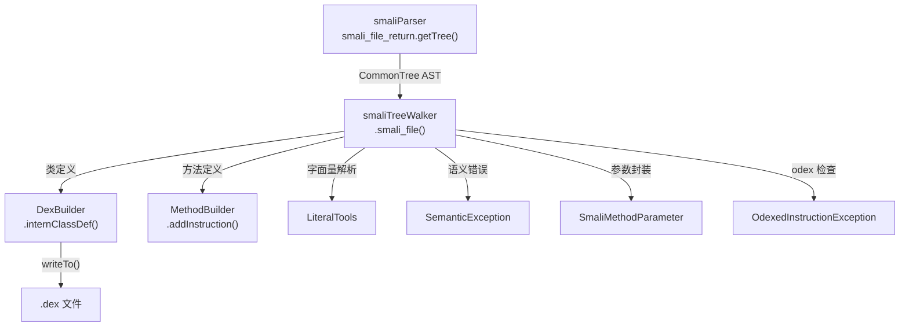

# 🌳 smaliTreeWalker

> ANTLR 树遍历器，遍历 smali 语法树并调用 dexlib2 `DexBuilder` API 构建 DEX 数据结构，是 smali 汇编的代码生成阶段。

| 属性 | 值 |
|---|---|
| 完整类名 | `org.jf.smali.smaliTreeWalker` |
| 源码链接 | [smaliTreeWalker.java](https://github.com/android-security-engineer/ZjDroid-skills/blob/master/src/org/jf/smali/smaliTreeWalker.java) |
| 生成工具 | ANTLR 3（从 `smaliTreeWalker.g` 生成） |
| 角色 | 编译器"代码生成"阶段（语义分析 + IR 构建） |

---

## 🎯 职责

`smaliTreeWalker` 是 smali 编译器三阶段中的第三阶段——代码生成：

1. **遍历 AST**：通过 `CommonTreeNodeStream` 接收 `smaliParser` 输出的语法树
2. **语义分析**：验证寄存器范围、指令参数类型、odex 指令合法性等
3. **调用 DexBuilder**：将每个 AST 节点翻译为 dexlib2 `DexBuilder` 的 API 调用，逐步构建 DEX 类、字段、方法、指令
4. **使用辅助类**：调用 `LiteralTools` 解析字面量，用 `SmaliMethodParameter` 封装参数，用 `SemanticException` 报告语义错误

---

## 🧠 关键实现

**主入口**

```java
smaliTreeWalker dexGen = new smaliTreeWalker(treeStream);
dexGen.setVerboseErrors(verboseErrors);
dexGen.setDexBuilder(dexBuilder);
dexGen.smali_file();  // 开始遍历 AST
```

**错误检查**

```java
return dexGen.getNumberOfSyntaxErrors() == 0;
```

`smaliTreeWalker` 继承 ANTLR 的 `TreeParser`，通过 `reportError()` 机制累计语义错误计数（与 `smaliParser` 的语法错误分别统计，但最终都纳入失败判断）。

**DexBuilder 集成**

树遍历器在处理每种 AST 节点时的典型操作：

- `.class` 节点 → `dexBuilder.internClassDef(type, accessFlags, superType, interfaces, sourceFile, annotations, ...)`
- `.method` 节点 → `dexBuilder.internMethod(methodRef, accessFlags, parameters, returnType, regCount, ...)`
- 指令节点 → `methodBuilder.addInstruction(new BuilderInstruction...)`
- `.field` 节点 → `dexBuilder.internField(fieldRef, accessFlags, initialValue, annotations)`

---

## 🔗 关系



---

## 📌 小结

`smaliTreeWalker` 是 smali 汇编器中代码量最大的文件（数千行），因为它需要为 smali 语法中的每种构造（200+ 条语法规则）提供对应的 dexlib2 API 调用。由于是 ANTLR 生成的代码，直接阅读源文件效率不高；理解其职责（"将 AST 翻译为 DexBuilder 调用"）和使用的辅助类（`LiteralTools`、`SmaliMethodParameter`、`SemanticException`）更为重要。

ZjDroid 的 [`DexFileBuilder`](/source/smali/DexFileBuilder) 通过调用 `main.assembleSmaliFile()` 间接使用 `smaliTreeWalker`，无需直接操作这个复杂的生成类。

::: warning 不要手动修改
`smaliTreeWalker.java` 由 ANTLR 从 `smaliTreeWalker.g` 文法文件生成。修改词法/语义规则应修改 `.g` 文件后重新生成。
:::
