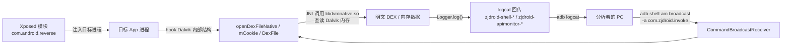

# ZjDroid 是什么

**ZjDroid** 是一个基于 [Xposed 框架](https://github.com/rovo89/Xposed)的 Android 应用**动态逆向分析工具**。

它本身是一个 Xposed 模块（包名 `com.android.reverse`）。当目标 App 运行时，ZjDroid 会通过 Xposed 注入到目标进程内部，然后**逆向分析者只需通过 `adb` 发送一条广播指令**，就能驱动目标进程完成脱壳、内存 dump、API 监控等动作。

## 一句话定位

> ZjDroid 让你能在不修改目标 APK 的前提下，在 App 运行时"打开它的黑盒"——把它加载的真实代码、调用的敏感 API、内存里的数据全部暴露出来。

## 它是怎么工作的

整个工具的运行分为三个层次：

1. **注入层**：作为 Xposed 模块，在每个非系统 App 启动时被加载。入口类 [`ReverseXposedModule`](https://github.com/android-security-engineer/ZjDroid-skills/blob/master/src/com/android/reverse/mod/ReverseXposedModule.java) 实现 `IXposedHookLoadPackage`，在 `handleLoadPackage` 中完成初始化。

2. **Hook 层**：注入后，ZjDroid 会 hook 掉 Dalvik 的 DEX 加载入口（`openDexFileNative`）、`Application.onCreate`、以及一大批敏感 API。这样它就能"知道"目标 App 什么时候加载了什么 DEX、调用了什么敏感方法。

3. **指令层**：ZjDroid 在目标进程内注册了一个 `BroadcastReceiver`，监听 `com.zjdroid.invoke` 广播。你通过 `adb shell am broadcast` 发出的指令会被这个接收器解析并执行，结果通过 `logcat` 输出。

```
┌──────────────────────────────────────────────────────────┐
│  你的电脑                                                  │
│  adb shell am broadcast -a com.zjdroid.invoke ...         │
└─────────────────────────┬────────────────────────────────┘
                          │ Android 广播
                          ▼
┌──────────────────────────────────────────────────────────┐
│  目标 App 进程（已被 ZjDroid 通过 Xposed 注入）            │
│                                                            │
│  CommandBroadcastReceiver  ← 接收广播                       │
│         │                                                  │
│         ▼                                                  │
│  CommandHandlerParser      ← 解析 JSON 指令                 │
│         │                                                  │
│         ▼                                                  │
│  XxxCommandHandler         ← 执行（脱壳/dump/监控...）      │
│         │                                                  │
│         ▼                                                  │
│  logcat（zjdroid-shell-{包名} / zjdroid-apimonitor-{包名}） │
└──────────────────────────────────────────────────────────┘
```

### 整体定位



## 八大能力

| 能力 | 作用 |
|------|------|
| [DEX 内存 Dump](../features/dex-dump) | 导出进程内存中已加载的 DEX |
| [内存 BackSmali 脱壳](../features/backsmali) | 从内存直接反编译 DEX，破解加固 |
| [DEX 加载信息收集](../features/dexinfo) | 列出当前加载的所有 DEX 及其内存指针 |
| [类信息枚举](../features/dump-class) | 列出指定 DEX 中可加载的类名 |
| [内存区域 Dump](../features/mem-dump) | 导出任意内存地址范围的数据 |
| [Dalvik 堆 Dump](../features/heap-dump) | 导出 Java 堆快照（.hprof） |
| [Lua 脚本注入](../features/lua-invoke) | 在目标进程内运行 Lua 调 Java |
| [敏感 API 监控](../features/api-monitor) | 监控短信/网络/定位等敏感调用 |

## 时代背景

ZjDroid 面向 **Dalvik 运行时**（Android 2.2 ~ 4.3，`minSdkVersion=8`、`targetSdkVersion=18`）。它的脱壳原理深度依赖 Dalvik 的内部数据结构（`mCookie`、`DexFile` 指针表）。这意味着：

- 在 Dalvik 设备上，它是脱壳利器；
- 在 **ART 运行时**（Android 5.0+）上，由于底层结构完全不同，其核心脱壳能力**不再适用**。

详见 [适用场景与局限](./limitations)。

## 这份文档是给谁看的

这份文档是一个**教学站点**，目标是让你从零开始：

- 理解 ZjDroid 解决了什么问题、解决得如何；
- 看懂它每个功能点的实现原理与代码细节；
- 能够上手使用它进行 Android 动态逆向分析。

如果你是 Android 安全研究者、逆向工程师，或正在学习移动安全的同学，这份文档就是为你准备的。
