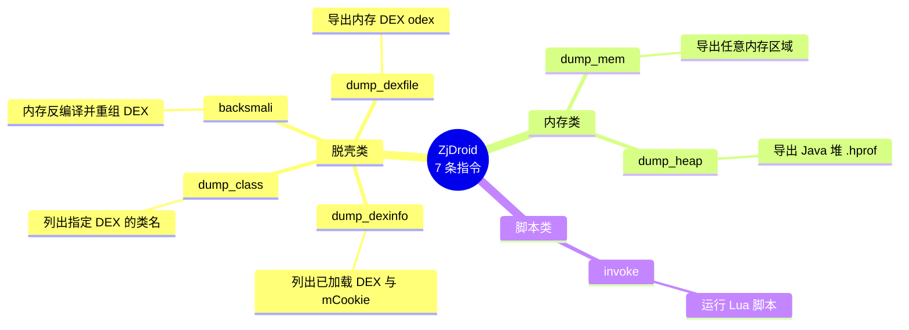

# 命令总览

ZjDroid 的所有指令都是一条 `com.zjdroid.invoke` 广播，区别只在 `cmd` 这个 JSON 里的 `action` 字段。

## 通用格式

```bash
adb shell am broadcast \
  -a com.zjdroid.invoke \
  --ei target <PID> \
  --es cmd '{"action":"<动作>", ...其他参数}'
```

| 参数 | 含义 |
|------|------|
| `-a com.zjdroid.invoke` | 固定的广播 action |
| `--ei target <PID>` | 目标进程 PID（整数） |
| `--es cmd '<JSON>'` | 指令 JSON 字符串 |

## 指令速查表

| action | 参数 | 作用 | 输出文件 | 详见 |
|--------|------|------|---------|------|
| `dump_dexinfo` | 无 | 列出已加载的 DEX 及 mCookie | （仅日志） | [DEX 信息收集](../features/dexinfo) |
| `dump_class` | `dexpath` | 列出指定 DEX 的类名 | （仅日志） | [类信息枚举](../features/dump-class) |
| `backsmali` | `dexpath` | 内存反编译并重组 DEX（脱壳） | `files/dexfile.dex` | [BackSmali 脱壳](../features/backsmali) |
| `dump_dexfile` | `dexpath` | 导出内存 DEX（odex 格式） | `files/<name>` | [DEX 内存 Dump](../features/dex-dump) |
| `dump_mem` | `startaddr`, `length` | 导出内存区域 | `files/<起始地址>` | [内存区域 Dump](../features/mem-dump) |
| `dump_heap` | 无 | 导出 Java 堆快照 | `files/<PID>.hprof` | [Dalvik 堆 Dump](../features/heap-dump) |
| `invoke` | `filepath` | 运行 Lua 脚本 | （脚本自定义） | [Lua 脚本注入](../features/lua-invoke) |
| （自动） | — | 敏感 API 监控 | （仅日志） | [API 监控](../features/api-monitor) |

## 7 条指令全景

按用途分三组：脱壳类（4 条，围绕 DEX）、内存类（2 条）、脚本类（1 条）。



::: warning 指令数量以源码为准
源码 `CommandHandlerParser.java` 的分发链里真实接入的指令**就是这 7 条**。`NativeHookInfoHandler` 虽存在于目录中，但未被调度器接入，属死代码，不计入可用指令。
:::

## 完整命令示例

### 1. dump_dexinfo

```bash
adb shell am broadcast -a com.zjdroid.invoke \
  --ei target 12345 \
  --es cmd '{"action":"dump_dexinfo"}'
```

### 2. dump_class

```bash
adb shell am broadcast -a com.zjdroid.invoke \
  --ei target 12345 \
  --es cmd '{"action":"dump_class","dexpath":"/data/data/com.example.target/files/x.dex"}'
```

### 3. backsmali（脱壳）

```bash
adb shell am broadcast -a com.zjdroid.invoke \
  --ei target 12345 \
  --es cmd '{"action":"backsmali","dexpath":"/data/data/com.example.target/files/x.dex"}'
```

### 4. dump_dexfile

```bash
adb shell am broadcast -a com.zjdroid.invoke \
  --ei target 12345 \
  --es cmd '{"action":"dump_dexfile","dexpath":"/data/data/com.example.target/files/x.dex"}'
```

### 5. dump_mem

::: warning 参数名是 startaddr
README 里写的是 `start`，但代码实际解析的 key 是 **`startaddr`**。请用 `startaddr`。
:::

```bash
adb shell am broadcast -a com.zjdroid.invoke \
  --ei target 12345 \
  --es cmd '{"action":"dump_mem","startaddr":12345678,"length":1024}'
```

### 6. dump_heap

```bash
adb shell am broadcast -a com.zjdroid.invoke \
  --ei target 12345 \
  --es cmd '{"action":"dump_heap"}'
```

### 7. invoke（Lua 脚本）

```bash
# 先 push 脚本到设备
adb push script.lua /data/local/tmp/

# 再执行
adb shell am broadcast -a com.zjdroid.invoke \
  --ei target 12345 \
  --es cmd '{"action":"invoke","filepath":"/data/local/tmp/script.lua"}'
```

## 查看结果

```bash
# 指令执行结果
adb shell logcat -s zjdroid-shell-<包名>

# API 监控结果
adb shell logcat -s zjdroid-apimonitor-<包名>
```

## 脱壳工作流

脱壳是一个三步流程：先用 `dump_dexinfo` 拿到每个 DEX 的 mCookie 与路径，再用 `dump_class` 看类名定位目标 DEX，最后用 `backsmali`（重组可读）或 `dump_dexfile`（直出 odex）导出。

```mermaid
sequenceDiagram
    participant 分析者 as 分析者 PC
    participant 目标 as 目标进程
    participant 采集 as DexFileInfoCollecter

    分析者->>目标: dump_dexinfo
    目标->>采集: 遍历已加载 DEX
    采集-->>目标: DEX 路径 + mCookie 列表
    目标-->>分析者: logcat 输出 DEX 清单

    分析者->>目标: dump_class(dexpath)
    目标->>采集: 枚举该 DEX 类名
    采集-->>目标: 类名列表
    目标-->>分析者: logcat 输出类名(定位目标 DEX)

    分析者->>目标: backsmali(dexpath)
    Note over 目标: 反汇编 → 重组 DEX
    目标-->>分析者: files/dexfile.dex

    分析者->>目标: 或 dump_dexfile(dexpath)
    Note over 目标: 直接导出内存 DEX(odex)
    目标-->>分析者: files/&lt;name&gt;
```

::: tip 选 backsmali 还是 dump_dexfile
`backsmali` 走"反汇编→重组"路径，产出可被 baksmali/smali 工具链直接处理的 DEX；`dump_dexfile` 直接 dump 内存中的 odex，更快但可能需额外修复。壳破坏了 DEX 时优先试 `backsmali`。
:::

---

指令的协议细节见 [指令协议](./protocol)。
