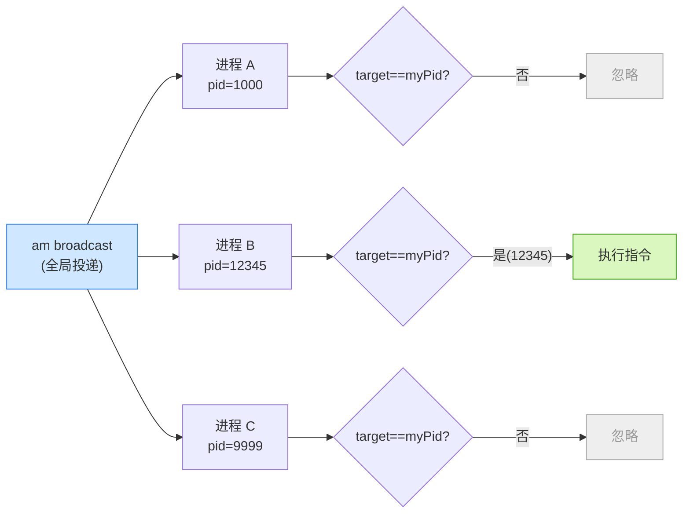
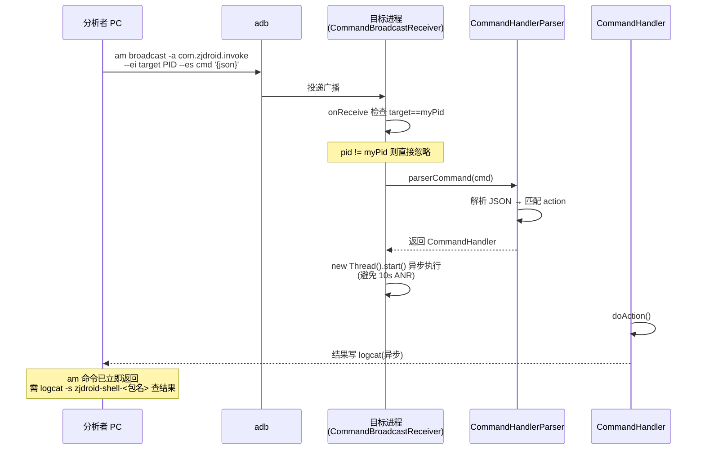

# 指令协议

深入看 ZjDroid 指令从"一条 adb 命令"到"被执行"的全过程，以及协议的设计细节。

## 协议层次

```
adb shell am broadcast
       │
       ▼
Android 广播 (action = com.zjdroid.invoke)
  extras: target(int) + cmd(String, JSON)
       │
       ▼
CommandBroadcastReceiver.onReceive()
       │
       ▼
CommandHandlerParser.parserCommand(cmd)
       │  解析 JSON → 匹配 action → 构造 Handler
       ▼
XxxCommandHandler.doAction()
```

## 广播协议

| Intent 字段 | 类型 | 键 | 说明 |
|-------------|------|----|------|
| action | String | — | 固定 `com.zjdroid.invoke` |
| extra | int | `target` | 目标进程 PID |
| extra | String | `cmd` | JSON 格式指令 |

### 为什么用广播 + PID 路由

广播是 Android 全局的——设备上**所有**被 ZjDroid 注入的进程都会收到同一条广播。ZjDroid 用 `target` PID 来路由：

```java
int pid = arg1.getIntExtra(TARGET_KEY, 0);
if (pid == android.os.Process.myPid()) {   // 只有目标 PID 匹配的进程才执行
    ...
}
```

这样一条广播只命中一个目标进程，其余被注入的进程会忽略它。



::: tip 为什么不用 Xposed 自带的 IPC
Xposed 没有内置的"指令通道"。广播是 Android 原生、零成本、无需额外权限的通信方式，且 `am broadcast` 可从 adb 直接发起——非常适合"分析者从外部驱动目标进程"这个场景。
:::

## JSON 指令格式

```json
{
  "action": "<动作名>",
  "<参数1>": <值1>,
  "<参数2>": <值2>
}
```

`action` 是必填字段，决定执行哪个 Handler。其余参数按 action 不同而不同。

## action 到 Handler 的映射

[`CommandHandlerParser`](https://github.com/android-security-engineer/ZjDroid-skills/blob/master/src/com/android/reverse/request/CommandHandlerParser.java) 是核心分发器，本质是一个 if-else 链：

```java
String action = jsoncmd.getString("action");

if ("dump_dexinfo".equals(action))      handler = new DumpDexInfoCommandHandler();
else if ("dump_dexfile".equals(action)) handler = new DumpDexFileCommandHandler(dexpath);
else if ("backsmali".equals(action))    handler = new BackSmaliCommandHandler(dexpath);
else if ("dump_class".equals(action))   handler = new DumpClassCommandHandler(dexpath);
else if ("dump_heap".equals(action))    handler = new DumpHeapCommandHandler();
else if ("invoke".equals(action))       handler = new InvokeScriptCommandHandler(filepath, FILETYPE);
else if ("dump_mem".equals(action))     handler = new DumpMemCommandHandler(start, length);
else Logger.log(action + " cmd is invalid!");
```

每个 Handler 都实现统一的 [`CommandHandler`](https://github.com/android-security-engineer/ZjDroid-skills/blob/master/src/com/android/reverse/request/CommandHandler.java) 接口：

```java
public interface CommandHandler {
    void doAction();
}
```

这是典型的**命令模式**：把每个操作封装成一个对象，解析器负责构造对象，调用方只管 `doAction()`。

## 参数键的官方取值

下面是代码里实际解析的参数键（**以代码为准**，部分与 README 不一致）：

| action | 参数键 | 类型 | 说明 |
|--------|--------|------|------|
| `dump_class` | `dexpath` | String | DEX 路径 |
| `backsmali` | `dexpath` | String | DEX 路径 |
| `dump_dexfile` | `dexpath` | String | DEX 路径 |
| `invoke` | `filepath` | String | Lua 脚本路径 |
| `dump_mem` | `startaddr` | int | 起始地址 |
| `dump_mem` | `length` | int | 字节数 |
| `dump_dexinfo` | — | — | 无参数 |
| `dump_heap` | — | — | 无参数 |

::: warning README 的两处出入
1. `dump_mem` 的起始地址参数，README 写 `start`，代码实际是 **`startaddr`**；
2. `dump_class` 分支取值用的常量名是 `PARAM_DEXPATH_DUMP_DEXFILE`（看着像笔误），但其值仍为 `"dexpath"`，行为正确。
:::

## 执行模型

```java
// CommandBroadcastReceiver
new Thread(new Runnable() {
    public void run() { handler.doAction(); }
}).start();
```

指令在**新线程**执行，原因：

- `BroadcastReceiver.onReceive` 在主线程，超时 10 秒会 ANR；
- `backsmali` 等操作耗时远超 10 秒；
- 因此必须切到子线程。

这也意味着：广播会**立即返回**（`am broadcast` 命令很快结束），真正的执行结果要靠 logcat 异步查看。

## 广播协议时序

下图是一条指令从 adb 发出到结果回传的完整时序，关键点在于：广播全局投递后由 PID 路由命中唯一进程，再切子线程执行以避免 ANR，结果异步写 logcat。



## 异常处理

```java
try {
    ...解析并执行...
} catch (JSONException e) {
    e.printStackTrace();   // JSON 格式错误
}
```

JSON 解析失败会被 catch，但只是打印堆栈，不会崩溃。如果是无效 action，会 log `"xxx cmd is invalid!"`。

---

完整命令示例见 [命令总览](./commands)。
