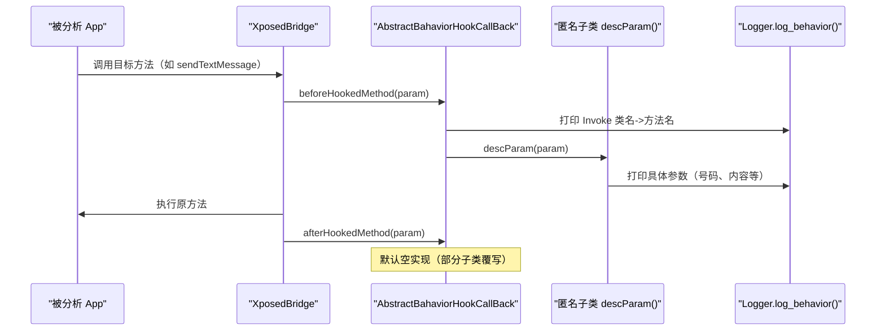

# 📋 AbstractBahaviorHookCallBack

> 所有行为监控回调的**抽象基类**——在 `beforeHookedMethod` 中统一打印"Invoke 类名->方法名"，并将参数描述委托给子类实现的 `descParam()`。

| 属性 | 值 |
|------|-----|
| 源码路径 | [AbstractBahaviorHookCallBack.java](https://github.com/android-security-engineer/ZjDroid-skills/blob/master/src/com/android/reverse/apimonitor/AbstractBahaviorHookCallBack.java) |
| 类型 | 抽象类 |
| 所在包 | `com.android.reverse.apimonitor` |
| 关键依赖 | `MethodHookCallBack`、`HookParam`、`Logger` |

## 🎯 职责

`AbstractBahaviorHookCallBack` 处于 Hook 回调链的核心位置，它：

1. **统一打印调用头**：每次目标方法被调用前，自动输出 `Invoke <类名>-><方法名>` 日志，无需各子类重复编写。
2. **委托参数描述**：调用抽象方法 `descParam(param)`，让各具体 Hook 回调决定记录哪些参数。
3. **预留栈轨迹能力**：内置 `printStackInfo()` 方法，可过滤输出调用栈（当前被注释掉，可按需开启）。

## 🔍 监控的 API

本类为抽象回调基类，不直接绑定任何目标方法，由各 Hook 子类的匿名内部类实例使用。

## 🧠 关键实现

### beforeHookedMethod：统一调用日志

```java
@Override
public void beforeHookedMethod(HookParam param) {
    Logger.log_behavior("Invoke "+ param.method.getDeclaringClass().getName()
            +"->"+param.method.getName());
    this.descParam(param);
}
```

这是整个监控框架的**关键埋点**：

- `param.method.getDeclaringClass().getName()` 获取被 Hook 方法所在的**真实类名**（如 `android.telephony.SmsManager`）。
- `param.method.getName()` 获取**方法名**（如 `sendTextMessage`）。
- 两者拼接后通过 `Logger.log_behavior()` 输出到 logcat，tag 为 `zjdroid-apimonitor-<包名>`。

::: tip 日志格式
每次命中都会先输出一行固定格式的调用头，方便在 logcat 中快速定位：
```
zjdroid-apimonitor D  Invoke android.telephony.SmsManager->sendTextMessage
```
:::

### afterHookedMethod：当前为空实现

```java
@Override
public void afterHookedMethod(HookParam param) {
    // Logger.log_behavior("End Invoke "+ param.method.toString());
}
```

`afterHookedMethod` 有一行被注释掉的"调用结束"日志。部分子类（如 `NetWorkHook`）会**覆写**此方法来获取 HTTP 响应状态码，其余子类依赖此默认空实现。

### descParam：子类必须实现

```java
public abstract void descParam(HookParam param);
```

各具体 Hook 回调（以匿名内部类形式）实现此方法，负责从 `param.args[]` 中提取并记录关键参数。

### printStackInfo：可选的栈轨迹

```java
private void printStackInfo(){
    Throwable ex = new Throwable();
    StackTraceElement[] stackElements = ex.getStackTrace();
    if(stackElements != null){
        StackTraceElement st;
        for(int i=0; i<stackElements.length; i++){
            st = stackElements[i];
            if(st.getClassName().startsWith("com.android.reverse")
               || st.getClassName().startsWith("de.robv.android.xposed.XposedBridge"))
                continue;
            Logger.log_behavior(st.getClassName()+":"+st.getMethodName()
                    +":"+st.getFileName()+":"+st.getLineNumber());
        }
    }
}
```

::: warning 注意
`printStackInfo()` 通过 `new Throwable()` 捕获当前调用栈，并**过滤掉** ZjDroid 自身（`com.android.reverse`）和 XposedBridge 的栈帧，只打印被分析 App 的真实调用路径。该方法在 `beforeHookedMethod` 中已被注释——开启后能还原完整调用链，但会显著增加日志量。
:::

## 🔗 调用关系



## 📌 小结

`AbstractBahaviorHookCallBack` 是**模板方法模式**在回调层的体现：固定的"打印调用头 → 委托参数描述"流程由基类保证，差异化的参数提取逻辑由 `descParam()` 抽象交给各具体场景。`printStackInfo()` 的存在则说明框架设计者已考虑到调用链还原的需求，只是出于性能考量默认关闭。

**相关文档：**
- [ApiMonitorHook](/source/apimonitor/ApiMonitorHook) — Hook 子类的基类
- [ApiMonitorHookManager](/source/apimonitor/ApiMonitorHookManager) — 统一调度入口
