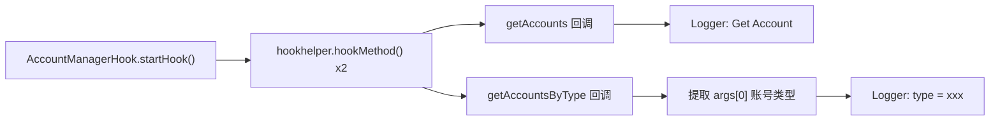

# 👤 AccountManagerHook

> 监控 `android.accounts.AccountManager` 的**账号枚举**行为——拦截应用对设备已登录账号列表（Google、微信、微博等）的读取，记录查询的账号类型。

| 属性 | 值 |
|------|-----|
| 源码路径 | [AccountManagerHook.java](https://github.com/android-security-engineer/ZjDroid-skills/blob/master/src/com/android/reverse/apimonitor/AccountManagerHook.java) |
| 类型 | 具体类（extends ApiMonitorHook） |
| 所在包 | `com.android.reverse.apimonitor` |
| 关键依赖 | `android.accounts.AccountManager`、`RefInvoke`、`Logger` |

## 🎯 职责

设备上已登录的账号列表是高价值情报：通过枚举账号类型（如 `com.google`、`com.facebook`），攻击者可以精准识别用户身份、判断设备归属、定向实施社工攻击。`AccountManagerHook` 拦截两个账号枚举入口，记录触发行为和查询类型。

## 🔍 监控的 API

| 被 Hook 的方法 | 记录的参数 / 行为 |
|--------------|----------------|
| `AccountManager.getAccounts()` | 触发即记录（枚举所有账号） |
| `AccountManager.getAccountsByType(String type)` | 记录查询的账号类型字符串 |

## 🧠 关键实现

### getAccounts Hook（枚举全部账号）

```java
Method getAccountsMethod = RefInvoke.findMethodExact(
        "android.accounts.AccountManager", ClassLoader.getSystemClassLoader(),
        "getAccounts");
hookhelper.hookMethod(getAccountsMethod, new AbstractBahaviorHookCallBack() {
    @Override
    public void descParam(HookParam param) {
        Logger.log_behavior("Get Account ->");
    }
});
```

`getAccounts()` 返回设备上**所有类型**的已登录账号数组，调用此方法需要 `GET_ACCOUNTS` 权限（Android 6.0 以下）或精细权限（6.0+）。触发即记录，无附加参数。

### getAccountsByType Hook（按类型查询）

```java
Method getAccountsByTypeMethod = RefInvoke.findMethodExact(
        "android.accounts.AccountManager", ClassLoader.getSystemClassLoader(),
        "getAccountsByType", String.class);
hookhelper.hookMethod(getAccountsByTypeMethod, new AbstractBahaviorHookCallBack() {
    @Override
    public void descParam(HookParam param) {
        String type = (String) param.args[0];
        Logger.log_behavior("Get Account By Type ->");
        Logger.log_behavior("type :" + type);
    }
});
```

::: info 账号类型的情报价值
常见账号类型字符串示例：
- `com.google` — Google 账号
- `com.sina.weibo` — 微博账号
- `com.tencent.mm` — 微信账号
- `com.facebook.auth.login` — Facebook 账号

若应用使用 `getAccountsByType("com.google")` 精准查询 Google 账号，则极可能存在账号窃取意图。
:::

## 🔗 调用关系



## 📌 小结

`AccountManagerHook` 以最精简的实现（仅 2 个 Hook 点，约 30 行代码）覆盖了账号枚举的核心路径。其价值在于：当日志中出现 `getAccountsByType` 调用且类型为第三方账号体系时，结合其他监控数据可快速判断应用是否在进行身份识别攻击。

**相关文档：**
- [AbstractBahaviorHookCallBack](/source/apimonitor/AbstractBahaviorHookCallBack) — 日志回调基类
- [ApiMonitorHookManager](/source/apimonitor/ApiMonitorHookManager) — 注册调度入口
