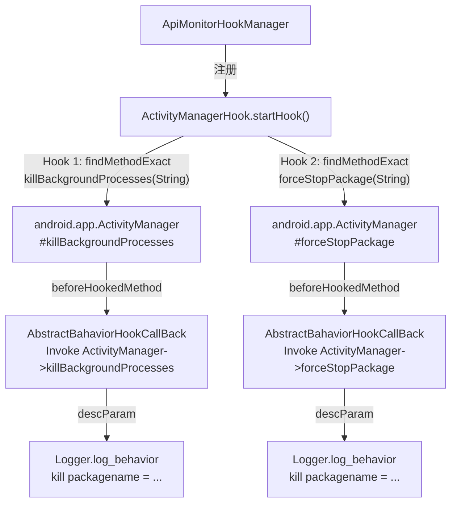

# 🔫 ActivityManagerHook

> 拦截 `android.app.ActivityManager` 的 `killBackgroundProcesses` 与 `forceStopPackage`，监控被分析 App 试图强制杀死其他应用进程的行为，用于检测反调试对抗、清除竞争对手或删除安全工具等高危操作。

| 属性 | 值 |
|------|-----|
| 源码路径 | [ActivityManagerHook.java](https://github.com/android-security-engineer/ZjDroid-skills/blob/master/src/com/android/reverse/apimonitor/ActivityManagerHook.java) |
| 类型 | `class` extends `ApiMonitorHook` |
| 所在包 | `com.android.reverse.apimonitor` |
| 关键依赖 | `RefInvoke`、`AbstractBahaviorHookCallBack`、`Logger`、`android.app.ActivityManager` |

## 🎯 职责

`ActivityManagerHook` 注册两个针对进程终止 API 的钩子：
1. **`killBackgroundProcesses`** — 终止指定包名的后台进程（需要 `KILL_BACKGROUND_PROCESSES` 权限）
2. **`forceStopPackage`** — 强制停止指定包名的所有进程（系统级权限，通常只有 system UID 可调用）

两个钩子的 `descParam` 实现完全相同，均打印目标包名。

## 🔍 监控的 API

| 被 Hook 的方法 | 记录的参数 / 行为 |
|---------------|----------------|
| `android.app.ActivityManager#killBackgroundProcesses(String)` | 目标应用包名 |
| `android.app.ActivityManager#forceStopPackage(String)` | 目标应用包名 |

## 🧠 关键实现

### startHook() 完整代码

```java
public void startHook() {
    Method killBackgroundProcessesmethod = RefInvoke.findMethodExact(
            "android.app.ActivityManager", ClassLoader.getSystemClassLoader(),
            "killBackgroundProcesses", String.class);
    hookhelper.hookMethod(killBackgroundProcessesmethod, new AbstractBahaviorHookCallBack() {
        @Override
        public void descParam(HookParam param) {
            String packageName = (String) param.args[0];
            Logger.log_behavior("kill packagename = " + packageName);
        }
    });

    Method forceStopPackagemethod = RefInvoke.findMethodExact(
            "android.app.ActivityManager", ClassLoader.getSystemClassLoader(),
            "forceStopPackage", String.class);
    hookhelper.hookMethod(forceStopPackagemethod, new AbstractBahaviorHookCallBack() {
        @Override
        public void descParam(HookParam param) {
            String packageName = (String) param.args[0];
            Logger.log_behavior("kill packagename = " + packageName);
        }
    });
}
```

**关键要点逐条解析：**

**① 两个 API 的权限差异**

| 方法 | 所需权限 | 调用者 |
|------|---------|--------|
| `killBackgroundProcesses` | `KILL_BACKGROUND_PROCESSES` | 普通第三方 App 可申请 |
| `forceStopPackage` | 系统签名或 `android.permission.FORCE_STOP_PACKAGES` | 通常仅系统 App / ROOT App |

前者是普通 App 可用的"温和"终止，后者是系统级强制停止。监控这两个 API 可区分行为的危害等级。

**② 两个钩子的 descParam 实现相同**

两个钩子的 `descParam` 逻辑完全一致，都是读取 `param.args[0]`（目标包名）并打印。仅凭 [AbstractBahaviorHookCallBack](/source/apimonitor/AbstractBahaviorHookCallBack) 的 `beforeHookedMethod` 输出的方法名才能区分到底是哪个 API 被调用：

```
Invoke android.app.ActivityManager->killBackgroundProcesses
kill packagename = com.example.security

Invoke android.app.ActivityManager->forceStopPackage
kill packagename = com.example.target
```

::: tip 分析价值
若被分析 App 调用了 `forceStopPackage` 杀死安全软件或 ZjDroid 自身，这是极强的对抗信号。结合日志时间戳可判断是否是对某一检测动作的反应。
:::

**③ 无需 Class.forName**

两个方法的参数类型均为 `String.class`，属于 JDK 标准类型，可直接引用，无需动态加载，反射调用最为简洁。

## 🔗 调用关系



## 📌 小结

`ActivityManagerHook` 以两个结构几乎完全对称的钩子，覆盖了 Android 进程终止的主要 API 路径。区分 `killBackgroundProcesses`（普通权限）与 `forceStopPackage`（系统权限）对于判断被分析 App 的权限滥用程度至关重要。与 [PackageManagerHook](/source/apimonitor/PackageManagerHook) 的静默卸载监控配合，可完整还原被分析 App 对系统环境的主动破坏链路。
