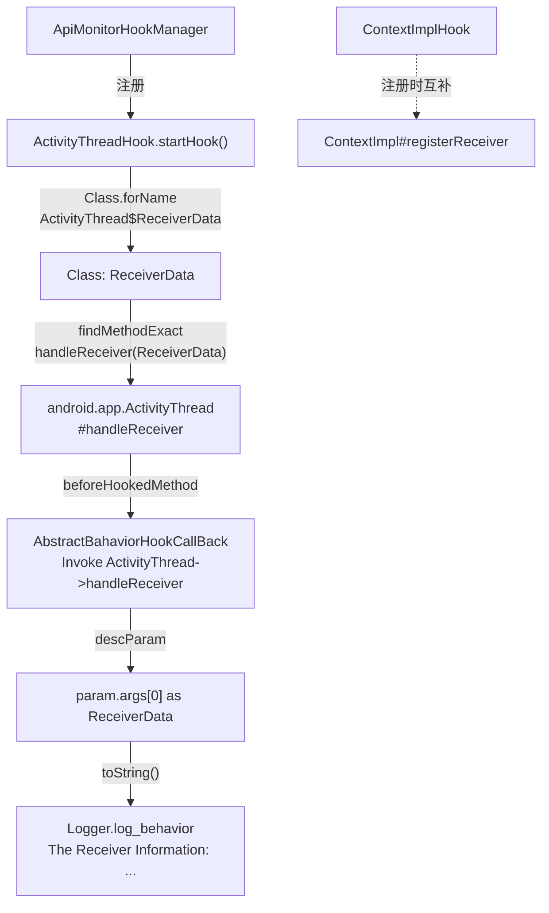

# 🧵 ActivityThreadHook

> 拦截 `android.app.ActivityThread#handleReceiver`，在广播真正分发给 `BroadcastReceiver` 之前捕获 `ReceiverData` 的完整信息，是从调度层面监控广播接收的底层探针。

| 属性 | 值 |
|------|-----|
| 源码路径 | [ActivityThreadHook.java](https://github.com/android-security-engineer/ZjDroid-skills/blob/master/src/com/android/reverse/apimonitor/ActivityThreadHook.java) |
| 类型 | `class` extends `ApiMonitorHook` |
| 所在包 | `com.android.reverse.apimonitor` |
| 关键依赖 | `RefInvoke`、`AbstractBahaviorHookCallBack`、`Logger`、`android.app.ActivityThread`（内部类 `ReceiverData`） |

## 🎯 职责

`ActivityThreadHook` 钩住 `ActivityThread` 中负责实际分发广播的私有方法 `handleReceiver(ReceiverData)`。与 [ContextImplHook](/source/apimonitor/ContextImplHook) 在"注册时"拦截不同，本类在"接收时"拦截，捕获的是每一次广播真正到达接收器时的 `ReceiverData` 对象，包含 Intent、权限、广播来源等完整上下文。

::: info 两层广播监控的互补关系
| Hook 类 | 监控时机 | 关注点 |
|---------|---------|--------|
| [ContextImplHook](/source/apimonitor/ContextImplHook) | `registerReceiver` 注册时 | 接收器类名 + 订阅 Action |
| `ActivityThreadHook` | `handleReceiver` 接收时 | ReceiverData 完整运行时数据 |

两者配合可形成从"订阅"到"触发"的完整广播追踪链路。
:::

## 🔍 监控的 API

| 被 Hook 的方法 | 记录的参数 / 行为 |
|---------------|----------------|
| `android.app.ActivityThread#handleReceiver(ActivityThread$ReceiverData)` | `ReceiverData.toString()` 完整转储 |

## 🧠 关键实现

### startHook() 完整代码

```java
public void startHook() {
    try {
        Class receiverDataClass = Class.forName("android.app.ActivityThread$ReceiverData");
        if (receiverDataClass != null) {
            Method handleReceiverMethod = RefInvoke.findMethodExact(
                    "android.app.ActivityThread",
                    ClassLoader.getSystemClassLoader(),
                    "handleReceiver", receiverDataClass);
            hookhelper.hookMethod(handleReceiverMethod, new AbstractBahaviorHookCallBack() {
                @Override
                public void descParam(HookParam param) {
                    Logger.log_behavior("The Receiver Information:");
                    Object data = param.args[0];
                    Logger.log_behavior(data.toString());
                }
            });
        }
    } catch (ClassNotFoundException e) {
        e.printStackTrace();
    }
}
```

**关键要点逐条解析：**

**① 动态加载内部类 `ActivityThread$ReceiverData`**

`ReceiverData` 是 `ActivityThread` 的静态内部类（`ActivityThread$ReceiverData`），在 Android SDK 中未公开，编译期无法直接引用。代码通过 `Class.forName("android.app.ActivityThread$ReceiverData")` 动态加载，并用于 `findMethodExact` 的参数类型列表。

这是一个"先找类、再找方法"的双重反射模式，也是 ZjDroid 中处理 AOSP 内部类的标准写法。

**② null 判断的防御性检查**

```java
if (receiverDataClass != null) { ... }
```

`Class.forName` 成功时返回 Class 对象，失败时抛出 `ClassNotFoundException`（已被 catch），理论上不会返回 null。此处 null 检查是额外的防御性代码，在极端 ROM 定制场景下提供保护。

**③ `data.toString()` 的信息量**

`ReceiverData` 继承自 `BroadcastRecord`（AOSP 内部类），其 `toString()` 通常包含：
- 触发广播的 Intent（Action、Data、Extras）
- 广播的发送方信息
- 接收器的权限和标志

直接打印 `data.toString()` 是最简洁的获取全量信息的方式，无需逐字段反射读取。

::: warning AOSP 版本兼容性
`handleReceiver` 是 AOSP 内部私有方法，其签名和 `ReceiverData` 内部类结构在不同 Android 版本间可能有变化。若 `Class.forName` 抛出 `ClassNotFoundException`，日志中会打印堆栈但不影响其他 Hook 类的运行。
:::

**④ try-catch 的范围**

整个 `startHook()` 方法体被一个 try-catch 包裹，`ClassNotFoundException` 被捕获并打印堆栈。这意味着如果内部类加载失败，本 Hook 会静默跳过（不崩溃），保证 ZjDroid 整体稳健性。

## 🔗 调用关系



## 📌 小结

`ActivityThreadHook` 深入 Android 消息调度层，通过钩住 `ActivityThread.handleReceiver` 这一广播分发的终点方法，以 `ReceiverData.toString()` 的方式获取每次广播触发的完整运行时快照。相比在注册阶段拦截的 [ContextImplHook](/source/apimonitor/ContextImplHook)，本类能捕获实际触发事件，是广播行为分析的最后一道监控防线。
