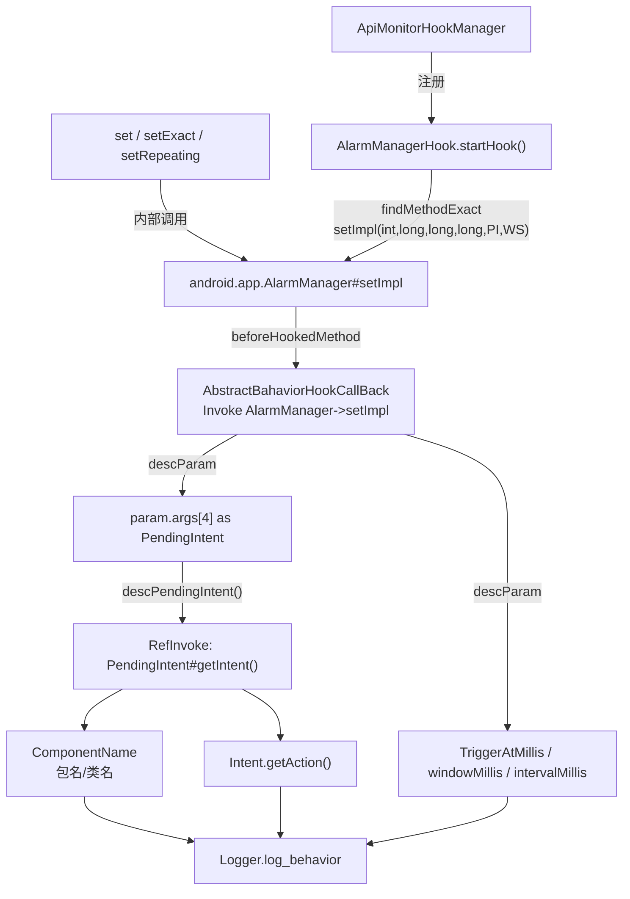

# ⏰ AlarmManagerHook

> 拦截 `android.app.AlarmManager#setImpl`，捕获被分析 App 注册定时任务时的完整参数——触发时间、窗口、重复间隔及关联的 `PendingIntent`，用于检测后台定时唤醒、恶意 C&C 心跳等行为。

| 属性 | 值 |
|------|-----|
| 源码路径 | [AlarmManagerHook.java](https://github.com/android-security-engineer/ZjDroid-skills/blob/master/src/com/android/reverse/apimonitor/AlarmManagerHook.java) |
| 类型 | `class` extends `ApiMonitorHook` |
| 所在包 | `com.android.reverse.apimonitor` |
| 关键依赖 | `RefInvoke`、`AbstractBahaviorHookCallBack`、`Logger`、`android.app.AlarmManager`、`android.app.PendingIntent`、`android.os.WorkSource` |

## 🎯 职责

`AlarmManagerHook` 钩住 `AlarmManager.setImpl`（所有 `set`/`setExact`/`setRepeating` 最终汇聚的内部实现方法），并提供 `descPendingIntent` 辅助方法，通过反射调用 `PendingIntent.getIntent()` 获取内部 `Intent`，进而读取 `ComponentName` 与 Action，将定时任务的触发目标完整暴露。

::: info 为什么钩 setImpl 而非公开 API？
`AlarmManager` 的 `set`、`setExact`、`setRepeating` 等公开方法最终都调用内部 `setImpl`，通过钩住这个汇聚点，一个 Hook 即可覆盖所有定时任务注册路径，无需为每个公开方法单独设置钩子。
:::

## 🔍 监控的 API

| 被 Hook 的方法 | 记录的参数 / 行为 |
|---------------|----------------|
| `android.app.AlarmManager#setImpl(int, long, long, long, PendingIntent, WorkSource)` | 触发时间（`triggerAtMillis`）、窗口大小（`windowMillis`）、重复间隔（`intervalMillis`）、PendingIntent 指向的 ComponentName 与 Action |

## 🧠 关键实现

### startHook() 主体

```java
public void startHook() {
    Method setImplmethod = RefInvoke.findMethodExact(
            "android.app.AlarmManager", ClassLoader.getSystemClassLoader(),
            "setImpl", int.class, long.class, long.class, long.class,
            PendingIntent.class, WorkSource.class);
    hookhelper.hookMethod(setImplmethod, new AbstractBahaviorHookCallBack() {
        @Override
        public void descParam(HookParam param) {
            Logger.log_behavior("The Alarm Information:");
            PendingIntent intent = (PendingIntent) param.args[4];
            descPendingIntent(intent);
            Logger.log_behavior("TriggerAtMillis = " + param.args[1]);
            Logger.log_behavior("windowMillis = "    + param.args[2]);
            Logger.log_behavior("intervalMillis = "  + param.args[3]);
        }
    });
}
```

**setImpl 参数映射表：**

| 下标 | 类型 | 含义 |
|------|------|------|
| `args[0]` | `int` | 闹钟类型（`ELAPSED_REALTIME`、`RTC_WAKEUP` 等） |
| `args[1]` | `long` | 首次触发时刻（ms，`triggerAtMillis`） |
| `args[2]` | `long` | 触发窗口大小（ms，`windowMillis`；非精确模式下用于省电对齐） |
| `args[3]` | `long` | 重复间隔（ms，`intervalMillis`；0 表示一次性） |
| `args[4]` | `PendingIntent` | 触发时执行的 PendingIntent |
| `args[5]` | `WorkSource` | 电量归因来源（通常为 null） |

::: tip
`args[0]`（闹钟类型）和 `args[5]`（WorkSource）当前未打印，已记录的三个时间参数足以判断定时任务的触发节奏。
:::

### descPendingIntent 辅助方法

```java
private void descPendingIntent(PendingIntent pintent) {
    Method getIntentMethod = RefInvoke.findMethodExact(
            "android.app.PendingIntent", ClassLoader.getSystemClassLoader(),
            "getIntent");
    try {
        Intent intent = (Intent) getIntentMethod.invoke(pintent, new Object[]{});
        ComponentName cn = intent.getComponent();
        if(cn != null) {
            Logger.log_behavior("The ComponentName = "
                    + cn.getPackageName() + "/" + cn.getClassName());
        }
        Logger.log_behavior("The Intent Action = " + intent.getAction());
    } catch (IllegalArgumentException | IllegalAccessException
             | InvocationTargetException e) {
        e.printStackTrace();
    }
}
```

`PendingIntent.getIntent()` 是隐藏 API（`@hide`），无法直接调用，因此通过 `RefInvoke.findMethodExact` + `Method.invoke` 的方式绕过。拿到内部 `Intent` 后，提取：

- `ComponentName`（包名/类名）→ 定时任务的接收方组件
- `Action` → 定时任务触发的意图动作

::: warning 异常处理
三种反射异常均被捕获并打印堆栈，但未对调用流程产生阻断，即使 `descPendingIntent` 失败，后续三个时间参数仍会正常打印。
:::

## 🔗 调用关系



## 📌 小结

`AlarmManagerHook` 以"钩汇聚点"的策略，用单个 `setImpl` 钩子覆盖所有定时任务注册路径，并通过 `descPendingIntent` 反射解析隐藏 API，完整输出定时任务的触发目标与时间参数。这是检测恶意 App 持久化唤醒、后台心跳、定时数据上报等行为的核心工具之一。
