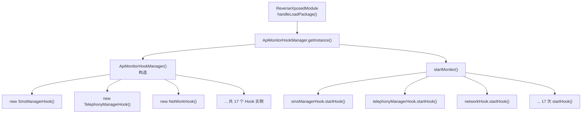

# 🎛️ ApiMonitorHookManager

> 敏感 API 监控层的**唯一入口**——单例管理器，负责在模块加载时批量实例化并启动全部 17 个（代码中实际注册）Hook 对象。

| 属性 | 值 |
|------|-----|
| 源码路径 | [ApiMonitorHookManager.java](https://github.com/android-security-engineer/ZjDroid-skills/blob/master/src/com/android/reverse/apimonitor/ApiMonitorHookManager.java) |
| 类型 | 普通类（单例） |
| 所在包 | `com.android.reverse.apimonitor` |
| 关键依赖 | 全部 17 个 `ApiMonitorHook` 子类 |

## 🎯 职责

`ApiMonitorHookManager` 是整个 API 监控子系统的**调度中枢**。它以单例模式持有所有具体 Hook 对象的引用，并通过 `startMonitor()` 方法统一触发注册。调用方（`ReverseXposedModule`）只需调用一行代码即可开启对短信、电话、网络、通讯录、账号、摄像头、录音等 17 类敏感行为的全面拦截。

## 🔍 监控的 API

本类自身不直接 Hook 任何方法，而是将职责委托给各个具体 Hook 类。

| 委托 Hook 类 | 监控目标 |
|-------------|---------|
| `SmsManagerHook` | 短信发送 / 读取 |
| `TelephonyManagerHook` | 电话号码读取 / 电话状态监听 |
| `MediaRecorderHook` | 视频/音频录制 |
| `AccountManagerHook` | 账号信息读取 |
| `ActivityManagerHook` | Activity 管理操作 |
| `AlarmManagerHook` | 闹钟/定时任务 |
| `ConnectivityManagerHook` | 网络连接状态 |
| `ContentResolverHook` | 通讯录/短信/通话记录 CRUD |
| `ContextImplHook` | 系统服务获取 |
| `PackageManagerHook` | 应用包信息查询 |
| `RuntimeHook` | Shell 命令执行 |
| `ActivityThreadHook` | 主线程 / 广播接收 |
| `AudioRecordHook` | 麦克风录音 |
| `CameraHook` | 摄像头拍照 / 预览 |
| `NetWorkHook` | HTTP 网络请求 |
| `NotificationManagerHook` | 通知发送 |
| `ProcessBuilderHook` | 进程创建 |

## 🧠 关键实现

### 单例模式

```java
private static ApiMonitorHookManager hookmger;

public static ApiMonitorHookManager getInstance(){
    if(hookmger == null)
        hookmger = new ApiMonitorHookManager();
    return hookmger;
}
```

::: warning 线程安全提示
此处为非线程安全的懒汉式单例。在 Xposed 模块的 `handleLoadPackage` 回调中调用，由于 Zygote fork 机制保证了调用时机的单线程性，实际运行中不存在竞争问题。
:::

### 构造函数：批量实例化

```java
private ApiMonitorHookManager(){
    this.smsManagerHook = new SmsManagerHook();
    this.telephonyManagerHook = new TelephonyManagerHook();
    this.mediaRecorderHook = new MediaRecorderHook();
    this.accountManagerHook = new AccountManagerHook();
    this.activityManagerHook = new ActivityManagerHook();
    this.alarmManagerHook = new AlarmManagerHook();
    this.connectivityManagerHook = new ConnectivityManagerHook();
    this.contentResolverHook = new ContentResolverHook();
    this.contextImplHook = new ContextImplHook();
    this.packageManagerHook = new PackageManagerHook();
    this.runtimeHook = new RuntimeHook();
    this.activityThreadHook = new ActivityThreadHook();
    this.audioRecordHook = new AudioRecordHook();
    this.cameraHook = new CameraHook();
    this.networkHook = new NetWorkHook();
    this.notificationManagerHook = new NotificationManagerHook();
    this.processBuilderHook = new ProcessBuilderHook();
}
```

::: info 设计说明
所有 Hook 对象在构造时仅完成实例化，**不执行任何 Hook 操作**。真正的 `XposedBridge.hookMethod()` 调用推迟到 `startMonitor()` 中进行，确保构造期间的无副作用性。
:::

### startMonitor：统一激活

```java
public void startMonitor(){
    this.smsManagerHook.startHook();
    this.telephonyManagerHook.startHook();
    // ... 共 17 次 startHook() 调用
    this.processBuilderHook.startHook();
}
```

每个 `startHook()` 内部通过 `RefInvoke.findMethodExact()` 定位目标方法，再调用 `HookHelperInterface.hookMethod()` 完成注册。整个过程在目标 App 进程加载时同步完成。

## 🔗 调用关系



## 📌 小结

`ApiMonitorHookManager` 是一个**外观模式（Facade）+ 单例**的组合体。它将复杂的多 Hook 注册逻辑隐藏在 `startMonitor()` 背后，使调用方代码极为简洁。若需新增监控目标，只需新建 `ApiMonitorHook` 子类、在构造函数中实例化、在 `startMonitor()` 中调用即可，完全符合开闭原则。

**相关文档：**
- [ApiMonitorHook](/source/apimonitor/ApiMonitorHook) — 所有 Hook 的抽象基类
- [AbstractBahaviorHookCallBack](/source/apimonitor/AbstractBahaviorHookCallBack) — 行为日志回调基类
- [ReverseXposedModule](/source/mod/ReverseXposedModule) — 模块入口，调用 `startMonitor()`
