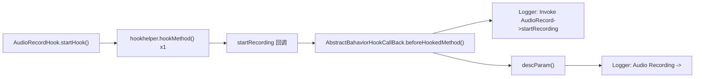

# 🎙️ AudioRecordHook

> 监控 `android.media.AudioRecord` 的**麦克风录音启动**行为——拦截 `startRecording()` 调用，检测应用是否在后台静默录制环境音。

| 属性 | 值 |
|------|-----|
| 源码路径 | [AudioRecordHook.java](https://github.com/android-security-engineer/ZjDroid-skills/blob/master/src/com/android/reverse/apimonitor/AudioRecordHook.java) |
| 类型 | 具体类（extends ApiMonitorHook） |
| 所在包 | `com.android.reverse.apimonitor` |
| 关键依赖 | `android.media.AudioRecord`、`RefInvoke`、`Logger` |

## 🎯 职责

麦克风窃听是间谍软件的高价值能力之一。`AudioRecordHook` 针对低层 PCM 录音 API `AudioRecord`（区别于高层的 `MediaRecorder`）的启动方法实施监控——一旦 `startRecording()` 被调用，即意味着麦克风已被激活并开始采集原始音频数据。

::: info AudioRecord vs MediaRecorder
| 特性 | `AudioRecord` | `MediaRecorder` |
|-----|--------------|----------------|
| 数据格式 | 原始 PCM | 编码后音频文件 |
| 灵活性 | 高（可自定义处理每帧数据）| 低（直接输出文件）|
| 间谍软件偏好 | 常见（便于实时传输 PCM 流）| 也有使用（见 MediaRecorderHook）|

`AudioRecord` 因其原始数据访问能力，更容易被用于实时音频流式传输攻击。
:::

## 🔍 监控的 API

| 被 Hook 的方法 | 记录的参数 / 行为 |
|--------------|----------------|
| `AudioRecord.startRecording()` | 触发即记录（"Audio Recording"） |

## 🧠 关键实现

### startRecording Hook

```java
Method startRecordingMethod = RefInvoke.findMethodExact(
        "android.media.AudioRecord", ClassLoader.getSystemClassLoader(),
        "startRecording");
hookhelper.hookMethod(startRecordingMethod, new AbstractBahaviorHookCallBack() {
    @Override
    public void descParam(HookParam param) {
        Logger.log_behavior("Audio Recording ->");
    }
});
```

实现极为精简：单个 Hook 点，无参数提取（`startRecording()` 本身无参数）。触发即代表麦克风已开启，配合 `AbstractBahaviorHookCallBack` 自动输出的调用头：

```
zjdroid-apimonitor D  Invoke android.media.AudioRecord->startRecording
zjdroid-apimonitor D  Audio Recording ->
```

这两行日志联合即构成完整的录音启动证据。

::: warning 监控局限性
`AudioRecordHook` 仅 Hook 了 `startRecording()`，以下行为未被覆盖：
- `AudioRecord` 构造函数（可在此获取采样率、声道数、缓冲区大小等配置）
- `read()` 方法（可获取实际 PCM 数据，但调用频率极高，Hook 此方法会严重影响性能）
- `stop()` / `release()` 方法（可计算录音时长）

在深度分析场景下，可扩展 Hook `AudioRecord` 的构造函数以获取录音参数配置。
:::

## 🔗 调用关系



## 📌 小结

`AudioRecordHook` 是监控框架中实现最简洁的类之一（源码仅 27 行），但其覆盖的威胁类型（后台麦克风窃听）却是安全分析中优先级最高的检测项之一。与 `MediaRecorderHook` 共同构成 ZjDroid 的**双层录音监控体系**，分别覆盖低层 PCM 录制和高层文件录制两种路径。

**相关文档：**
- [AbstractBahaviorHookCallBack](/source/apimonitor/AbstractBahaviorHookCallBack) — 日志回调基类
- [ApiMonitorHookManager](/source/apimonitor/ApiMonitorHookManager) — 注册调度入口
