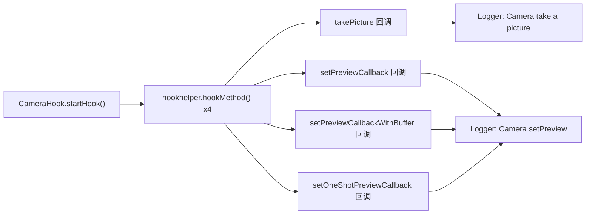

# 📷 CameraHook

> 监控 `android.hardware.Camera` 的**拍照与预览回调注册**行为——覆盖静态拍照及三种预览帧回调模式，检测应用是否在未经用户感知的情况下启用摄像头。

| 属性 | 值 |
|------|-----|
| 源码路径 | [CameraHook.java](https://github.com/android-security-engineer/ZjDroid-skills/blob/master/src/com/android/reverse/apimonitor/CameraHook.java) |
| 类型 | 具体类（extends ApiMonitorHook） |
| 所在包 | `com.android.reverse.apimonitor` |
| 关键依赖 | `android.hardware.Camera`（Camera1 API）、`RefInvoke`、`Logger` |

## 🎯 职责

间谍软件的典型特征之一是**后台静默拍照或录制预览帧**。`CameraHook` 针对旧版 Camera1 API 实施监控：

- `takePicture()` — 主动拍照行为
- `setPreviewCallback()` / `setPreviewCallbackWithBuffer()` / `setOneShotPreviewCallback()` — 三种预览帧回调注册，注册后即可连续截取摄像头画面

## 🔍 监控的 API

| 被 Hook 的方法 | 记录的参数 / 行为 |
|--------------|----------------|
| `Camera.takePicture(shutter, raw, postview, jpeg)` | 触发即记录（拍照动作） |
| `Camera.setPreviewCallback(callback)` | 触发即记录（注册持续预览帧） |
| `Camera.setPreviewCallbackWithBuffer(callback)` | 触发即记录（注册带缓冲的预览帧） |
| `Camera.setOneShotPreviewCallback(callback)` | 触发即记录（注册单次预览帧） |

## 🧠 关键实现

### takePicture Hook

```java
Method takePictureMethod = RefInvoke.findMethodExact(
        "android.hardware.Camera", ClassLoader.getSystemClassLoader(),
        "takePicture",
        ShutterCallback.class, PictureCallback.class,
        PictureCallback.class, PictureCallback.class);
hookhelper.hookMethod(takePictureMethod, new AbstractBahaviorHookCallBack() {
    @Override
    public void descParam(HookParam param) {
        Logger.log_behavior("Camera take a picture->");
    }
});
```

`takePicture` 的四参数重载对应 `(shutter, raw, postview, jpeg)` 回调，这是最完整的拍照签名。触发即表示应用正在主动拍摄静态图像。

### 三种预览回调 Hook

```java
// 持续回调——每帧都触发 onPreviewFrame()
Method setPreviewCallbackMethod = RefInvoke.findMethodExact(
        "android.hardware.Camera", ClassLoader.getSystemClassLoader(),
        "setPreviewCallback", PreviewCallback.class);

// 带缓冲的持续回调——性能优化版，每帧触发但使用预分配缓冲
Method setPreviewCallbackWithBufferMethod = RefInvoke.findMethodExact(
        "android.hardware.Camera", ClassLoader.getSystemClassLoader(),
        "setPreviewCallbackWithBuffer", PreviewCallback.class);

// 单次回调——仅触发一次 onPreviewFrame() 后自动取消
Method setOneShotPreviewCallbackMethod = RefInvoke.findMethodExact(
        "android.hardware.Camera", ClassLoader.getSystemClassLoader(),
        "setOneShotPreviewCallback", PreviewCallback.class);
```

三者均输出 `"Camera setPreview ->"` 日志，回调含义不同：

::: info 三种预览回调的区别
| 方法 | 触发频率 | 典型用途 |
|------|---------|---------|
| `setPreviewCallback` | 每帧（连续）| 实时视频流处理、人脸识别 |
| `setPreviewCallbackWithBuffer` | 每帧（连续，零 GC）| 高性能连续帧处理 |
| `setOneShotPreviewCallback` | 仅一次 | 取一帧截图后停止 |

三者都允许应用在不触发 `takePicture()` 的情况下获取摄像头画面，是后台窃拍的常见手段。
:::

## 🔗 调用关系



## 📌 小结

`CameraHook` 以 4 个 Hook 点覆盖了 Camera1 API 的全部图像获取路径。需注意它针对的是**旧版 `android.hardware.Camera` 类**——Android 5.0 引入的 Camera2（`android.hardware.camera2`）未在此覆盖。对于分析目标 App 使用 Camera2 的场景，需额外补充 Hook 点。

**相关文档：**
- [AbstractBahaviorHookCallBack](/source/apimonitor/AbstractBahaviorHookCallBack) — 日志回调基类
- [ApiMonitorHookManager](/source/apimonitor/ApiMonitorHookManager) — 注册调度入口
