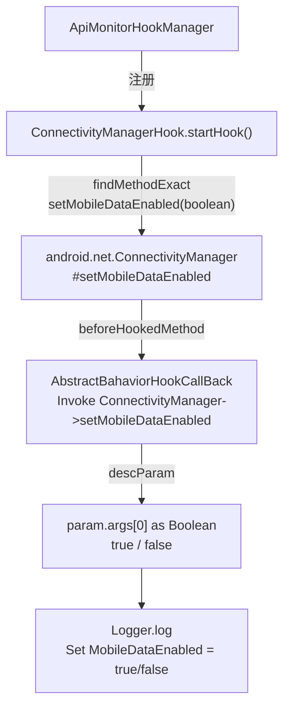

# 🌐 ConnectivityManagerHook

> 拦截 `android.net.ConnectivityManager#setMobileDataEnabled`，监控被分析 App 是否试图在运行时私自开启或关闭手机移动数据，用于检测流量劫持与网络状态篡改行为。

| 属性 | 值 |
|------|-----|
| 源码路径 | [ConnectivityManagerHook.java](https://github.com/android-security-engineer/ZjDroid-skills/blob/master/src/com/android/reverse/apimonitor/ConnectivityManagerHook.java) |
| 类型 | `class` extends `ApiMonitorHook` |
| 所在包 | `com.android.reverse.apimonitor` |
| 关键依赖 | `RefInvoke`、`AbstractBahaviorHookCallBack`、`Logger`、`android.net.ConnectivityManager` |

## 🎯 职责

`ConnectivityManagerHook` 以极简方式（单个钩子、一行核心日志）监控移动数据开关操作。它拦截 `setMobileDataEnabled(boolean)` 这一需要 `CHANGE_NETWORK_STATE` 系统权限的隐藏 API，将开启/关闭状态记录到 logcat，暴露恶意应用在用户不知情下修改网络连接的行为。

::: warning setMobileDataEnabled 是隐藏 API
`ConnectivityManager.setMobileDataEnabled(boolean)` 在 AOSP 中标注为 `@hide`，普通应用无法直接调用，但系统级 App 或通过反射可绕过此限制。ZjDroid 通过 `RefInvoke` 定位此方法后注入钩子，监控此类越权调用。
:::

## 🔍 监控的 API

| 被 Hook 的方法 | 记录的参数 / 行为 |
|---------------|----------------|
| `android.net.ConnectivityManager#setMobileDataEnabled(boolean)` | 目标状态（`true` = 开启，`false` = 关闭） |

## 🧠 关键实现

### startHook() 完整代码

```java
public void startHook() {
    Method setMobileDataEnabledmethod = RefInvoke.findMethodExact(
            "android.net.ConnectivityManager", ClassLoader.getSystemClassLoader(),
            "setMobileDataEnabled", boolean.class);
    hookhelper.hookMethod(setMobileDataEnabledmethod, new AbstractBahaviorHookCallBack() {
        @Override
        public void descParam(HookParam param) {
            boolean status = (Boolean) param.args[0];
            Logger.log("Set MobileDataEnabled = " + status);
        }
    });
}
```

**关键要点逐条解析：**

**① 使用 `boolean.class` 匹配原始类型**

`findMethodExact` 的参数类型必须与方法签名完全一致。`setMobileDataEnabled` 的参数是原始类型 `boolean`（非 `Boolean`），因此传入 `boolean.class` 而非 `Boolean.class`，避免匹配失败。

**② `param.args[0]` 拆箱为 boolean**

Xposed 框架在传递原始类型参数时会进行自动装箱，`param.args[0]` 实际类型为 `Boolean` 对象，通过 `(Boolean) param.args[0]` 强转后赋给 `boolean status` 自动完成拆箱。

**③ 使用 `Logger.log` 而非 `Logger.log_behavior`**

此处与其他 Hook 类不同，调用的是 `Logger.log(...)` 而非 `Logger.log_behavior(...)`，说明两个方法的日志级别或 tag 可能有所差异。值得关注的细节：这可能表明移动数据状态属于网络类日志，与行为类日志分开归类。

::: tip 与其他网络 Hook 的协同
`ConnectivityManagerHook` 专注于移动数据开关这一"主动修改"场景，而 `NetWorkHook`（本文档不负责）可能覆盖网络连接状态读取。两者组合可从"读"和"写"两个维度全面监控网络操作。
:::

**④ 基类输出**

[AbstractBahaviorHookCallBack](/source/apimonitor/AbstractBahaviorHookCallBack) 的 `beforeHookedMethod` 在 `descParam` 之前自动输出：

```
Invoke android.net.ConnectivityManager->setMobileDataEnabled
```

配合 `descParam` 的状态值，完整日志形如：

```
Invoke android.net.ConnectivityManager->setMobileDataEnabled
Set MobileDataEnabled = true
```

## 🔗 调用关系



## 📌 小结

`ConnectivityManagerHook` 是 ZjDroid 中实现最简洁的 Hook 类之一——仅需定位一个隐藏 API、读取单个布尔参数、打印一行日志，却能精准捕获被分析 App 私自修改移动数据连接状态的行为。在检测流量恶意操控、后台联网隐秘行为时，此类是不可缺少的网络层探针。
