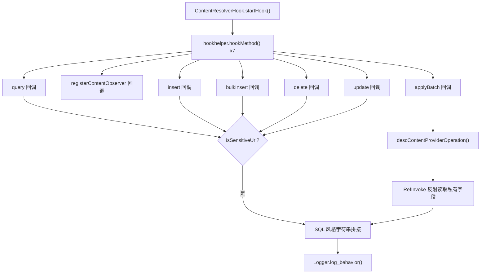

# 🗄️ ContentResolverHook

> 监控 `android.content.ContentResolver` 对**隐私 ContentProvider** 的 CRUD 操作——覆盖通讯录、短信、彩信、通话记录、浏览器书签等敏感 URI，将操作拼接为 SQL 风格日志输出。

| 属性 | 值 |
|------|-----|
| 源码路径 | [ContentResolverHook.java](https://github.com/android-security-engineer/ZjDroid-skills/blob/master/src/com/android/reverse/apimonitor/ContentResolverHook.java) |
| 类型 | 具体类（extends ApiMonitorHook） |
| 所在包 | `com.android.reverse.apimonitor` |
| 关键依赖 | `android.content.ContentResolver`、`android.content.ContentProviderOperation`、`RefInvoke`（通过反射读取私有字段）、`Logger` |

## 🎯 职责

ContentProvider 是 Android 隐私数据的核心访问层。`ContentResolverHook` 对 `ContentResolver` 的 7 个主要操作方法实施 Hook，并将操作参数**拼接为 SQL 语义字符串**（如 `select * from [content://sms] where ...`），极大降低了日志阅读门槛。监控范围由 `privacyUris` 白名单精确控制，避免日志爆炸。

## 🔍 监控的 API

| 被 Hook 的方法 | 记录的参数 / 行为 |
|--------------|----------------|
| `ContentResolver.query()` | 命中隐私 URI 时输出 SELECT SQL 字符串 |
| `ContentResolver.registerContentObserver()` | 命中隐私 URI 时记录 Observer 类名 |
| `ContentResolver.insert()` | 命中隐私 URI 时输出 INSERT SQL 字符串 |
| `ContentResolver.bulkInsert()` | 命中隐私 URI 时逐条输出 INSERT SQL |
| `ContentResolver.delete()` | 命中隐私 URI 时输出 DELETE SQL 字符串 |
| `ContentResolver.update()` | 命中隐私 URI 时输出 UPDATE SQL 字符串 |
| `ContentResolver.applyBatch()` | 逐条解码批量操作并输出对应 SQL |

## 🧠 关键实现

### 隐私 URI 过滤

```java
private static final String[] privacyUris = {
    "content://com.android.contacts",
    "content://sms",
    "content://mms-sms",
    "content://contacts/",
    "content://call_log",
    "content://browser/bookmarks"
};

private boolean isSensitiveUri(Uri uri) {
    String url = uri.toString().toLowerCase();
    for (int i = 0; i < privacyUris.length; i++) {
        if (url.startsWith(privacyUris[i])) {
            return true;
        }
    }
    return false;
}
```

所有 Hook 回调在记录日志前先通过 `isSensitiveUri()` 检查，仅对匹配 6 类隐私前缀的 URI 产生输出，避免对业务 ContentProvider 的正常访问产生干扰。

### SQL 风格日志拼接

```java
// query → SELECT SQL
private String concatenateQuery(Uri uri, String[] projection, String selection,
        String[] selectionArgs, String sortOrder) {
    StringBuilder sb = new StringBuilder("select ");
    if (projection == null) {
        sb.append("* ");
    } else {
        sb.append(concatenateStringArray(projection, ","));
    }
    sb.append(" from [" + uri.toString() + "] ");
    if (!TextUtils.isEmpty(selection)) {
        sb.append(" where ");
        // 将 ? 占位符替换为实际参数值
        if (selectionArgs != null) {
            String selectstr = selection;
            for (int i = 0; i < selectionArgs.length; i++) {
                selectstr = selectstr.replaceFirst("?", selectionArgs[i]);
            }
            sb.append(selectstr);
        }
    }
    if (!TextUtils.isEmpty(sortOrder))
        sb.append(" order by " + sortOrder);
    return sb.toString();
}
```

::: tip SQL 拼接的阅读价值
输出示例：
```
Query SQL = select _id,address,body from [content://sms/inbox]  where read=0 order by date desc
```
这比直接打印参数列表更直观，分析者无需了解 `ContentResolver.query()` 的参数语义即可理解操作意图。
:::

### applyBatch 的反射解码

```java
Method applyBatchMethod = RefInvoke.findMethodExact("android.content.ContentResolver",
        ClassLoader.getSystemClassLoader(), "applyBatch", String.class, ArrayList.class);
hookhelper.hookMethod(applyBatchMethod, new AbstractBahaviorHookCallBack() {
    @Override
    public void descParam(HookParam param) {
        ArrayList<ContentProviderOperation> opts =
                (ArrayList<ContentProviderOperation>) param.args[1];
        for (int i = 0; i < opts.size(); i++) {
            Logger.log_behavior("Batch SQL = " + descContentProviderOperation(opts.get(i)));
        }
    }
});
```

`applyBatch` 的每个操作对象 `ContentProviderOperation` 将操作类型和参数封装在私有字段中，通过 `RefInvoke.getFieldInt()` / `RefInvoke.getFieldOjbect()` 反射读取：

```java
private String descContentProviderOperation(ContentProviderOperation opt) {
    int mType = RefInvoke.getFieldInt("android.content.ContentProviderOperation", opt, "mType");
    switch (mType) {
        case TYPE_INSERT: // 1
            Uri uri = (Uri) RefInvoke.getFieldOjbect(..., "mUri");
            ContentValues cv = (ContentValues) RefInvoke.getFieldOjbect(..., "mValues");
            return concatenateInsert(uri, cv);
        case TYPE_UPDATE: // 2
            // 读取 mUri, mValues, mSelection, mSelectionArgs
            return concatenateUpdate(uri, cv, selection, selectionArgs);
        case TYPE_DELETE: // 3
            // 读取 mUri, mSelection, mSelectionArgs
            return concatenateDelete(uri, selection, selectionArgs);
    }
}
```

::: warning 反射访问私有字段
`ContentProviderOperation.mType`、`mUri`、`mValues`、`mSelection`、`mSelectionArgs` 均为私有字段，此处通过 `RefInvoke` 反射强行读取。这依赖 Android 具体版本的内部字段命名，不同版本可能存在兼容性差异。
:::

### ContentValues 键集反射读取

```java
private Set<String> getContentValuesKeySet(ContentValues cv) {
    HashMap<String, Object> mValue = (HashMap<String, Object>)
            RefInvoke.getFieldOjbect("android.content.ContentValues", cv, "mValues");
    return mValue.keySet();
}
```

`ContentValues` 没有公开 `keySet()` 方法（Android 源码中存储在私有 `HashMap mValues`），同样通过反射获取。

## 🔗 调用关系



## 📌 小结

`ContentResolverHook` 是监控框架中**代码量最大**的 Hook 类，其精髓在于三点：① 通过 `privacyUris` 白名单将监控焦点聚焦到真正的隐私数据；② 将 ContentProvider 的操作参数还原为 SQL 语义字符串，大幅提升日志可读性；③ 通过反射深入解析 `applyBatch` 的批量操作，不留监控盲区。

**相关文档：**
- [AbstractBahaviorHookCallBack](/source/apimonitor/AbstractBahaviorHookCallBack) — 日志回调基类
- [ApiMonitorHookManager](/source/apimonitor/ApiMonitorHookManager) — 注册调度入口
