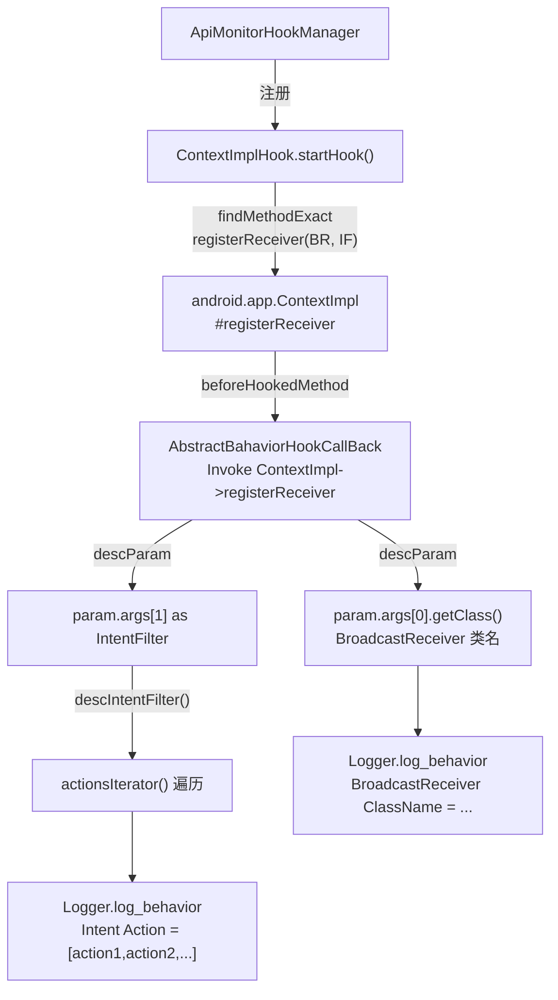

# 📡 ContextImplHook

> 拦截 `android.app.ContextImpl#registerReceiver`，监控被分析 App 动态注册广播接收器的行为，记录接收器类名及其订阅的 Intent Action 列表，用于检测隐式广播监听与隐私窃取意图。

| 属性 | 值 |
|------|-----|
| 源码路径 | [ContextImplHook.java](https://github.com/android-security-engineer/ZjDroid-skills/blob/master/src/com/android/reverse/apimonitor/ContextImplHook.java) |
| 类型 | `class` extends `ApiMonitorHook` |
| 所在包 | `com.android.reverse.apimonitor` |
| 关键依赖 | `RefInvoke`、`AbstractBahaviorHookCallBack`、`Logger`、`android.app.ContextImpl`、`android.content.IntentFilter` |

## 🎯 职责

`ContextImplHook` 专注于广播动态注册监控。它钩住 `ContextImpl.registerReceiver(BroadcastReceiver, IntentFilter)` 这一内部实现方法（而非公开的 `Context.registerReceiver`），并提供 `descIntentFilter` 辅助方法将 `IntentFilter` 中所有 Action 枚举为逗号分隔的字符串。

::: info 为什么钩 ContextImpl 而非 Context？
`Context.registerReceiver` 是抽象方法，真正的实现位于 `android.app.ContextImpl`（AOSP 内部类）。Xposed 需要 Hook 具体实现类的方法才能生效，故直接钩 `ContextImpl` 更精准。
:::

## 🔍 监控的 API

| 被 Hook 的方法 | 记录的参数 / 行为 |
|---------------|----------------|
| `android.app.ContextImpl#registerReceiver(BroadcastReceiver, IntentFilter)` | BroadcastReceiver 类名、订阅的 Intent Action 列表 |

## 🧠 关键实现

### startHook() 主体

```java
public void startHook() {
    Method registerReceivermethod = RefInvoke.findMethodExact(
            "android.app.ContextImpl", ClassLoader.getSystemClassLoader(),
            "registerReceiver", BroadcastReceiver.class, IntentFilter.class);
    hookhelper.hookMethod(registerReceivermethod, new AbstractBahaviorHookCallBack() {
        @Override
        public void descParam(HookParam param) {
            Logger.log_behavior("Register BroatcastReceiver");
            Logger.log_behavior("The BroatcastReceiver ClassName = "
                    + param.args[0].getClass().toString());
            if(param.args[1] != null) {
               String intentstr = descIntentFilter((IntentFilter) param.args[1]);
               Logger.log_behavior("Intent Action = [" + intentstr + "]");
            }
        }
    });
}
```

**关键要点逐条解析：**

**① 钩住两参数重载**

`registerReceiver` 有多个重载（带 permission、带 Handler、带 flags 等），这里精确钩住最常用的双参数版本 `(BroadcastReceiver, IntentFilter)`，覆盖大多数动态注册场景。

**② `param.args[0]` → 接收器类名**

`param.args[0]` 是传入的 `BroadcastReceiver` 实例，通过 `getClass().toString()` 获取运行时类名，直接暴露该接收器的真实实现类，哪怕是匿名内部类也能显示出来。

**③ `param.args[1]` 的 null 检查**

某些调用场景下 `IntentFilter` 可能为 null（如仅接收粘性广播），代码做了显式检查，避免 `NullPointerException`。

**④ descIntentFilter 辅助方法**

```java
public String descIntentFilter(IntentFilter intentFilter) {
    StringBuilder sb = new StringBuilder();
    Iterator<String> actions = intentFilter.actionsIterator();
    String action = null;
    while(actions.hasNext()) {
        action = actions.next();
        sb.append(action + ",");
    }
    return sb.toString();
}
```

使用 `IntentFilter.actionsIterator()` 遍历所有注册的 Action，拼接为逗号分隔字符串。典型输出示例：

```
Intent Action = [android.intent.action.BOOT_COMPLETED,android.net.conn.CONNECTIVITY_CHANGE,]
```

::: warning 尾部逗号
当前实现在末尾会多一个逗号，这是典型的 StringBuilder 追加模式的小瑕疵，不影响功能，但在生产级代码中通常会用 `sb.deleteCharAt(sb.length()-1)` 去除。
:::

**⑤ 仅监控 Action，不监控 DataType/Category**

`IntentFilter` 还可以匹配 DataType、DataScheme、Category 等条件，当前实现只遍历 Action，已足够识别大多数隐私监听行为（如监听 SMS、开机广播、网络变化等）。

## 🔗 调用关系



## 📌 小结

`ContextImplHook` 通过钩住 `ContextImpl.registerReceiver` 内部实现，精准捕获被分析 App 的每一次动态广播注册，并通过 `descIntentFilter` 辅助方法将订阅意图转化为可读字符串。它是检测开机自启、隐式监听、敏感广播窃取等行为的重要探针，与 [ActivityThreadHook](/source/apimonitor/ActivityThreadHook) 联合使用可形成广播发送+接收的完整监控链路。
