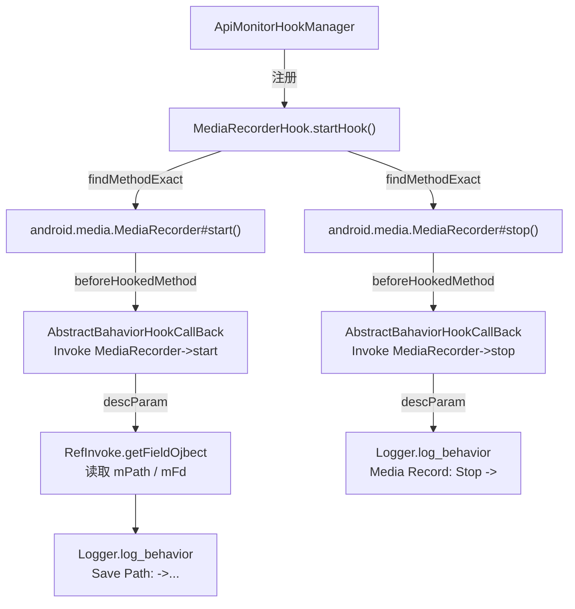

# 🎙️ MediaRecorderHook

> 监控 `android.media.MediaRecorder` 的录音/录像生命周期，捕获录制启停时刻及保存路径，用于检测应用是否在后台悄然开启麦克风或摄像头录制。

| 属性 | 值 |
|------|-----|
| 源码路径 | [MediaRecorderHook.java](https://github.com/android-security-engineer/ZjDroid-skills/blob/master/src/com/android/reverse/apimonitor/MediaRecorderHook.java) |
| 类型 | `class` extends `ApiMonitorHook` |
| 所在包 | `com.android.reverse.apimonitor` |
| 关键依赖 | `RefInvoke`、`AbstractBahaviorHookCallBack`、`Logger`、`android.media.MediaRecorder` |

## 🎯 职责

`MediaRecorderHook` 专门拦截 `MediaRecorder.start()` 与 `MediaRecorder.stop()` 两个生命周期方法。在录制开始时，通过反射读取私有字段 `mPath`（文件路径）或 `mFd`（文件描述符），将录制目的地输出到 logcat，让逆向分析师清楚地看到被分析 App 何时、向哪里保存媒体数据。

## 🔍 监控的 API

| 被 Hook 的方法 | 记录的参数 / 行为 |
|---------------|----------------|
| `android.media.MediaRecorder#start()` | 录制保存路径（`mPath`）或文件描述符（`mFd`） |
| `android.media.MediaRecorder#stop()` | 仅记录停止事件，无额外参数 |

## 🧠 关键实现

### startHook() 整体流程

```java
public void startHook() {
    Method startmethod = RefInvoke.findMethodExact(
            "android.media.MediaRecorder", ClassLoader.getSystemClassLoader(),
            "start");
    hookhelper.hookMethod(startmethod, new AbstractBahaviorHookCallBack() {
        @Override
        public void descParam(HookParam param) {
            Logger.log_behavior("Media Record: Start ->");
            String mPath = (String)RefInvoke.getFieldOjbect(
                    "android.media.MediaRecorder", param.thisObject, "mPath");
            if(mPath != null)
               Logger.log_behavior("Save Path: ->" + mPath);
            else {
                FileDescriptor mFd = (FileDescriptor) RefInvoke.getFieldOjbect(
                        "android.media.MediaRecorder", param.thisObject, "mFd");
                Logger.log_behavior("Save Path: ->" + mFd.toString());
            }
        }
    });

    Method stopmethod = RefInvoke.findMethodExact(
            "android.media.MediaRecorder", ClassLoader.getSystemClassLoader(),
            "stop");
    hookhelper.hookMethod(stopmethod, new AbstractBahaviorHookCallBack() {
        @Override
        public void descParam(HookParam param) {
            Logger.log_behavior("Media Record: Stop ->");
        }
    });
}
```

**关键要点逐条解析：**

**① 用 `RefInvoke.findMethodExact` 定位方法**

`findMethodExact` 通过类名 + 方法名精确查找，避免了直接持有 `MediaRecorder` 类引用导致的编译期依赖问题，符合 Xposed Hook 框架的惯例。

**② `start()` 钩子——双路径读取**

`MediaRecorder` 内部保存录制目标有两条路径：
- `setOutputFile(String path)` → 私有字段 `mPath`（字符串文件路径）
- `setOutputFile(FileDescriptor fd)` → 私有字段 `mFd`（文件描述符）

代码先尝试读取 `mPath`，非 null 则直接打印；为 null 时退而读取 `mFd`，确保两种情况都能被捕获。

::: tip 反射读私有字段
`RefInvoke.getFieldOjbect(className, instance, fieldName)` 是 ZjDroid 自封装的反射工具，内部通过 `getDeclaredField` + `setAccessible(true)` 实现，无需关心字段可见性。
:::

**③ `stop()` 钩子——最小记录**

`stop()` 的拦截仅打印一条停止标志，不需要额外参数，主要用于在 logcat 时序上确认录制完整结束。

**④ 基类 `beforeHookedMethod` 自动打印调用头**

每次命中，`AbstractBahaviorHookCallBack.beforeHookedMethod` 会先输出：

```
Invoke android.media.MediaRecorder->start
```

再由 `descParam` 输出路径详情，两者合力提供完整上下文。

::: warning 注意
`mPath` / `mFd` 是 AOSP 私有字段，不同 Android 版本命名可能有微小差异。如遇字段读取失败（返回 null），请核对目标 ROM 的 `MediaRecorder` 源码。
:::

## 🔗 调用关系



## 📌 小结

`MediaRecorderHook` 以最小代价（两个方法钩子）覆盖了媒体录制的完整生命周期，重点在于 `start()` 中的双路径读取逻辑——无论被分析 App 使用文件路径还是文件描述符保存录音/录像，都能被准确捕获。配合 [ApiMonitorHookManager](/source/apimonitor/ApiMonitorHookManager) 的统一调度，该类是检测偷录类隐私行为的核心探针之一。
