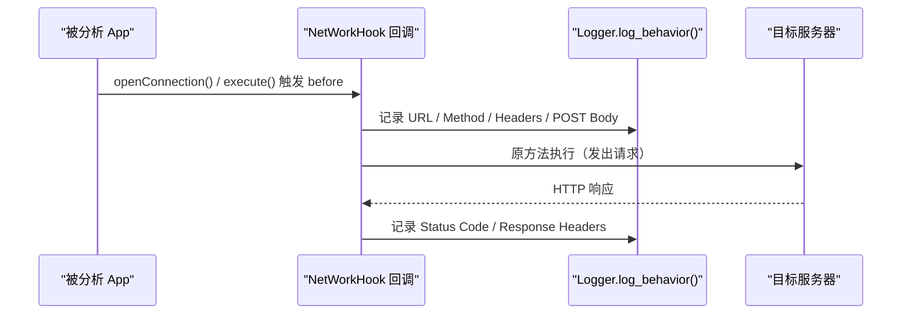

# 🌐 NetWorkHook

> 监控 App 的**全量 HTTP 网络请求**——同时覆盖 `HttpURLConnection`（`java.net.URL`）和 `Apache HttpClient` 两条通道，并在 `afterHookedMethod` 中额外捕获响应状态码与响应头。

| 属性 | 值 |
|------|-----|
| 源码路径 | [NetWorkHook.java](https://github.com/android-security-engineer/ZjDroid-skills/blob/master/src/com/android/reverse/apimonitor/NetWorkHook.java) |
| 类型 | 具体类（extends ApiMonitorHook） |
| 所在包 | `com.android.reverse.apimonitor` |
| 关键依赖 | `java.net.URL`、`org.apache.http.impl.client.AbstractHttpClient`、`RefInvoke`、`Logger` |

## 🎯 职责

网络行为是判断恶意软件 C2 通信、隐私数据外传的核心依据。`NetWorkHook` 实现了双通道覆盖：

- **通道一**：Hook `URL.openConnection()` 捕获所有基于 `HttpURLConnection` 的连接目标 URL。
- **通道二**：Hook `AbstractHttpClient.execute()` 深度解析 `HttpGet`/`HttpPost` 请求，包括 URL、请求头、POST 正文；并在 `afterHookedMethod` 中读取响应状态码和响应头。

## 🔍 监控的 API

| 被 Hook 的方法 | 记录的参数 / 行为 |
|--------------|----------------|
| `URL.openConnection()` | 连接目标 URL（`param.thisObject` 转型）  |
| `AbstractHttpClient.execute(host, request, context)` | HTTP 方法、URL、所有请求头；POST 正文（urlencoded/text）；响应状态码、响应头 |

## 🧠 关键实现

### URL.openConnection Hook

```java
Method openConnectionMethod = RefInvoke.findMethodExact(
        "java.net.URL", ClassLoader.getSystemClassLoader(), "openConnection");
hookhelper.hookMethod(openConnectionMethod, new AbstractBahaviorHookCallBack() {
    @Override
    public void descParam(HookParam param) {
        URL url = (URL) param.thisObject;
        Logger.log_behavior("Connect to URL ->");
        Logger.log_behavior("The URL = " + url.toString());
    }
});
```

`openConnection()` 是实例方法，通过 `param.thisObject` 即可获得 `URL` 对象本身，调用 `toString()` 输出完整 URL（含协议、主机、路径、查询串）。

### AbstractHttpClient.execute Hook（请求拦截）

```java
Method executeRequest = RefInvoke.findMethodExact(
        "org.apache.http.impl.client.AbstractHttpClient",
        ClassLoader.getSystemClassLoader(),
        "execute", HttpHost.class, HttpRequest.class, HttpContext.class);
hookhelper.hookMethod(executeRequest, new AbstractBahaviorHookCallBack() {
    @Override
    public void descParam(HookParam param) {
        HttpHost host = (HttpHost) param.args[0];
        HttpRequest request = (HttpRequest) param.args[1];
        if (request instanceof HttpGet) {
            HttpGet httpGet = (HttpGet) request;
            Logger.log_behavior("HTTP Method : " + httpGet.getMethod());
            Logger.log_behavior("HTTP URL : " + httpGet.getURI().toString());
            // 打印所有请求头
            Header[] headers = request.getAllHeaders();
            if (headers != null) {
                for (int i = 0; i < headers.length; i++) {
                    Logger.log_behavior(headers[i].getName() + ":" + headers[i].getName());
                }
            }
        } else if (request instanceof HttpPost) {
            HttpPost httpPost = (HttpPost) request;
            Logger.log_behavior("HTTP Method : " + httpPost.getMethod());
            Logger.log_behavior("HTTP URL : " + httpPost.getURI().toString());
            // 请求头
            // ...
            // POST 正文（根据 Content-Type 区分 urlencoded / text）
            HttpEntity entity = httpPost.getEntity();
            String contentType = entity.getContentType() != null
                    ? entity.getContentType().getValue() : null;
            if (URLEncodedUtils.CONTENT_TYPE.equals(contentType)) {
                // application/x-www-form-urlencoded
                byte[] data = new byte[(int) entity.getContentLength()];
                entity.getContent().read(data);
                Logger.log_behavior("HTTP POST Content : "
                        + new String(data, HTTP.DEFAULT_CONTENT_CHARSET));
            } else if (contentType != null && contentType.startsWith(HTTP.DEFAULT_CONTENT_TYPE)) {
                // text/* 系列，自动识别编码
                byte[] data = new byte[(int) entity.getContentLength()];
                entity.getContent().read(data);
                String charset = contentType.substring(contentType.lastIndexOf("=") + 1);
                Logger.log_behavior("HTTP POST Content : " + new String(data, charset));
            } else {
                // 其他类型，默认 ISO-8859-1
                byte[] data = new byte[(int) entity.getContentLength()];
                entity.getContent().read(data);
                Logger.log_behavior("HTTP POST Content : "
                        + new String(data, HTTP.DEFAULT_CONTENT_CHARSET));
            }
        }
    }
```

::: tip POST 正文的三路解析
源码对 POST body 的 `Content-Type` 进行了三路分支处理：
1. `application/x-www-form-urlencoded` → 默认字符集解码
2. `text/*`（含 `text/plain; charset=UTF-8` 等）→ 从 Content-Type 尾部截取 charset 解码
3. 其他 → 兜底用默认字符集

这确保了无论表单提交还是 JSON/XML 文本 POST，正文都能以可读字符串形式记录。
:::

::: warning GET 请求头 Bug
注意源码第 55-56 行：
```java
Logger.log_behavior(headers[i].getName() + ":" + headers[i].getName());
```
打印 GET 请求头时 `getValue()` 误写为了第二个 `getName()`，导致请求头**值**部分也显示为名称字符串。POST 请求头处已修正为 `getValue()`。
:::

### afterHookedMethod：响应拦截

```java
@Override
public void afterHookedMethod(HookParam param) {
    super.afterHookedMethod(param);
    HttpResponse resp = (HttpResponse) param.getResult();
    if (resp != null) {
        Logger.log_behavior("Status Code = " + resp.getStatusLine().getStatusCode());
        Header[] headers = resp.getAllHeaders();
        if (headers != null) {
            for (int i = 0; i < headers.length; i++) {
                Logger.log_behavior(headers[i].getName() + ":" + headers[i].getValue());
            }
        }
    }
}
```

`NetWorkHook` 是所有 Hook 回调中**唯一覆写了 `afterHookedMethod`** 的类。通过 `param.getResult()` 获取原方法的返回值（`HttpResponse` 对象），提取响应状态码和全部响应头，实现**完整的请求-响应日志**。

## 🔗 调用关系



## 📌 小结

`NetWorkHook` 是监控框架中实现最复杂的 Hook 类，覆盖了 Android 应用最常用的两种 HTTP 客户端，并通过 `before` + `after` 双阶段拦截实现了完整的请求/响应日志。源码中存在两处可以关注的细节：GET 请求头值的 `getName()` 误用，以及 `AbstractHttpClient` 的 `execute(HttpHost, HttpRequest, HttpContext)` 三参数重载选择——确保覆盖了最通用的调用形式。

**相关文档：**
- [AbstractBahaviorHookCallBack](/source/apimonitor/AbstractBahaviorHookCallBack) — 日志回调基类
- [ApiMonitorHookManager](/source/apimonitor/ApiMonitorHookManager) — 注册调度入口
