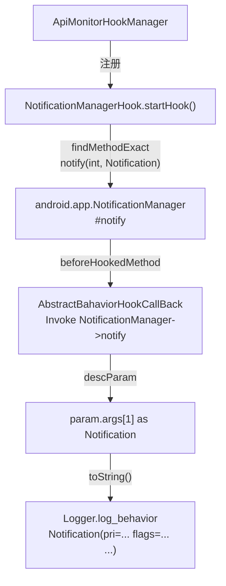

# 🔔 NotificationManagerHook

> 拦截 `android.app.NotificationManager#notify`，在通知弹出前记录完整的 `Notification` 对象信息，用于检测被分析 App 是否在后台静默弹通知或发送伪装通知。

| 属性 | 值 |
|------|-----|
| 源码路径 | [NotificationManagerHook.java](https://github.com/android-security-engineer/ZjDroid-skills/blob/master/src/com/android/reverse/apimonitor/NotificationManagerHook.java) |
| 类型 | `class` extends `ApiMonitorHook` |
| 所在包 | `com.android.reverse.apimonitor` |
| 关键依赖 | `RefInvoke`、`AbstractBahaviorHookCallBack`、`Logger`、`android.app.NotificationManager`、`android.app.Notification` |

## 🎯 职责

`NotificationManagerHook` 以最简洁的实现（一个钩子、三行日志）监控所有通过 `NotificationManager.notify(int, Notification)` 发出的系统通知，直接调用 `Notification.toString()` 将通知对象的完整状态序列化后写入 logcat，让分析师快速掌握通知内容与属性。

## 🔍 监控的 API

| 被 Hook 的方法 | 记录的参数 / 行为 |
|---------------|----------------|
| `android.app.NotificationManager#notify(int, Notification)` | 通知 ID（`param.args[0]`）及 `Notification.toString()` 完整转储 |

## 🧠 关键实现

### startHook() 完整代码

```java
public void startHook() {
    Method notifyMethod = RefInvoke.findMethodExact(
            "android.app.NotificationManager",
            ClassLoader.getSystemClassLoader(),
            "notify", int.class, Notification.class);
    hookhelper.hookMethod(notifyMethod, new AbstractBahaviorHookCallBack() {
        @Override
        public void descParam(HookParam param) {
            Notification notification = (Notification) param.args[1];
            Logger.log_behavior("Send Notification ->");
            Logger.log_behavior(notification.toString());
        }
    });
}
```

**关键要点逐条解析：**

**① 两参数重载精确匹配**

`NotificationManager.notify` 有两个常见重载：
- `notify(int id, Notification notification)` ← 本类钩住此版本
- `notify(String tag, int id, Notification notification)` ← 带 tag 版本未覆盖

两参数版本是最常用的入口，覆盖了绝大多数通知发送场景。

**② 直接用 `notification.toString()`**

`Notification.toString()` 由 Android 框架实现，会输出包含 icon、tickerText、when、flags、contentView 等核心字段的完整文本，例如：

```
Notification(pri=0 contentView=com.example.app/0x7f0a0001 vibrate=null sound=null tick)
```

这种方式不需要手动枚举字段，简洁且覆盖面广，适合快速扫描通知属性。

::: info 通知 ID 未打印
注意：`param.args[0]` 是通知 ID（int 类型），当前实现未单独打印此 ID，仅打印 `Notification` 对象本身。如需追踪特定 ID 的通知更新/取消操作，可补充 `Logger.log_behavior("Notification ID = " + param.args[0])`。
:::

**③ 在 `beforeHookedMethod` 阶段拦截**

基类 [AbstractBahaviorHookCallBack](/source/apimonitor/AbstractBahaviorHookCallBack) 的 `beforeHookedMethod` 在方法执行前触发，因此本钩子在通知实际发送给系统之前就记录了所有信息，即使后续操作失败也不影响日志完整性。

::: warning 注意
Android 8.0（API 26）引入了 `NotificationChannel`，通知发送路径有所变化，但 `notify(int, Notification)` 入口方法保持不变，本 Hook 仍然有效。
:::

## 🔗 调用关系



## 📌 小结

`NotificationManagerHook` 是 ZjDroid API 监控模块中实现最精简的探针之一——单个钩子、直接 `toString()` 输出，却能有效暴露 App 的通知发送行为。对于分析推送欺诈、诱导点击等恶意通知行为，此类是第一道信息采集屏障。
