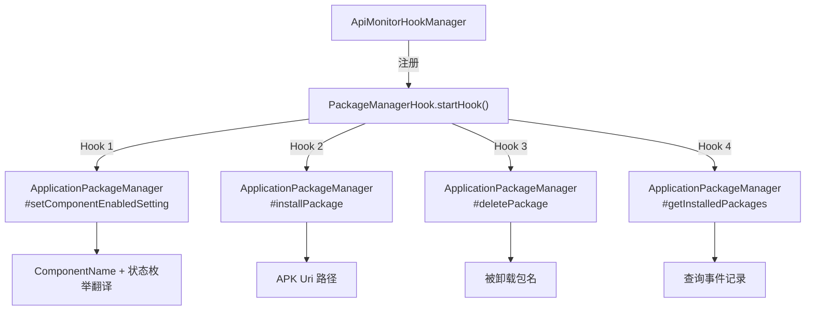

# 📦 PackageManagerHook

> 拦截 `ApplicationPackageManager` 的组件启停、静默安装/卸载、查询已安装应用四类操作，全面监控被分析 App 对包管理器的滥用行为，是检测插件化加载、静默推广、恶意持久化的关键探针。

| 属性 | 值 |
|------|-----|
| 源码路径 | [PackageManagerHook.java](https://github.com/android-security-engineer/ZjDroid-skills/blob/master/src/com/android/reverse/apimonitor/PackageManagerHook.java) |
| 类型 | `class` extends `ApiMonitorHook` |
| 所在包 | `com.android.reverse.apimonitor` |
| 关键依赖 | `RefInvoke`、`AbstractBahaviorHookCallBack`、`Logger`、`android.app.ApplicationPackageManager`、`android.content.pm.PackageManager` |

## 🎯 职责

`PackageManagerHook` 在 `startHook()` 中注册四个钩子，覆盖包管理器的核心操作场景：
1. **组件启停**：`setComponentEnabledSetting` — 动态启用/禁用 Activity、Service、Receiver 等组件
2. **静默安装**：`installPackage` — 无用户感知地安装 APK
3. **静默卸载**：`deletePackage` — 无用户感知地卸载应用
4. **枚举应用**：`getInstalledPackages` — 查询设备上所有已安装包

## 🔍 监控的 API

| 被 Hook 的方法 | 记录的参数 / 行为 |
|---------------|----------------|
| `ApplicationPackageManager#setComponentEnabledSetting(ComponentName, int, int)` | 组件包名/类名、新启用状态（枚举值翻译） |
| `ApplicationPackageManager#installPackage(Uri, IPackageInstallObserver, int, String)` | APK 的 Uri 路径 |
| `ApplicationPackageManager#deletePackage(String, IPackageDeleteObserver, int)` | 目标应用包名 |
| `ApplicationPackageManager#getInstalledPackages(int, int)` | 仅记录调用事件（无参数详情） |

## 🧠 关键实现

### 1. 组件启停监控

```java
Method setComponentEnableSettingmethod = RefInvoke.findMethodExact(
        "android.app.ApplicationPackageManager",
        ClassLoader.getSystemClassLoader(),
        "setComponentEnabledSetting",
        ComponentName.class, int.class, int.class);
hookhelper.hookMethod(setComponentEnableSettingmethod, new AbstractBahaviorHookCallBack() {
    @Override
    public void descParam(HookParam param) {
        ComponentName cn = (ComponentName) param.args[0];
        int newState = (Integer) param.args[1];
        Logger.log_behavior("Set ComponentEnabled ->");
        Logger.log_behavior("The Component ClassName: "
                + cn.getPackageName() + "/" + cn.getClassName());
        if (newState == PackageManager.COMPONENT_ENABLED_STATE_DISABLED)
            Logger.log_behavior("Component New State = COMPONENT_ENABLED_STATE_DISABLED");
        if (newState == PackageManager.COMPONENT_ENABLED_STATE_ENABLED)
            Logger.log_behavior("Component New State = COMPONENT_ENABLED_STATE_ENABLED");
        if (newState == PackageManager.COMPONENT_ENABLED_STATE_DISABLED_USER)
            Logger.log_behavior("Component New State = COMPONENT_ENABLED_STATE_DISABLED_USER");
        if (newState == PackageManager.COMPONENT_ENABLED_STATE_DEFAULT)
            Logger.log_behavior("Component New State = COMPONENT_ENABLED_STATE_DEFAULT");
    }
});
```

**要点：** `newState` 是 `PackageManager` 定义的四个枚举常量之一，代码用多个 if 分支将整数值翻译为可读字符串，方便分析师直接理解操作意图（而非面对魔法数字）。注意使用多 if 而非 if-else，逻辑上只有一个分支能匹配，但代码可读性略低于 switch。

### 2. 静默安装监控

```java
installPackagemethod = RefInvoke.findMethodExact(
        "android.app.ApplicationPackageManager",
        ClassLoader.getSystemClassLoader(),
        "installPackage",
        Uri.class,
        Class.forName("android.content.pm.IPackageInstallObserver"),
        int.class, String.class);
hookhelper.hookMethod(installPackagemethod, new AbstractBahaviorHookCallBack() {
    @Override
    public void descParam(HookParam param) {
        Uri uri = (Uri) param.args[0];
        Logger.log_behavior("Slient Install APK ->");
        Logger.log_behavior("The APK URL = " + uri.toString());
    }
});
```

**要点：** `IPackageInstallObserver` 是内部 AIDL 接口，无法在编译期直接引用，因此使用 `Class.forName(...)` 动态加载，并包裹在 try-catch 中处理 `ClassNotFoundException`。APK 来源 Uri 被完整打印，可暴露静默下载安装的 APK 路径或 URL。

### 3. 静默卸载监控

```java
deletePackagemethod = RefInvoke.findMethodExact(
        "android.app.ApplicationPackageManager",
        ClassLoader.getSystemClassLoader(),
        "deletePackage",
        String.class,
        Class.forName("android.content.pm.IPackageDeleteObserver"),
        int.class);
hookhelper.hookMethod(deletePackagemethod, new AbstractBahaviorHookCallBack() {
    @Override
    public void descParam(HookParam param) {
        String packagename = (String) param.args[0];
        Logger.log_behavior("Slient UnInstall APK ->");
        Logger.log_behavior("The APK PackageName = " + packagename);
    }
});
```

**要点：** 同样通过 `Class.forName` 处理 `IPackageDeleteObserver` 内部接口。记录被卸载的包名，用于检测恶意应用清除竞争对手或删除安全软件的行为。

### 4. 应用枚举监控

```java
Method getInstalledPackagesMethod = RefInvoke.findMethodExact(
        "android.app.ApplicationPackageManager",
        ClassLoader.getSystemClassLoader(),
        "getInstalledPackages", int.class, int.class);
hookhelper.hookMethod(getInstalledPackagesMethod, new AbstractBahaviorHookCallBack() {
    @Override
    public void descParam(HookParam param) {
        Logger.log_behavior("Query Installed Apps ->");
    }
});
```

**要点：** 此钩子仅记录调用事件，不打印参数。两个 int 参数分别是 `flags`（过滤条件）和 `userId`，对于检测"App 是否在扫描已安装应用"这个行为而言，调用事件本身就足够有意义。

::: info 注意日志中的拼写
源码中使用了 `"Slient Install APK"` 和 `"Slient UnInstall APK"`（`Silent` 拼写有误），文档引用原文以保持与 logcat 输出一致。
:::

## 🔗 调用关系



## 📌 小结

`PackageManagerHook` 是本批次中 Hook 点最多（4 个）、覆盖面最广的类。它通过钩住 `ApplicationPackageManager` 的内部实现（而非公开 `PackageManager` 接口），绕过访问限制，全面监控组件管理、静默安装卸载和应用枚举四类高风险操作。配合 [ActivityManagerHook](/source/apimonitor/ActivityManagerHook) 的进程管理监控，可构建完整的系统级权限滥用检测体系。
