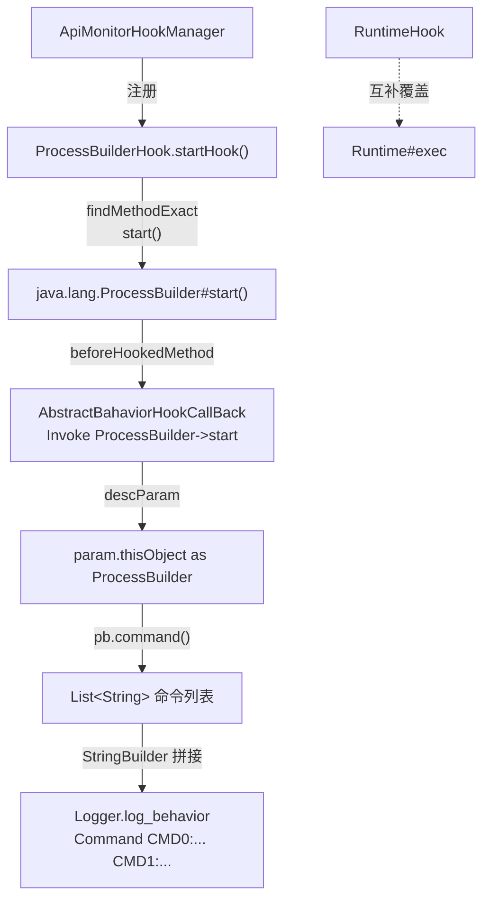

# 🔨 ProcessBuilderHook

> 拦截 `java.lang.ProcessBuilder#start()` 以监控通过 `ProcessBuilder` API 启动子进程的行为，与 `RuntimeHook` 互补，共同覆盖 Java 层进程创建的两条主要路径。

| 属性 | 值 |
|------|-----|
| 源码路径 | [ProcessBuilderHook.java](https://github.com/android-security-engineer/ZjDroid-skills/blob/master/src/com/android/reverse/apimonitor/ProcessBuilderHook.java) |
| 类型 | `class` extends `ApiMonitorHook` |
| 所在包 | `com.android.reverse.apimonitor` |
| 关键依赖 | `RefInvoke`、`AbstractBahaviorHookCallBack`、`Logger`、`java.lang.ProcessBuilder` |

## 🎯 职责

`ProcessBuilderHook` 钩住 `ProcessBuilder.start()`，在进程真正启动之前，通过 `param.thisObject` 获取 `ProcessBuilder` 实例并调用其公开 API `command()` 读取命令列表，将所有参数拼接为可读字符串后写入 logcat。

::: info 与 RuntimeHook 的分工
[RuntimeHook](/source/apimonitor/RuntimeHook) 覆盖 `Runtime.exec` 调用路径；`ProcessBuilderHook` 覆盖 `ProcessBuilder.start` 调用路径。两者形成互补。某些 App 或三方库偏好使用 `ProcessBuilder` 的流式 API，此时 `RuntimeHook` 无法命中，需要本类补位。
:::

## 🔍 监控的 API

| 被 Hook 的方法 | 记录的参数 / 行为 |
|---------------|----------------|
| `java.lang.ProcessBuilder#start()` | 完整命令列表（`pb.command()` 逐元素拼接后打印） |

## 🧠 关键实现

### startHook() 完整代码

```java
public void startHook() {
    Method execmethod = RefInvoke.findMethodExact(
            "java.lang.ProcessBuilder", ClassLoader.getSystemClassLoader(),
            "start");
    hookhelper.hookMethod(execmethod, new AbstractBahaviorHookCallBack() {
        @Override
        public void descParam(HookParam param) {
            Logger.log_behavior("Create New Process ->");
            ProcessBuilder pb = (ProcessBuilder) param.thisObject;
            List<String> cmds = pb.command();
            StringBuilder sb = new StringBuilder();
            for(int i = 0; i < cmds.size(); i++) {
               sb.append("CMD" + i + ":" + cmds.get(i) + " ");
            }
            Logger.log_behavior("Command" + sb.toString());
        }
    });
}
```

**关键要点逐条解析：**

**① `param.thisObject` 获取 `ProcessBuilder` 实例**

`start()` 是实例方法，`param.thisObject` 即该 `ProcessBuilder` 对象本身。与 `RuntimeHook` 读取 `param.args[0]` 不同，这里直接用 Java 公开 API `pb.command()` 获取命令列表，无需反射读私有字段，更简洁也更稳定。

**② 拼接方式**

命令列表被格式化为：

```
Command CMD0:/system/bin/sh  CMD1:-c  CMD2:id
```

每个元素带有 `CMD{i}:` 前缀，使用空格分隔，一行打印，便于 logcat 过滤时快速定位。

**③ 无参数 `start()`**

`ProcessBuilder.start()` 没有形参，所有信息均通过对象本身的 `command()` 获取。这意味着无论调用者在创建 `ProcessBuilder` 时如何拼装命令（构造函数 / `command(List)` / `command(String...)` 多次设置），最终都以 `start()` 时刻 `pb.command()` 的快照为准。

::: tip 小技巧
`ProcessBuilder` 还支持 `redirectErrorStream`、`environment`、`directory` 等属性，如需更完整的分析，可在 `descParam` 中追加读取这些属性并打印。当前实现专注命令本身，保持了日志简洁性。
:::

**④ 日志 tag**

[AbstractBahaviorHookCallBack](/source/apimonitor/AbstractBahaviorHookCallBack) 的 `beforeHookedMethod` 首先输出：

```
Invoke java.lang.ProcessBuilder->start
```

随后 `descParam` 输出拼接后的命令字符串。

## 🔗 调用关系



## 📌 小结

`ProcessBuilderHook` 通过钩住 `ProcessBuilder.start()` 并利用 `param.thisObject` 直接调用公开 API 读取命令列表，以优雅的方式记录了被分析 App 所有基于 `ProcessBuilder` 的子进程创建行为。与 [RuntimeHook](/source/apimonitor/RuntimeHook) 配合，构成 ZjDroid 进程监控的完整防线。
