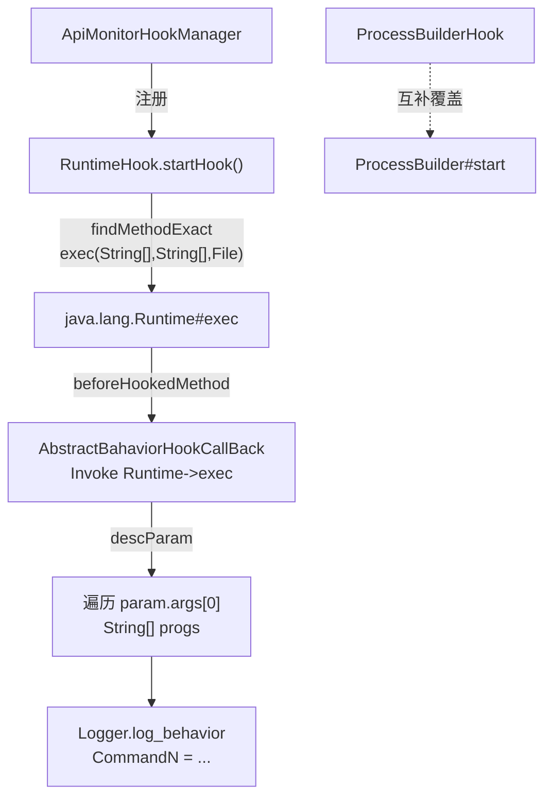

# ⚙️ RuntimeHook

> 拦截 `java.lang.Runtime#exec(String[], String[], File)` 以监控被分析 App 通过 Java 标准运行时直接启动子进程的行为，是检测 Shell 命令执行、提权操作的关键探针。

| 属性 | 值 |
|------|-----|
| 源码路径 | [RuntimeHook.java](https://github.com/android-security-engineer/ZjDroid-skills/blob/master/src/com/android/reverse/apimonitor/RuntimeHook.java) |
| 类型 | `class` extends `ApiMonitorHook` |
| 所在包 | `com.android.reverse.apimonitor` |
| 关键依赖 | `RefInvoke`、`AbstractBahaviorHookCallBack`、`Logger`、`java.lang.Runtime` |

## 🎯 职责

`RuntimeHook` 钩住 `Runtime.exec` 的三参数重载（命令数组、环境变量数组、工作目录），遍历并逐条打印命令行参数，从而揭露被分析 App 试图执行的系统命令（如 `su`、`chmod`、`pm install` 等）。

::: info 与 ProcessBuilderHook 的分工
`RuntimeHook` 覆盖 `Runtime.exec` 调用路径，[ProcessBuilderHook](/source/apimonitor/ProcessBuilderHook) 覆盖 `ProcessBuilder.start` 调用路径，两者形成互补，共同封堵进程创建的两条主要 Java API 路径。
:::

## 🔍 监控的 API

| 被 Hook 的方法 | 记录的参数 / 行为 |
|---------------|----------------|
| `java.lang.Runtime#exec(String[], String[], File)` | 完整命令行参数数组（逐元素打印） |

## 🧠 关键实现

### startHook() 完整代码

```java
public void startHook() {
    Method execmethod = RefInvoke.findMethodExact(
            "java.lang.Runtime", ClassLoader.getSystemClassLoader(),
            "exec", String[].class, String[].class, File.class);
    hookhelper.hookMethod(execmethod, new AbstractBahaviorHookCallBack() {
        @Override
        public void descParam(HookParam param) {
            Logger.log_behavior("Create New Process ->");
            String[] progs = (String[]) param.args[0];
            for(int i = 0; i < progs.length; i++) {
               Logger.log_behavior("Command" + i + " = " + progs[i]);
            }
        }
    });
}
```

**关键要点逐条解析：**

**① 精确匹配三参数重载**

`Runtime.exec` 有多个重载，这里选择的签名是 `exec(String[] cmdarray, String[] envp, File dir)`。此重载是 Android 应用执行带环境变量及工作目录的命令时必经的路径，覆盖面最广。

```
String[].class   // 第 0 个参数：命令及参数数组
String[].class   // 第 1 个参数：环境变量数组
File.class       // 第 2 个参数：工作目录
```

**② `param.args[0]` 是命令数组**

`exec(String[] cmdarray, ...)` 中 `cmdarray[0]` 是可执行程序，`cmdarray[1...]` 是参数。钩子逐一打印每个元素，输出形如：

```
Command0 = su
Command1 = -c
Command2 = id
```

**③ 省略环境变量与工作目录**

当前实现只记录命令数组（`param.args[0]`），环境变量（`param.args[1]`）和工作目录（`param.args[2]`）未打印。这是一个权衡：大多数恶意行为识别只需命令本身，冗余信息反而会干扰 logcat 阅读。

::: warning 注意
`Runtime.exec(String command)` 单字符串重载是另一条调用链，内部最终也会走到 `exec(String[], String[], File)`，因此本 Hook 理论上可以覆盖所有路径。但若目标 ROM 做了修改，建议同时关注该单参数重载。
:::

**④ 日志 tag**

通过 [AbstractBahaviorHookCallBack](/source/apimonitor/AbstractBahaviorHookCallBack) 的 `beforeHookedMethod`，命中时首先输出：

```
Invoke java.lang.Runtime->exec
```

随后 `descParam` 输出逐条命令参数。

## 🔗 调用关系



## 📌 小结

`RuntimeHook` 以单个钩子精准拦截 `Runtime.exec` 的三参数重载，通过逐元素遍历命令数组，将被分析 App 的子进程创建意图完整暴露。与 [ProcessBuilderHook](/source/apimonitor/ProcessBuilderHook) 联合使用，可覆盖 Android 上 Java 层进程创建的主流路径。
