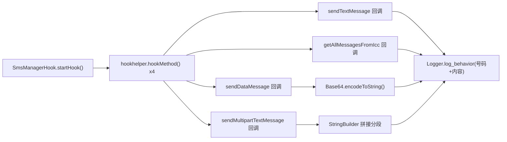

# 📱 SmsManagerHook

> 监控 `android.telephony.SmsManager` 的**短信发送与读取**行为，覆盖普通文本、数据短信、长短信三种发送方式及 SIM 卡短信读取。

| 属性 | 值 |
|------|-----|
| 源码路径 | [SmsManagerHook.java](https://github.com/android-security-engineer/ZjDroid-skills/blob/master/src/com/android/reverse/apimonitor/SmsManagerHook.java) |
| 类型 | 具体类（extends ApiMonitorHook） |
| 所在包 | `com.android.reverse.apimonitor` |
| 关键依赖 | `android.telephony.SmsManager`、`android.util.Base64`、`RefInvoke`、`Logger` |

## 🎯 职责

短信是移动端最常见的隐私泄露渠道之一（验证码拦截、静默扣费短信）。`SmsManagerHook` 对 `SmsManager` 的全部发送路径实施拦截，记录**目标号码、短信内容（或 Base64 编码内容）**，同时监控对 SIM 卡存储短信的读取行为。

## 🔍 监控的 API

| 被 Hook 的方法 | 记录的参数 / 行为 |
|--------------|----------------|
| `SmsManager.sendTextMessage()` | 目标号码（args[0]）、文本内容（args[2]） |
| `SmsManager.getAllMessagesFromIcc()` | 触发即记录（无参数可提取） |
| `SmsManager.sendDataMessage()` | 目标号码（args[0]）、端口（args[2]）、内容 Base64（args[3]） |
| `SmsManager.sendMultipartTextMessage()` | 目标号码（args[0]）、拼接后完整内容（args[2]） |

## 🧠 关键实现

### sendTextMessage Hook

```java
Method sendTextMessagemethod = RefInvoke.findMethodExact(
        "android.telephony.SmsManager", ClassLoader.getSystemClassLoader(),
        "sendTextMessage",
        String.class, String.class, String.class,
        PendingIntent.class, PendingIntent.class);
hookhelper.hookMethod(sendTextMessagemethod, new AbstractBahaviorHookCallBack() {
    @Override
    public void descParam(HookParam param) {
        Logger.log_behavior("Send SMS ->");
        String dstNumber = (String) param.args[0];
        String content = (String) param.args[2];
        Logger.log_behavior("SMS DestNumber:" + dstNumber);
        Logger.log_behavior("SMS Content:" + content);
    }
});
```

`sendTextMessage` 签名为 `(destinationAddress, scAddress, text, sentIntent, deliveryIntent)`，因此：
- `args[0]` = 目标号码
- `args[2]` = 短信正文（`args[1]` 是短信中心号码，通常为 null）

### sendDataMessage Hook（二进制数据短信）

```java
Method sendDataMessagemethod = RefInvoke.findMethodExact(
        "android.telephony.SmsManager", ClassLoader.getSystemClassLoader(),
        "sendDataMessage",
        String.class, String.class, short.class,
        byte[].class, PendingIntent.class, PendingIntent.class);
hookhelper.hookMethod(sendDataMessagemethod, new AbstractBahaviorHookCallBack() {
    @Override
    public void descParam(HookParam param) {
        Logger.log_behavior("Send Data SMS ->");
        String dstNumber = (String) param.args[0];
        short port = (Short) param.args[2];
        String content = Base64.encodeToString((byte[]) param.args[3], 0);
        Logger.log_behavior("SMS DestNumber:" + dstNumber);
        Logger.log_behavior("SMS destinationPort:" + port);
        Logger.log_behavior("SMS Base64 Content:" + content);
    }
});
```

::: tip 二进制短信的威胁
`sendDataMessage` 用于发送**端口寻址的二进制短信**，常被恶意软件用于向特定端口（如 WAP Push、OTA 配置端口）发送隐蔽指令。ZjDroid 将 `byte[]` 内容通过 `Base64.encodeToString()` 转换为可打印字符串记录，避免乱码。
:::

### sendMultipartTextMessage Hook（长短信）

```java
Method sendMultipartTextMessagemethod = RefInvoke.findMethodExact(
        "android.telephony.SmsManager", ClassLoader.getSystemClassLoader(),
        "sendMultipartTextMessage",
        String.class, String.class,
        ArrayList.class, ArrayList.class, ArrayList.class);
hookhelper.hookMethod(sendMultipartTextMessagemethod, new AbstractBahaviorHookCallBack() {
    @Override
    public void descParam(HookParam param) {
        Logger.log_behavior("Send Multipart SMS ->");
        String dstNumber = (String) param.args[0];
        ArrayList<String> sms = (ArrayList<String>) param.args[2];
        StringBuilder sb = new StringBuilder();
        for (int i = 0; i < sms.size(); i++) {
            sb.append(sms.get(i));
        }
        Logger.log_behavior("SMS DestNumber:" + dstNumber);
        Logger.log_behavior("SMS Content:" + sb.toString());
    }
});
```

长短信被系统拆分为多个分段（`ArrayList<String>`），此处通过遍历 `args[2]` 并拼接 `StringBuilder` 还原完整内容。

### getAllMessagesFromIcc Hook（SIM 卡短信读取）

```java
Method getAllMessagesFromIccmethod = RefInvoke.findMethodExact(
        "android.telephony.SmsManager", ClassLoader.getSystemClassLoader(),
        "getAllMessagesFromIcc");
hookhelper.hookMethod(getAllMessagesFromIccmethod, new AbstractBahaviorHookCallBack() {
    @Override
    public void descParam(HookParam param) {
        Logger.log_behavior("Read SMS From Icc ->");
    }
});
```

`getAllMessagesFromIcc()` 无参数，仅记录触发行为本身。该方法被调用即意味着应用正在读取 SIM 卡上存储的短信（而非手机内存短信）。

## 🔗 调用关系



## 📌 小结

`SmsManagerHook` 以 4 个 Hook 点覆盖了 `SmsManager` 的完整公开发送接口，是检测**短信木马、吸费软件、验证码拦截**的核心组件。其中对二进制短信的 Base64 编码处理和对长短信的分段拼接还原，体现了对实际攻击场景的针对性设计。

**相关文档：**
- [AbstractBahaviorHookCallBack](/source/apimonitor/AbstractBahaviorHookCallBack) — 日志回调基类
- [ApiMonitorHookManager](/source/apimonitor/ApiMonitorHookManager) — 注册调度入口
