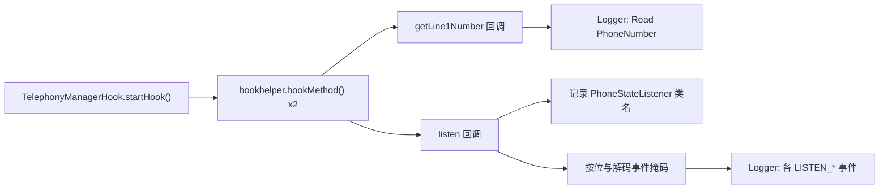

# 📞 TelephonyManagerHook

> 监控 `android.telephony.TelephonyManager` 的**本机号码读取**与**电话状态订阅**行为，捕获应用对通话状态、信号、基站位置等敏感信息的监听意图。

| 属性 | 值 |
|------|-----|
| 源码路径 | [TelephonyManagerHook.java](https://github.com/android-security-engineer/ZjDroid-skills/blob/master/src/com/android/reverse/apimonitor/TelephonyManagerHook.java) |
| 类型 | 具体类（extends ApiMonitorHook） |
| 所在包 | `com.android.reverse.apimonitor` |
| 关键依赖 | `android.telephony.TelephonyManager`、`android.telephony.PhoneStateListener`、`RefInvoke`、`Logger` |

## 🎯 职责

`TelephonyManagerHook` 专注于两类行为：

1. **设备识别**：拦截 `getLine1Number()` 的调用，任何试图获取本机号码的行为都会被记录。
2. **状态窃听**：拦截 `listen()` 的调用，解码注册的监听事件掩码，输出应用实际关注的电话状态类型（通话状态、基站位置、信号强度等），为判断是否存在通话监控行为提供依据。

## 🔍 监控的 API

| 被 Hook 的方法 | 记录的参数 / 行为 |
|--------------|----------------|
| `TelephonyManager.getLine1Number()` | 触发即记录（"Read PhoneNumber"） |
| `TelephonyManager.listen(listener, events)` | `PhoneStateListener` 类名 + 解码后的事件类型 |

## 🧠 关键实现

### getLine1Number Hook

```java
Method getLine1Numbermethod = RefInvoke.findMethodExact(
        "android.telephony.TelephonyManager", ClassLoader.getSystemClassLoader(),
        "getLine1Number");
hookhelper.hookMethod(getLine1Numbermethod, new AbstractBahaviorHookCallBack() {
    @Override
    public void descParam(HookParam param) {
        Logger.log_behavior("Read PhoneNumber ->");
    }
});
```

`getLine1Number()` 是获取本机 SIM 卡号码的标准 API，调用此方法需要 `READ_PHONE_STATE` 权限。触发即说明应用正在读取 MSISDN，日志仅记录触发行为（返回值在 `afterHookedMethod` 中可获取但此处未提取）。

### listen Hook（电话状态订阅解码）

```java
Method listenMethod = RefInvoke.findMethodExact(
        "android.telephony.TelephonyManager", ClassLoader.getSystemClassLoader(),
        "listen", PhoneStateListener.class, int.class);
hookhelper.hookMethod(listenMethod, new AbstractBahaviorHookCallBack() {
    @Override
    public void descParam(HookParam param) {
        Logger.log_behavior("Listen Telephone State Change ->");
        Logger.log_behavior("PhoneStateListener ClassName = "
                + param.args[0].getClass().getName());
        int event = (Integer) param.args[1];
        if ((event & PhoneStateListener.LISTEN_CELL_LOCATION) != 0) {
            Logger.log_behavior("Listen Enent = " + "LISTEN_CELL_LOCATION");
        }
        if ((event & PhoneStateListener.LISTEN_SIGNAL_STRENGTHS) != 0) {
            Logger.log_behavior("Listen Enent = " + "LISTEN_SIGNAL_STRENGTHS");
        }
        if ((event & PhoneStateListener.LISTEN_CALL_STATE) != 0) {
            Logger.log_behavior("Listen Enent = " + "LISTEN_CALL_STATE");
        }
        if ((event & PhoneStateListener.LISTEN_DATA_CONNECTION_STATE) != 0) {
            Logger.log_behavior("Listen Enent = " + "LISTEN_DATA_CONNECTION_STATE");
        }
        if ((event & PhoneStateListener.LISTEN_CELL_LOCATION) != 0) {
            Logger.log_behavior("Listen Enent = " + "LISTEN_SERVICE_STATE");
        }
    }
});
```

::: info 位掩码解码
`listen()` 的第二个参数 `events` 是一个**位掩码**，通过按位与（`&`）操作可以解码应用注册了哪些事件类型。ZjDroid 逐一检测 5 种关键事件：
- `LISTEN_CELL_LOCATION` — 基站位置变化（可推断地理位置）
- `LISTEN_SIGNAL_STRENGTHS` — 信号强度变化
- `LISTEN_CALL_STATE` — 通话状态（响铃/接通/挂断）
- `LISTEN_DATA_CONNECTION_STATE` — 移动数据连接状态
- `LISTEN_SERVICE_STATE` — 网络服务状态
:::

::: warning 代码 Bug 提示
源码第 48-49 行对 `LISTEN_CELL_LOCATION` 检测了两次，第二次应为 `LISTEN_SERVICE_STATE`（值为 `1`）的检测，但实际使用的掩码仍是 `LISTEN_CELL_LOCATION`。这意味着 `LISTEN_SERVICE_STATE` 事件**不会被正确识别**，日志中显示的 `"LISTEN_SERVICE_STATE"` 实际是 `LISTEN_CELL_LOCATION` 命中时的误报。
:::

## 🔗 调用关系



## 📌 小结

`TelephonyManagerHook` 以极简的两个 Hook 点覆盖了电话隐私的两个核心维度：**身份识别**（号码读取）和**行为监听**（状态订阅）。位掩码解码的设计使分析者无需逆向 `PhoneStateListener` 子类即可直接得知应用的监听意图。需注意源码中存在的 `LISTEN_SERVICE_STATE` 掩码误用问题。

**相关文档：**
- [AbstractBahaviorHookCallBack](/source/apimonitor/AbstractBahaviorHookCallBack) — 日志回调基类
- [ApiMonitorHookManager](/source/apimonitor/ApiMonitorHookManager) — 注册调度入口
