# 🛡️ API 监控层（apimonitor 包）

> `com.android.reverse.apimonitor` — ZjDroid 的**敏感行为感知中枢**，由 1 个管理器 + 2 个抽象基类 + 17 个具体 Hook 类构成，在模块加载时批量注册，对目标 App 的 20 类敏感 API 调用实施全面监控。

## 📌 包整体职责

当 [ReverseXposedModule](/source/mod/ReverseXposedModule) 在目标 App 进程中加载时，它调用：

```java
ApiMonitorHookManager.getInstance().startMonitor();
```

这一行代码触发对 **17 个 Hook 类**（共覆盖 20+ 个敏感 API 方法）的批量 Xposed Hook 注册。此后，每当目标 App 调用短信、电话、网络、通讯录、账号、摄像头、录音等敏感 API 时，框架自动：

1. 通过 [AbstractBahaviorHookCallBack](/source/apimonitor/AbstractBahaviorHookCallBack) 打印 `Invoke 类名->方法名` 调用头
2. 通过各 Hook 类的 `descParam()` 提取并记录关键参数
3. 所有输出统一走 `Logger.log_behavior()`，tag 形如 `zjdroid-apimonitor-<包名>`

## 🗂️ 全部类清单

### 框架基础设施（3 个）

| 类名 | 职责一句话 |
|------|-----------|
| [ApiMonitorHookManager](/source/apimonitor/ApiMonitorHookManager) | 单例调度器，持有所有 Hook 实例，通过 `startMonitor()` 批量激活 |
| [ApiMonitorHook](/source/apimonitor/ApiMonitorHook) | 所有 Hook 类的抽象基类，提供共享 `hookhelper` 并声明 `startHook()` 契约 |
| [AbstractBahaviorHookCallBack](/source/apimonitor/AbstractBahaviorHookCallBack) | 行为日志回调基类，统一输出调用头并委托 `descParam()` 提取参数 |

### 短信 / 电话（2 个）

| 类名 | 监控目标 | 文档 |
|------|---------|------|
| SmsManagerHook | 短信发送（文本/数据/长短信）、SIM 卡短信读取 | [查看文档](/source/apimonitor/SmsManagerHook) |
| TelephonyManagerHook | 本机号码读取、电话状态订阅（通话/基站/信号）| [查看文档](/source/apimonitor/TelephonyManagerHook) |

### 网络（2 个）

| 类名 | 监控目标 | 文档 |
|------|---------|------|
| NetWorkHook | HTTP 请求（HttpURLConnection + Apache HttpClient），含响应状态码 | [查看文档](/source/apimonitor/NetWorkHook) |
| ConnectivityManagerHook | 网络连接状态查询与变化监听 | [查看文档](/source/apimonitor/ConnectivityManagerHook) |

### 通讯录 / 数据存储（1 个）

| 类名 | 监控目标 | 文档 |
|------|---------|------|
| ContentResolverHook | 通讯录、短信、通话记录、浏览器书签的 CRUD 操作（含 SQL 语义日志）| [查看文档](/source/apimonitor/ContentResolverHook) |

### 账号（1 个）

| 类名 | 监控目标 | 文档 |
|------|---------|------|
| AccountManagerHook | 设备已登录账号枚举（全类型 / 按类型查询）| [查看文档](/source/apimonitor/AccountManagerHook) |

### 摄像头 / 录音 / 录像（3 个）

| 类名 | 监控目标 | 文档 |
|------|---------|------|
| CameraHook | Camera1 拍照、三种预览帧回调注册 | [查看文档](/source/apimonitor/CameraHook) |
| AudioRecordHook | AudioRecord 麦克风录音启动 | [查看文档](/source/apimonitor/AudioRecordHook) |
| MediaRecorderHook | MediaRecorder 音视频录制 | [查看文档](/source/apimonitor/MediaRecorderHook) |

### 进程 / Shell（2 个）

| 类名 | 监控目标 | 文档 |
|------|---------|------|
| RuntimeHook | `Runtime.exec()` Shell 命令执行 | [查看文档](/source/apimonitor/RuntimeHook) |
| ProcessBuilderHook | `ProcessBuilder.start()` 进程创建 | [查看文档](/source/apimonitor/ProcessBuilderHook) |

### 系统服务 / 广播（2 个）

| 类名 | 监控目标 | 文档 |
|------|---------|------|
| ContextImplHook | `Context.getSystemService()` 系统服务获取 | [查看文档](/source/apimonitor/ContextImplHook) |
| ActivityThreadHook | 主线程 Handler 消息、广播接收注册 | [查看文档](/source/apimonitor/ActivityThreadHook) |

### 通知 / 闹钟（2 个）

| 类名 | 监控目标 | 文档 |
|------|---------|------|
| NotificationManagerHook | 通知发送（`notify()`）| [查看文档](/source/apimonitor/NotificationManagerHook) |
| AlarmManagerHook | 闹钟 / 定时任务注册 | [查看文档](/source/apimonitor/AlarmManagerHook) |

### 包管理 / Activity 管理（2 个）

| 类名 | 监控目标 | 文档 |
|------|---------|------|
| PackageManagerHook | 应用包信息查询（已安装列表等）| [查看文档](/source/apimonitor/PackageManagerHook) |
| ActivityManagerHook | Activity / Service 管理操作 | [查看文档](/source/apimonitor/ActivityManagerHook) |

::: tip 文档说明
上表中的 MediaRecorderHook、RuntimeHook、ProcessBuilderHook、ContextImplHook、NotificationManagerHook、AlarmManagerHook、ConnectivityManagerHook、PackageManagerHook、ActivityManagerHook、ActivityThreadHook 共 10 个类的详细文档由另一位同事负责编写，链接将在完成后生效。
:::

## 🔗 整体架构关系图

```mermaid
graph TD
    MOD["ReverseXposedModule<br/>handleLoadPackage()"] --> MGR["ApiMonitorHookManager<br/>startMonitor()"]
    MGR --> BASE["ApiMonitorHook<br/>（抽象基类）"]
    BASE --> CB["AbstractBahaviorHookCallBack<br/>（回调基类）"]

    MGR --> SMS["SmsManagerHook<br/>短信发送/读取"]
    MGR --> TEL["TelephonyManagerHook<br/>电话号码/状态监听"]
    MGR --> NET["NetWorkHook<br/>HTTP 请求/响应"]
    MGR --> CON["ContentResolverHook<br/>通讯录/短信 CRUD"]
    MGR --> ACC["AccountManagerHook<br/>账号枚举"]
    MGR --> CAM["CameraHook<br/>摄像头拍照/预览"]
    MGR --> AUD["AudioRecordHook<br/>麦克风录音"]
    MGR --> MED["MediaRecorderHook<br/>音视频录制"]
    MGR --> RUN["RuntimeHook<br/>Shell 命令执行"]
    MGR --> PRO["ProcessBuilderHook<br/>进程创建"]
    MGR --> CTX["ContextImplHook<br/>系统服务获取"]
    MGR --> ATH["ActivityThreadHook<br/>广播/主线程"]
    MGR --> NTF["NotificationManagerHook<br/>通知发送"]
    MGR --> ALM["AlarmManagerHook<br/>闹钟/定时"]
    MGR --> CNT["ConnectivityManagerHook<br/>网络连接状态"]
    MGR --> PKG["PackageManagerHook<br/>包信息查询"]
    MGR --> ACT["ActivityManagerHook<br/>Activity 管理"]

    SMS --> CB
    TEL --> CB
    NET --> CB
    CON --> CB
    ACC --> CB
    CAM --> CB
    AUD --> CB
    MED --> CB
    RUN --> CB
    PRO --> CB
    CTX --> CB
    ATH --> CB
    NTF --> CB
    ALM --> CB
    CNT --> CB
    PKG --> CB
    ACT --> CB

    CB --> LOG["Logger.log_behavior()<br/>logcat 输出"]
```



## 📍 在项目中的位置

```
src/com/android/reverse/
├── mod/
│   └── ReverseXposedModule.java    ← 调用 ApiMonitorHookManager.startMonitor()
├── apimonitor/                      ← 本包
│   ├── ApiMonitorHookManager.java  ← 单例调度入口
│   ├── ApiMonitorHook.java         ← 抽象基类
│   ├── AbstractBahaviorHookCallBack.java ← 回调基类
│   ├── SmsManagerHook.java
│   ├── TelephonyManagerHook.java
│   ├── NetWorkHook.java
│   ├── ContentResolverHook.java
│   ├── AccountManagerHook.java
│   ├── CameraHook.java
│   ├── AudioRecordHook.java
│   ├── MediaRecorderHook.java
│   ├── RuntimeHook.java
│   ├── ProcessBuilderHook.java
│   ├── ContextImplHook.java
│   ├── ActivityThreadHook.java
│   ├── NotificationManagerHook.java
│   ├── AlarmManagerHook.java
│   ├── ConnectivityManagerHook.java
│   ├── PackageManagerHook.java
│   └── ActivityManagerHook.java
└── hook/
    ├── HookHelperFacktory.java     ← 工厂，供 ApiMonitorHook 使用
    └── HookHelperInterface.java
```

::: info 扩展新 Hook 的步骤
1. 新建 `XxxHook extends ApiMonitorHook`，实现 `startHook()`
2. 在 `startHook()` 中用 `RefInvoke.findMethodExact()` 定位目标方法
3. 调用 `hookhelper.hookMethod(method, new AbstractBahaviorHookCallBack() { ... })`
4. 在 `ApiMonitorHookManager` 中添加字段、实例化、调用 `startHook()`

四步完成一个新监控点的接入。
:::
