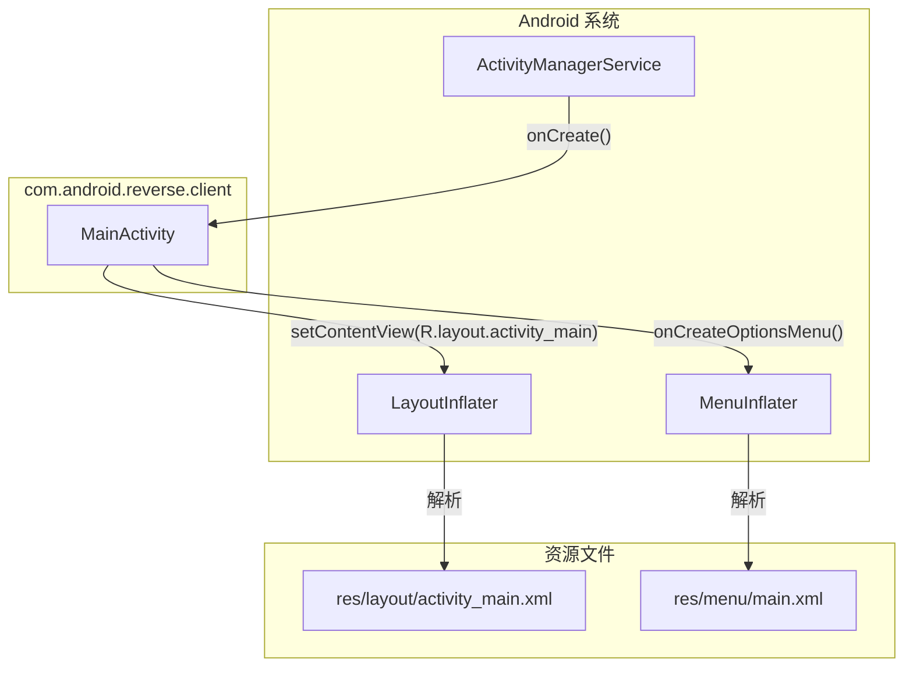

# 📱 MainActivity

> ZjDroid 客户端 App 的主界面 Activity，当前为空壳实现，仅完成基础 UI 布局加载，无实际功能逻辑。

| 属性 | 值 |
|------|-----|
| 源码路径 | [MainActivity.java](https://github.com/android-security-engineer/ZjDroid-skills/blob/master/src/com/android/reverse/client/MainActivity.java) |
| 类型 | 普通类（extends `Activity`） |
| 所在包 | `com.android.reverse.client` |
| 关键依赖 | `android.app.Activity`、`android.view.Menu`、`com.android.reverse.R` |

## 🎯 职责

`MainActivity` 是 ZjDroid 作为独立 Android App 时的启动界面。从现有代码来看，该类目前是一个 **占位实现**，其实际功能非常有限：

- 在 `onCreate` 中加载 `activity_main` 布局
- 在 `onCreateOptionsMenu` 中加载菜单资源 `R.menu.main`
- `onCreate` 包含一个空 try 块（留有扩展位，但当前无任何逻辑）

::: warning 空壳说明
`onCreate` 中的 `try-catch` 块内容完全为空，`catch` 分支中的强制类型转换 `((InvocationTargetException)e)` 只会在实际发生异常时执行（但 try 块为空不会抛出任何异常）。这说明该类是 **尚未开发完成的占位代码**，核心逻辑预期会在 try 块中填充。
:::

## 🔍 关键字段与方法

| 名称 | 类型 | 说明 |
|------|------|------|
| `onCreate(Bundle)` | 覆写方法 | Activity 创建回调，加载 `activity_main` 布局，try 块为空 |
| `onCreateOptionsMenu(Menu)` | 覆写方法 | 加载 `R.menu.main` 菜单，返回 `true` 启用菜单显示 |

## 🧠 关键实现

### 完整源码

```java
public class MainActivity extends Activity {

    @Override
    protected void onCreate(Bundle savedInstanceState) {
        super.onCreate(savedInstanceState);
        setContentView(R.layout.activity_main);     // 加载主布局
        try {
            // 预留位置，当前为空
        } catch (Exception e) {
            // 如果上面的 try 块中发生异常，尝试打印 InvocationTargetException 的原因
            ((InvocationTargetException) e).getTargetException().printStackTrace();
        }
    }

    @Override
    public boolean onCreateOptionsMenu(Menu menu) {
        // 加载菜单资源（适用于有 ActionBar 的情况）
        getMenuInflater().inflate(R.menu.main, menu);
        return true;
    }
}
```

### catch 块分析

```java
catch (Exception e) {
    ((InvocationTargetException) e).getTargetException().printStackTrace();
}
```

::: info 这段代码的含义
`InvocationTargetException` 是通过反射调用方法时，若被调用方法抛出异常，Java 会将原始异常包装进 `InvocationTargetException`。`getTargetException()` 用于获取被包装的原始异常。

这段代码说明原作者**预期在 try 块中会有反射调用**（如通过 `Class.forName` + `Method.invoke` 来动态加载某些组件），当前尚未实现，因此 try 块为空。
:::

### ZjDroid 整体架构中的位置

`client` 包（即本 App）与 `mod` 包（Xposed 模块）**共用同一个 APK 包名 `com.android.reverse`**，但运行在完全不同的语境下：

| 语境 | 运行方式 | 主要代码 |
|------|----------|---------|
| 作为普通 App 安装启动 | Activity 启动 | `client/MainActivity.java` |
| 作为 Xposed 模块被加载 | Xposed 在目标进程中注入 | `mod/ReverseXposedModule.java` |

因此 `MainActivity` 与 `ReverseXposedModule` 是同一个 APK 的两个不同"面"——前者面向用户（安装界面），后者面向 Xposed 框架（注入逻辑）。

## 🔗 调用关系



## 📌 小结

`MainActivity` 在当前版本中是一个 **功能最小化的占位实现**。它的存在意义主要是：

1. 让 `com.android.reverse` 能以普通 App 形式安装（Xposed 模块必须能被安装）
2. 提供一个用户可见的启动界面（哪怕是空白页面）
3. 预留了反射调用的扩展点（空 try 块 + `InvocationTargetException` catch）

如需了解 ZjDroid 的核心功能实现，应转向 [ReverseXposedModule](/source/mod/ReverseXposedModule)（Xposed 入口）和 [CommandBroadcastReceiver](/source/mod/CommandBroadcastReceiver)（指令接收器）。
