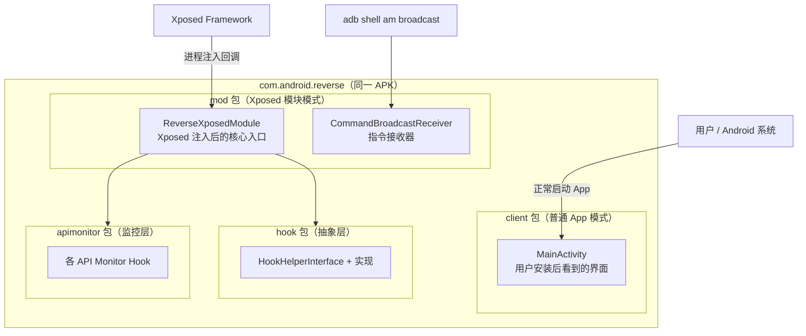

# 📱 客户端界面层（client 包）

`com.android.reverse.client` 是 ZjDroid APK 的 **Android 客户端界面层**，提供该工具作为普通 App 安装时的用户界面入口。

## 📋 包整体职责

| 职责 | 描述 |
|------|------|
| **App 启动入口** | 提供 `MainActivity`，使 ZjDroid 能以普通 App 形式被 Android 系统启动 |
| **安装桥接** | Xposed 模块必须以 APK 形式安装，client 包提供最小化 UI 满足此要求 |
| **扩展预留** | `MainActivity.onCreate` 中预留了反射调用扩展点 |

::: info 为什么 Xposed 模块需要 Activity？
Xposed 模块本质上是一个普通 APK，用户需要先通过 Xposed Installer（或 LSPosed Manager）启用它。一个没有任何 Activity 的 APK 无法被正常安装和管理。因此即使 UI 是空白的，一个最小化的 Activity 也是必要的。
:::

## 📁 类清单

| 类名 | 类型 | 一句话职责 |
|------|------|-----------|
| [MainActivity](/source/client/MainActivity) | Activity | App 启动界面，当前为空壳占位实现，加载基础布局 |

## 🗺️ 包在整个项目中的位置

::: warning 两种运行模式完全独立
`client` 包的代码（`MainActivity`）与 `mod` 包的代码（`ReverseXposedModule`）**共存于同一 APK，但运行时完全独立**：

- 用户点击 App 图标 → 启动 `MainActivity`，`mod` 包的代码不参与
- Xposed 在目标进程中注入 → 调用 `ReverseXposedModule`，`client` 包的代码不参与

两个入口互不干扰。
:::

::: tip 未来扩展方向
根据 `MainActivity.onCreate` 中预留的空 try 块（含 `InvocationTargetException` 处理），该界面预期会发展为一个控制面板，通过反射动态加载配置 UI 组件。目前是占位状态，如需了解实际功能，请参考 [mod 包](/source/mod/)。
:::
