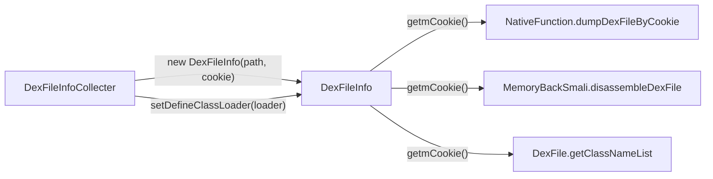

# 📦 DexFileInfo

> 单个 DEX 文件信息的轻量值对象（Value Object），封装路径、mCookie 和对应 ClassLoader，是脱壳流程的数据载体。

| 属性 | 值 |
|------|-----|
| 源码路径 | [DexFileInfo.java](https://github.com/android-security-engineer/ZjDroid-skills/blob/master/src/com/android/reverse/collecter/DexFileInfo.java) |
| 类型 | POJO / Value Object |
| 所在包 | `com.android.reverse.collecter` |
| 关键依赖 | 无外部依赖 |

## 🎯 职责

`DexFileInfo` 是采集层在 hook `openDexFileNative` / `defineClassNative` 之后的**数据存储载体**，记录：

- `dexPath`：DEX 文件在磁盘上的路径（或内存映射标识）。
- `mCookie`：Dalvik/ART 内部标识该 DEX 的句柄，后续 dump / backsmali 操作均依赖此值。
- `defineClassLoader`：第一个通过该 DEX 加载类的 `ClassLoader`，用于类名列举与反射调用。

## 🔍 关键字段与方法

| 成员 | 类型 | 说明 |
|------|------|------|
| `dexPath` | `String` | DEX 路径 |
| `mCookie` | `int` | Dalvik DexFile 内部 cookie（句柄） |
| `defineClassLoader` | `ClassLoader` | 定义该 DEX 类的类加载器 |
| `DexFileInfo(String, int)` | 构造 | 路径 + cookie，不含 ClassLoader |
| `DexFileInfo(String, int, ClassLoader)` | 构造 | 路径 + cookie + ClassLoader |
| `getmCookie()` / `setmCookie(int)` | getter/setter | 读写 cookie |
| `getDexPath()` / `setDexPath(String)` | getter/setter | 读写路径 |
| `getDefineClassLoader()` / `setDefineClassLoader` | getter/setter | 读写 ClassLoader |

## 🧠 关键实现

### 构造器链调用

```java
public DexFileInfo(String dexPath, int mCookie) {
    super();
    this.dexPath = dexPath;
    this.mCookie = mCookie;
}

public DexFileInfo(String dexPath, int mCookie, ClassLoader classLoader) {
    this(dexPath, mCookie);          // 委托给双参构造器
    this.defineClassLoader = classLoader;
}
```

::: info 设计说明
`defineClassLoader` 可能在 hook `openDexFileNative` 时尚不可知，因此提供了两个构造器。`DexFileInfoCollecter` 在后续 hook `defineClassNative` 时，再通过 `setDefineClassLoader()` 补充填入。
:::

### mCookie 的意义

`mCookie` 是 Dalvik VM 中 `DexFile` 对象的 `mCookie` 字段，实质上是指向内存中 `DexOrJar` 结构体的指针（在 32 位系统上以 `int` 存储）。ZjDroid 的所有核心操作都以此为"钥匙"：

| 操作 | 使用方式 |
|------|---------|
| DEX 内存 dump | `NativeFunction.dumpDexFileByCookie(mCookie, apiLevel)` |
| 类名列举 | `DexFile.getClassNameList(mCookie)` via `RefInvoke` |
| backsmali 反编译 | `MemoryBackSmali.disassembleDexFile(mCookie, filename)` |

## 🔗 调用关系



## 📌 小结

`DexFileInfo` 是纯粹的数据容器，无任何业务逻辑，但它承载了 ZjDroid 脱壳的核心关键数据——`mCookie`。理解这个字段是读懂整条脱壳链路的前提。

::: tip 进一步阅读
- [DexFileInfoCollecter](/source/collecter/DexFileInfoCollecter)：负责产生 `DexFileInfo` 实例。
- [NativeFunction](/source/util/NativeFunction)：通过 `mCookie` 跨 JNI 调用 `libdvmnative.so` 完成实际 dump。
:::
