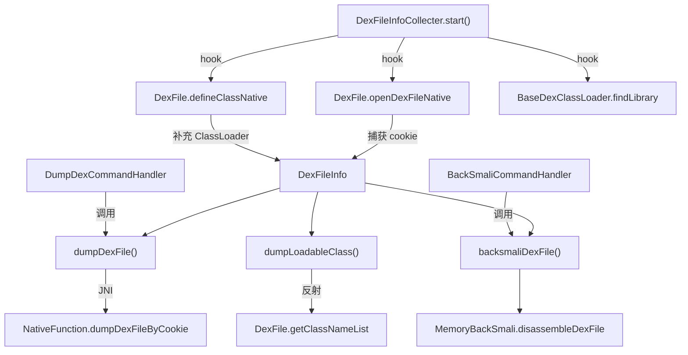

# 🔬 DexFileInfoCollecter

> DEX 信息采集器，通过 hook `openDexFileNative` 和 `defineClassNative` 捕获所有已加载 DEX 的 mCookie，并提供 dump、backsmali、类名列举等脱壳操作的核心入口。

| 属性 | 值 |
|------|-----|
| 源码路径 | [DexFileInfoCollecter.java](https://github.com/android-security-engineer/ZjDroid-skills/blob/master/src/com/android/reverse/collecter/DexFileInfoCollecter.java) |
| 类型 | 单例采集器 |
| 所在包 | `com.android.reverse.collecter` |
| 关键依赖 | `NativeFunction`、`MemoryBackSmali`、`RefInvoke`、`HookHelperFacktory`、`DexFileInfo` |

## 🎯 职责

`DexFileInfoCollecter` 是 ZjDroid 脱壳能力的**核心引擎**：

1. **Hook `openDexFileNative`**：拦截 Dalvik 加载 DEX 的底层方法，实时捕获 `dexPath` 和 `mCookie`。
2. **Hook `defineClassNative`**：补充记录加载类时的 `ClassLoader`，与 DEX 信息关联。
3. **Hook `findLibrary`**：将 `libdvmnative.so` 库路径重定向到模块自带版本，保证 JNI 桥能正常加载。
4. **提供脱壳操作接口**：`dumpDexFile`（内存 dump）、`backsmaliDexFile`（反编译）、`dumpLoadableClass`（列举类名）。

## 🔍 关键字段与方法

| 成员 | 类型 | 说明 |
|------|------|------|
| `dynLoadedDexInfo` | `HashMap<String, DexFileInfo>` | 存放 hook 捕获的动态加载 DEX 信息 |
| `pathClassLoader` | `PathClassLoader` | 目标应用的 ClassLoader |
| `collecter` | `static DexFileInfoCollecter` | 单例实例 |
| `DVMLIB_LIB` | `"dvmnative"` | 模块 JNI 库名，用于 findLibrary 重定向 |
| `start()` | `void` | 安装所有 hook，启动采集 |
| `dumpDexFileInfo()` | `HashMap<String, DexFileInfo>` | 枚举所有已加载 DEX（含 hook 捕获 + PathClassLoader 扫描） |
| `dumpLoadableClass(String)` | `String[]` | 列举指定 DEX 中的所有类名 |
| `backsmaliDexFile(String, String)` | `void` | 对指定 DEX 进行内存 backsmali 反编译 |
| `dumpDexFile(String, String)` | `void` | 将指定 DEX 从内存 dump 到文件 |
| `getCookie(String)` | `private int` | 根据 dexPath 查找 mCookie（先查缓存，再遍历 ClassLoader） |
| `setDefineClassLoader(int, ClassLoader)` | `private void` | 将 ClassLoader 关联到对应 mCookie 的 DexFileInfo |

## 🧠 关键实现

### 1. Hook openDexFileNative —— DEX 加载拦截

```java
Method openDexFileNativeMethod = RefInvoke.findMethodExact(
    "dalvik.system.DexFile",
    ClassLoader.getSystemClassLoader(),
    "openDexFileNative",
    String.class, String.class, int.class);

hookhelper.hookMethod(openDexFileNativeMethod, new MethodHookCallBack() {
    @Override
    public void afterHookedMethod(HookParam param) {
        String dexPath = (String) param.args[0];
        int mCookie = (Integer) param.getResult();
        if (mCookie != 0) {
            dynLoadedDexInfo.put(dexPath, new DexFileInfo(dexPath, mCookie));
        }
    }
});
```

::: tip 脱壳原理
`openDexFileNative` 是 Dalvik 加载任何 DEX（包括壳解密后动态加载的 DEX）的必经之路。在 `afterHookedMethod` 中，DEX 已被加载进内存，`mCookie` 即为该 DEX 在虚拟机内的句柄，后续可凭此 cookie 直接读取内存中的原始字节码。
:::

### 2. Hook defineClassNative —— 补充 ClassLoader

```java
Method defineClassNativeMethod = RefInvoke.findMethodExact(
    "dalvik.system.DexFile",
    ClassLoader.getSystemClassLoader(),
    "defineClassNative",
    String.class, ClassLoader.class, int.class);

hookhelper.hookMethod(defineClassNativeMethod, new MethodHookCallBack() {
    @Override
    public void afterHookedMethod(HookParam param) {
        if (!param.hasThrowable()) {
            int mCookie = (Integer) param.args[2];
            setDefineClassLoader(mCookie, (ClassLoader) param.args[1]);
        }
    }
});
```

`defineClassNative` 在每次类加载时触发，携带 `ClassLoader` 和 `mCookie`，通过 `setDefineClassLoader` 将两者关联，丰富 `DexFileInfo` 的信息。

### 3. Hook findLibrary —— libdvmnative 重定向

```java
hookhelper.hookMethod(findLibraryMethod, new MethodHookCallBack() {
    @Override
    public void afterHookedMethod(HookParam param) {
        if (DVMLIB_LIB.equals(param.args[0]) && param.getResult() == null) {
            param.setResult("/data/data/com.android.reverse/lib/libdvmnative.so");
        }
    }
});
```

::: warning 为何需要重定向
目标应用并不包含 `libdvmnative.so`，当 `NativeFunction` 尝试 `System.loadLibrary("dvmnative")` 时，原始 `findLibrary` 会返回 null。hook 在此时介入，将路径指向模块自身的 lib 目录，使 JNI 桥正常加载。
:::

### 4. dumpDexFileInfo —— 全量枚举

```java
public HashMap<String, DexFileInfo> dumpDexFileInfo() {
    HashMap<String, DexFileInfo> dexs = new HashMap<String, DexFileInfo>(dynLoadedDexInfo);
    Object dexPathList = RefInvoke.getFieldOjbect(
        "dalvik.system.BaseDexClassLoader", pathClassLoader, "pathList");
    Object[] dexElements = (Object[]) RefInvoke.getFieldOjbect(
        "dalvik.system.DexPathList", dexPathList, "dexElements");
    // 遍历 dexElements，补充 hook 未覆盖到的静态加载 DEX
    for (int i = 0; i < dexElements.length; i++) {
        DexFile dexFile = (DexFile) RefInvoke.getFieldOjbect(
            "dalvik.system.DexPathList$Element", dexElements[i], "dexFile");
        String mFileName = (String) RefInvoke.getFieldOjbect(
            "dalvik.system.DexFile", dexFile, "mFileName");
        int mCookie = RefInvoke.getFieldInt(
            "dalvik.system.DexFile", dexFile, "mCookie");
        dexs.put(mFileName, new DexFileInfo(mFileName, mCookie, pathClassLoader));
    }
    return dexs;
}
```

::: info 双重覆盖策略
- `dynLoadedDexInfo`：存放 hook 动态捕获的 DEX（壳运行时解密加载的部分）。
- `dexElements` 遍历：补充应用安装时就存在、在 hook 生效前已加载的 DEX。
两者合并，确保不遗漏任何 DEX。
:::

### 5. dumpDexFile —— 内存 dump 到文件

```java
public void dumpDexFile(String filename, String dexPath) {
    int mCookie = this.getCookie(dexPath);
    if (mCookie != 0) {
        FileOutputStream out = new FileOutputStream(file);
        ByteBuffer data = NativeFunction.dumpDexFileByCookie(
            mCookie, ModuleContext.getInstance().getApiLevel());
        data.order(ByteOrder.LITTLE_ENDIAN);
        byte[] buffer = new byte[8192];
        data.clear();
        while (data.hasRemaining()) {
            int count = Math.min(buffer.length, data.remaining());
            data.get(buffer, 0, count);
            out.write(buffer, 0, count);
        }
    }
}
```

通过 [NativeFunction](/source/util/NativeFunction) 的 `dumpDexFileByCookie` 调用 `libdvmnative.so`，读取 Dalvik 内存中该 DEX 的原始字节，以 8 KB 分块写入文件。

## 🔗 调用关系



## 📌 小结

`DexFileInfoCollecter` 是 ZjDroid 脱壳体系的核心，通过三个 hook 点（`openDexFileNative`、`defineClassNative`、`findLibrary`）和两路枚举（动态缓存 + 静态遍历），构建出完整的 DEX 信息图谱，并对上层 Command Handler 提供统一的操作接口。

::: tip 进一步阅读
- [DexFileInfo](/source/collecter/DexFileInfo)：单条 DEX 记录的数据结构。
- [NativeFunction](/source/util/NativeFunction)：底层 JNI 桥，实现真正的内存读取。
- [MemoryBackSmali](/source/smali/MemoryBackSmali)：基于 mCookie 的内存 backsmali 反编译。
:::
