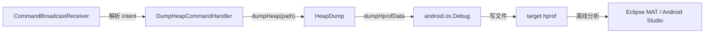

# 🗑️ HeapDump

> Dalvik Java 堆快照工具，封装 `android.os.Debug.dumpHprofData`，将目标进程的 Java 堆以 HPROF 格式写入文件，供 MAT 等工具离线分析。

| 属性 | 值 |
|------|-----|
| 源码路径 | [HeapDump.java](https://github.com/android-security-engineer/ZjDroid-skills/blob/master/src/com/android/reverse/collecter/HeapDump.java) |
| 类型 | 静态工具类 |
| 所在包 | `com.android.reverse.collecter` |
| 关键依赖 | `android.os.Debug` |

## 🎯 职责

`HeapDump` 是一个极简的**静态工具类**，只做一件事：调用 Android 标准 API `Debug.dumpHprofData(filename)` 将当前进程的 Java 堆内存快照写到指定文件路径。

在 ZjDroid 的逆向场景中，这一能力用于：
- 分析目标应用在特定时刻的对象分布，寻找解密后的字符串或密钥。
- 配合 MAT（Memory Analyzer Tool）追踪内存中残存的敏感数据。

## 🔍 关键字段与方法

| 成员 | 类型 | 说明 |
|------|------|------|
| `dumpHeap(String filename)` | `public static void` | 将 Java 堆以 HPROF 格式写入 `filename` 指定的路径 |

## 🧠 关键实现

```java
public static void dumpHeap(String filename) {
    try {
        Debug.dumpHprofData(filename);
    } catch (IOException e) {
        e.printStackTrace();
    }
}
```

整个类仅有这一个方法，逻辑几乎完全委托给 `android.os.Debug`。

::: info Debug.dumpHprofData 原理
`Debug.dumpHprofData` 会暂停 GC，遍历 Dalvik/ART 堆中所有存活对象，以 [HPROF 格式](https://java.net/projects/hat/sources/show/trunk/src/java/com/sun/tools/hat/internal/parser/HprofReader.java) 写出。HPROF 是 Java 堆快照的标准二进制格式，可被 Eclipse MAT、Android Studio Profiler、jhat 等工具解析。
:::

::: warning 写入权限
`filename` 必须是目标进程有写权限的路径，通常选用 `/sdcard/`（需 `WRITE_EXTERNAL_STORAGE`）或应用私有目录（如 `/data/data/<pkgname>/`）。
:::

### 调用链追踪

`HeapDump.dumpHeap` 在命令层由 `DumpHeapCommandHandler` 触发，命令格式为：

```
adb shell am broadcast -a com.android.reverse.action \
  --es cmd dumpHeap --es path /sdcard/target.hprof
```

## 🔗 调用关系



## 📌 小结

`HeapDump` 以最少的代码实现了 Java 堆采集能力。其价值在于**运行在目标进程内**（通过 Xposed 注入），因此可以访问所有对象，包括加密壳已在内存中展开的明文数据。

::: tip 进一步阅读
- [DumpHeapCommandHandler](/source/request/DumpHeapCommandHandler)：触发 `HeapDump.dumpHeap` 的命令处理器。
- [MemDump](/source/collecter/MemDump)：底层内存区域 dump，与 HeapDump 互补。
:::
