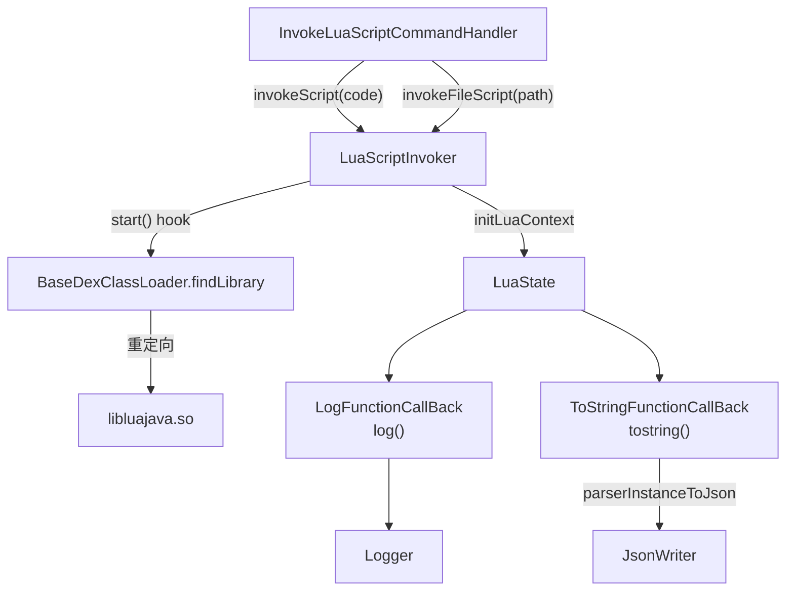

# 🌙 LuaScriptInvoker

> 在目标进程内嵌入 Lua 运行时并执行脚本，通过 LuaJava 桥接让 Lua 代码直接访问目标应用的 Java 对象，实现动态分析脚本化。

| 属性 | 值 |
|------|-----|
| 源码路径 | [LuaScriptInvoker.java](https://github.com/android-security-engineer/ZjDroid-skills/blob/master/src/com/android/reverse/collecter/LuaScriptInvoker.java) |
| 类型 | 单例，含静态内部类 |
| 所在包 | `com.android.reverse.collecter` |
| 关键依赖 | `luajava`（`org.keplerproject.luajava.*`）、`JsonWriter`、`RefInvoke`、`HookHelperFacktory` |

## 🎯 职责

`LuaScriptInvoker` 提供两类能力：

1. **Lua 运行时管理**：初始化 `LuaState`，注册 `log` 和 `tostring` 两个 Java 扩展函数，执行字符串或文件形式的 Lua 脚本。
2. **libluajava 库重定向**：hook `BaseDexClassLoader.findLibrary`，将 `luajava` so 路径指向模块自带的 `libluajava.so`，使目标进程能正常加载 LuaJava 桥接库。

## 🔍 关键字段与方法

| 成员 | 类型 | 说明 |
|------|------|------|
| `luaInvoker` | `static LuaScriptInvoker` | 单例实例 |
| `LUAJAVA_LIB` | `"luajava"` | 用于 findLibrary 匹配的库名 |
| `hookhelper` | `HookHelperInterface` | hook 框架适配层 |
| `getInstance()` | `static LuaScriptInvoker` | 懒汉单例获取 |
| `start()` | `void` | 安装 findLibrary hook，重定向 libluajava.so |
| `initLuaContext(LuaState)` | `private void` | 向 Lua 环境注册 `log` 和 `tostring` 函数 |
| `invokeScript(String)` | `void` | 执行 Lua 代码字符串 |
| `invokeFileScript(String)` | `void` | 从文件路径加载并执行 Lua 脚本 |
| `LogFunctionCallBack` | `static class` | `log(msg)` Lua 函数的 Java 实现 |
| `ToStringFunctionCallBack` | `static class` | `tostring(obj, ...)` Lua 函数的 Java 实现（输出 JSON） |

## 🧠 关键实现

### 1. start() —— libluajava 路径重定向

```java
public void start() {
    Method findLibraryMethod = RefInvoke.findMethodExact(
        "dalvik.system.BaseDexClassLoader",
        ClassLoader.getSystemClassLoader(),
        "findLibrary", String.class);

    hookhelper.hookMethod(findLibraryMethod, new MethodHookCallBack() {
        @Override
        public void afterHookedMethod(HookParam param) {
            Logger.log((String) param.args[0]);
            if (LUAJAVA_LIB.equals(param.args[0]) && param.getResult() == null) {
                param.setResult("/data/data/com.android.reverse/lib/libluajava.so");
            }
        }
    });
}
```

::: info 为何需要重定向
目标 App 不包含 `libluajava.so`，正常 `System.loadLibrary("luajava")` 会失败。此 hook 在 `findLibrary` 返回 null 时注入模块自带 so 的绝对路径，使 LuaJava 的 JNI 层能正常初始化。
:::

### 2. initLuaContext —— 注册 Java 扩展函数

```java
private void initLuaContext(LuaState luaState) {
    JavaFunction logfunction = new LogFunctionCallBack(luaState);
    logfunction.register("log");
    JavaFunction tostringfunction = new ToStringFunctionCallBack(luaState);
    tostringfunction.register("tostring");
}
```

向 Lua 全局环境注册两个可在脚本中直接调用的函数：
- `log(message)`：将字符串打印到 ZjDroid 日志。
- `tostring(obj, ...)`：将 Java 对象序列化为 JSON 并打印。

### 3. invokeScript / invokeFileScript —— 执行脚本

```java
public void invokeScript(String script) {
    LuaState luaState = LuaStateFactory.newLuaState();
    luaState.openLibs();
    this.initLuaContext(luaState);
    int error = luaState.LdoString(script);
    if (error != 0) {
        Logger.log("Read/Parse lua error. Exit");
        return;
    }
    luaState.close();
}

public void invokeFileScript(String scriptFilePath) {
    LuaState luaState = LuaStateFactory.newLuaState();
    luaState.openLibs();
    this.initLuaContext(luaState);
    int error = luaState.LdoFile(scriptFilePath);
    if (error != 0) {
        Logger.log("Read/Parse lua error. Exit");
        return;
    }
    luaState.close();
}
```

::: warning 每次调用都创建新 LuaState
`invokeScript` 和 `invokeFileScript` 均创建独立的 `LuaState` 实例，执行完毕后显式 `close()`，避免 native 层内存泄漏。但这也意味着多次调用之间**不共享 Lua 全局变量**。
:::

### 4. ToStringFunctionCallBack —— Java 对象 JSON 化

```java
public static class ToStringFunctionCallBack extends JavaFunction {
    @Override
    public int execute() throws LuaException {
        int param_size = this.L.getTop();
        for (int i = 2; i <= param_size; i++) {
            String objDsrc = JsonWriter.parserInstanceToJson(
                this.getParam(i).getObject());
            Logger.log(objDsrc);
        }
        return 0;
    }
}
```

::: tip 参数索引从 2 开始
LuaJava 中 `getTop()` 返回栈上参数总数，索引 1 是函数自身，实际用户参数从索引 2 开始。此实现支持变长参数，可一次序列化多个 Java 对象。
:::

### 5. LogFunctionCallBack —— 简单日志输出

```java
public static class LogFunctionCallBack extends JavaFunction {
    @Override
    public int execute() throws LuaException {
        int param_size = this.L.getTop();
        if (param_size == 2) {
            String message = this.L.getLuaObject(2).getString();
            Logger.log(message);
        }
        return 0;
    }
}
```

仅接受单字符串参数，打印到 ZjDroid 的 Logger。

## 🔗 调用关系



## 📌 小结

`LuaScriptInvoker` 将 Lua 脚本引擎嵌入目标进程，赋予逆向工程师在运行时编写分析脚本的能力——无需重新编译 APK，直接通过广播注入 Lua 代码即可访问目标应用的任意 Java 对象。

::: tip 使用场景举例
在 Lua 脚本中可以调用 `luajava.bindClass` 获取 Java 类，实例化对象，调用方法，并用 `tostring()` 将结果 JSON 序列化输出，整个过程在目标进程内实时执行。
:::
