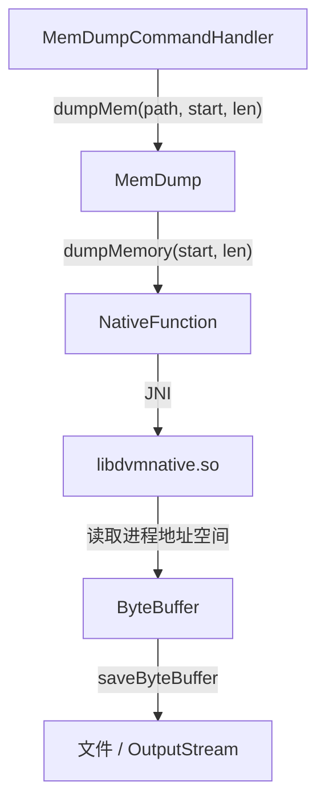

# 💾 MemDump

> 进程内存区域 dump 工具，通过 JNI 调用 `libdvmnative.so`，按起始地址与长度将任意内存段读取并写入文件或输出流。

| 属性 | 值 |
|------|-----|
| 源码路径 | [MemDump.java](https://github.com/android-security-engineer/ZjDroid-skills/blob/master/src/com/android/reverse/collecter/MemDump.java) |
| 类型 | 静态工具类 |
| 所在包 | `com.android.reverse.collecter` |
| 关键依赖 | `NativeFunction`（JNI 桥） |

## 🎯 职责

`MemDump` 提供对目标进程**任意虚拟内存地址段**的 dump 能力：

- 调用者指定起始地址（`start`）和长度（`length`），底层通过 `libdvmnative.so` 的 native 函数读取内存内容，返回 `ByteBuffer`。
- 支持写入磁盘文件（`dumpMem(filepath, start, length)`）和写入任意 `OutputStream`（`dumpMem(outstream, start, length)`），后者便于网络传输等场景。

## 🔍 关键字段与方法

| 成员 | 类型 | 说明 |
|------|------|------|
| `saveByteBuffer(OutputStream, ByteBuffer)` | `private static void` | 以 8 KB 分块将 `ByteBuffer` 写入输出流 |
| `dumpMem(String, int, int)` | `public static void` | dump 内存区域到文件 |
| `dumpMem(OutputStream, int, int)` | `public static void` | dump 内存区域到输出流 |

## 🧠 关键实现

### 1. saveByteBuffer —— 分块写入

```java
private static void saveByteBuffer(OutputStream out, ByteBuffer data) {
    data.order(ByteOrder.LITTLE_ENDIAN);
    byte[] buffer = new byte[8192];
    data.clear();
    while (data.hasRemaining()) {
        int count = Math.min(buffer.length, data.remaining());
        data.get(buffer, 0, count);
        try {
            out.write(buffer, 0, count);
        } catch (IOException e1) {
            e1.printStackTrace();
        }
    }
}
```

::: info 字节序处理
`data.order(ByteOrder.LITTLE_ENDIAN)` 确保在小端 ARM 设备上读取多字节数据时字节顺序正确。`data.clear()` 重置 position 到 0，保证从头读取。
:::

### 2. dumpMem(filepath) —— 写入文件

```java
public static void dumpMem(String filepath, int start, int length) {
    ByteBuffer buffer = NativeFunction.dumpMemory(start, length);
    File file = new File(filepath);
    if (!file.exists()) {
        file.createNewFile();
        file.setWritable(true);
    }
    saveByteBuffer(new FileOutputStream(file), buffer);
}
```

- `NativeFunction.dumpMemory(start, length)` 通过 JNI 调用 `libdvmnative.so` 中的 native 方法，直接访问进程地址空间并返回包含内存内容的 `ByteBuffer`。
- 文件不存在时自动创建并显式设置可写权限。

::: warning 地址合法性
`start` 和 `length` 必须是目标进程地址空间内的合法范围，否则 native 层可能引发 SIGSEGV，导致进程崩溃。通常需要先通过 `/proc/<pid>/maps` 确认目标地址段。
:::

### 3. dumpMem(OutputStream) —— 流式输出

```java
public static void dumpMem(OutputStream outstream, int start, int length) {
    ByteBuffer buffer = NativeFunction.dumpMemory(start, length);
    saveByteBuffer(outstream, buffer);
}
```

这一重载去掉了文件创建逻辑，直接向调用方提供的流写出，适用于通过 Socket 将 dump 内容实时回传到 PC 等场景。

## 🔗 调用关系



## 📌 小结

`MemDump` 将复杂的 native 内存读取能力封装为两个简洁的静态方法，是 ZjDroid 实现"指哪打哪"式内存 dump 的关键工具。其与 `HeapDump` 的区别在于：`HeapDump` 通过 Android API 转储 Java 层对象图（HPROF），而 `MemDump` 直接读取原始虚拟内存字节，能覆盖 native 层数据。

::: tip 进一步阅读
- [NativeFunction](/source/util/NativeFunction)：提供 `dumpMemory` JNI 桥，调用 `libdvmnative.so`。
- [HeapDump](/source/collecter/HeapDump)：Java 堆 HPROF 快照，与本类互补。
:::
