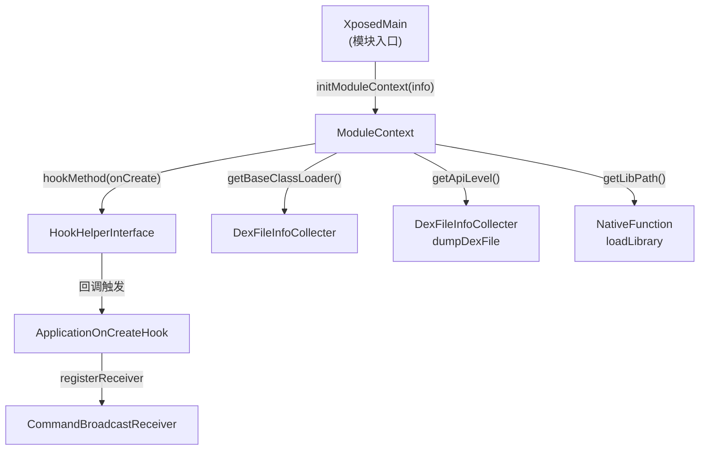

# 🏛️ ModuleContext

> 模块全局上下文单例，负责持有目标应用的元信息，并在 Application.onCreate 触发后完成 BroadcastReceiver 的注册，是整个 ZjDroid 模块的"启动枢纽"。

| 属性 | 值 |
|------|-----|
| 源码路径 | [ModuleContext.java](https://github.com/android-security-engineer/ZjDroid-skills/blob/master/src/com/android/reverse/collecter/ModuleContext.java) |
| 类型 | 普通类（单例） |
| 所在包 | `com.android.reverse.collecter` |
| 关键依赖 | `PackageMetaInfo`、`HookHelperFacktory`、`CommandBroadcastReceiver`、`Utility` |

## 🎯 职责

ModuleContext 是整个 Xposed 模块的全局状态容器，具体承担以下工作：

1. **持有目标包元信息**：包名、进程名、ApplicationInfo、ClassLoader、native 库路径。
2. **缓存 API 等级**：在构造时一次性读取，避免重复查询。
3. **注入 Application.onCreate**：通过 hook 在目标 App 第一次初始化后，将 `CommandBroadcastReceiver` 注册到目标进程，实现指令接收能力。

## 🔍 关键字段与方法

| 成员 | 类型 | 说明 |
|------|------|------|
| `moduleContext` | `static ModuleContext` | 单例实例 |
| `metaInfo` | `PackageMetaInfo` | 目标应用元信息 |
| `apiLevel` | `int` | 目标设备 Android API 级别 |
| `HAS_REGISTER_LISENER` | `boolean` | 防止 Receiver 重复注册的标志位 |
| `fristApplication` | `Application` | hook 后捕获到的第一个 Application 实例 |
| `hookhelper` | `HookHelperInterface` | hook 框架适配层（Xposed / 其他） |
| `getInstance()` | `static ModuleContext` | 懒汉式单例获取 |
| `initModuleContext(PackageMetaInfo)` | `void` | 模块初始化入口，完成 Application hook 布置 |
| `getBaseClassLoader()` | `ClassLoader` | 返回目标应用的 ClassLoader |
| `getLibPath()` | `String` | 返回目标应用 native 库目录 |
| `getApiLevel()` | `int` | 返回 API 级别 |

## 🧠 关键实现

### 1. 单例与构造

```java
private static ModuleContext moduleContext;

private ModuleContext() {
    this.apiLevel = Utility.getApiLevel();
}

public static ModuleContext getInstance() {
    if (moduleContext == null)
        moduleContext = new ModuleContext();
    return moduleContext;
}
```

::: warning 线程安全
此处为最简懒汉单例，未加同步锁。由于 Xposed 模块在主线程初始化，通常不存在并发问题，但在多进程场景下需注意。
:::

### 2. Application.onCreate hook 策略

```java
public void initModuleContext(PackageMetaInfo info) {
    this.metaInfo = info;
    String appClassName = this.getAppInfo().className;
    if (appClassName == null) {
        // 没有自定义 Application，直接 hook 基类
        Method hookOncreateMethod = Application.class
            .getDeclaredMethod("onCreate", new Class[] {});
        hookhelper.hookMethod(hookOncreateMethod, new ApplicationOnCreateHook());
    } else {
        // 有自定义 Application，优先 hook 子类
        Class<?> hook_application_class = this.getBaseClassLoader().loadClass(appClassName);
        Method hookOncreateMethod = hook_application_class
            .getDeclaredMethod("onCreate", new Class[] {});
        hookhelper.hookMethod(hookOncreateMethod, new ApplicationOnCreateHook());
        // NoSuchMethodException 时回退到基类 Application.onCreate
    }
}
```

::: tip 回退逻辑
若目标 App 没有重写 `onCreate`（`NoSuchMethodException`），代码会 catch 后自动回退到 hook `Application.class` 的 `onCreate`，保证覆盖所有情况。
:::

### 3. ApplicationOnCreateHook 内部类

```java
private class ApplicationOnCreateHook extends MethodHookCallBack {
    @Override
    public void afterHookedMethod(HookParam param) {
        if (!HAS_REGISTER_LISENER) {
            fristApplication = (Application) param.thisObject;
            IntentFilter filter = new IntentFilter(CommandBroadcastReceiver.INTENT_ACTION);
            fristApplication.registerReceiver(new CommandBroadcastReceiver(), filter);
            HAS_REGISTER_LISENER = true;
        }
    }
}
```

- `afterHookedMethod` 在目标 `onCreate` 执行完毕后触发，此时 Application Context 已就绪。
- `HAS_REGISTER_LISENER` 标志位防止多进程/多次回调时重复注册。
- 注册的 `CommandBroadcastReceiver` 是 ZjDroid 接受外部 ADB broadcast 指令的入口。

## 🔗 调用关系



## 📌 小结

ModuleContext 是 ZjDroid 的"神经中枢"：
- 它在 Xposed 注入时被最先初始化，持有一切元信息。
- 通过 hook Application.onCreate 完成 BroadcastReceiver 注册，使模块能够接收来自 `adb shell am broadcast` 的指令。
- 其他采集器（`DexFileInfoCollecter`、`NativeHookCollecter` 等）均通过 `ModuleContext.getInstance()` 读取 ClassLoader 和 API 级别等上下文信息。
