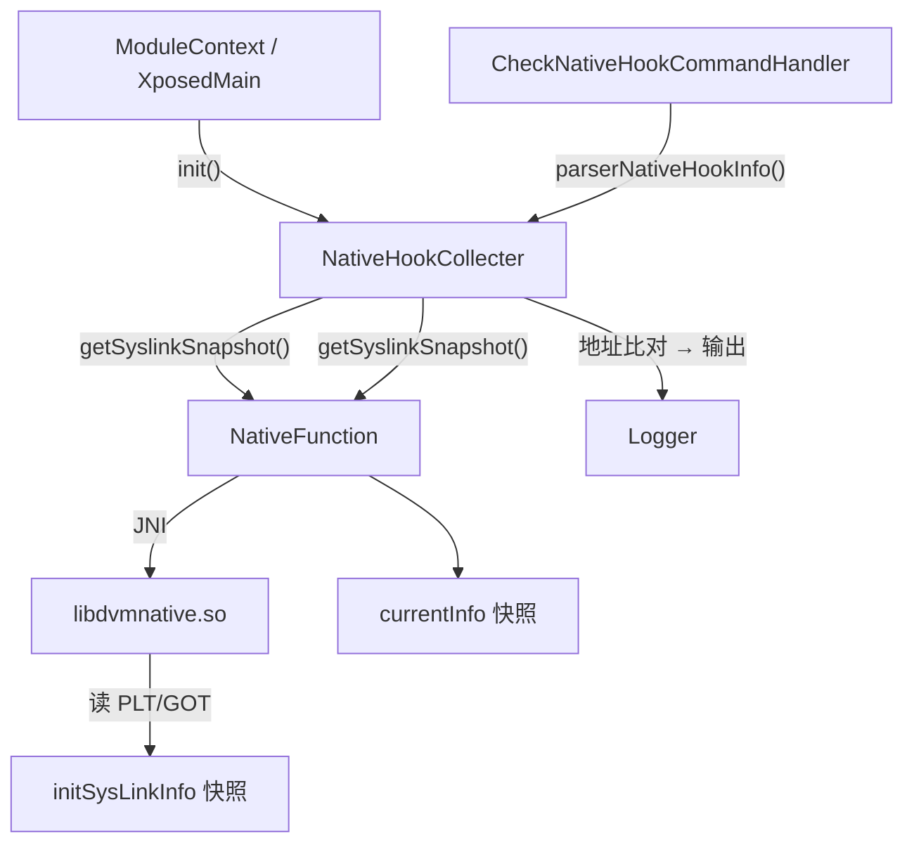

# 🔩 NativeHookCollecter

> Native hook 检测器，通过对比应用启动前后系统链接表（syslink）的函数地址快照，识别目标应用是否在 native 层施加了函数 hook。

| 属性 | 值 |
|------|-----|
| 源码路径 | [NativeHookCollecter.java](https://github.com/android-security-engineer/ZjDroid-skills/blob/master/src/com/android/reverse/collecter/NativeHookCollecter.java) |
| 类型 | 单例采集器 |
| 所在包 | `com.android.reverse.collecter` |
| 关键依赖 | `NativeFunction`（JNI 桥）、`Logger` |

## 🎯 职责

`NativeHookCollecter` 负责**检测目标进程的 native hook 行为**：

1. **`init()`**：在应用加载早期（native 代码执行前）通过 `NativeFunction.getSyslinkSnapshot()` 拍摄系统动态链接库函数地址快照（`initSysLinkInfo`）。
2. **`parserNativeHookInfo()`**：在需要检测时再次获取当前快照，与初始快照逐个对比每个库的每个函数地址；若某函数地址发生变化，说明该函数被 hook（通常是 PLT/GOT hook 或 inline hook）。

## 🔍 关键字段与方法

| 成员 | 类型 | 说明 |
|------|------|------|
| `collecter` | `static NativeHookCollecter` | 单例实例 |
| `initSysLinkInfo` | `static HashMap<String, HashMap<String, Integer>>` | 初始快照：外层 key = 库名，内层 key = 符号名，value = 函数地址 |
| `getInstance()` | `static NativeHookCollecter` | 懒汉单例获取 |
| `init()` | `void` | 拍摄初始 syslink 快照（仅执行一次） |
| `parserNativeHookInfo()` | `void` | 对比当前与初始快照，输出被 hook 的函数列表 |

## 🧠 关键实现

### 1. init() —— 初始快照采集

```java
public void init() {
    if (initSysLinkInfo == null)
        initSysLinkInfo = NativeFunction.getSyslinkSnapshot();
}
```

::: tip 时机至关重要
`init()` 必须在目标应用的 native 代码（尤其是 `System.loadLibrary`）执行之前调用，否则快照已包含 hook 后的地址，比对将失去意义。通常在 `ModuleContext.initModuleContext` 阶段尽早调用。
:::

`initSysLinkInfo` 使用 `static` 修饰 + `null` 检查，保证全局只拍一次初始快照，不会因多次调用被覆盖。

### 2. parserNativeHookInfo() —— 比对检测

```java
public void parserNativeHookInfo() {
    Logger.log("The parser native hook info start");
    if (initSysLinkInfo == null) {
        Logger.log("the init syslink info == null");
        return;
    }

    int hookcount = 0;
    HashMap<String, HashMap<String, Integer>> currentInfo =
        NativeFunction.getSyslinkSnapshot();

    Iterator<String> libkeys = currentInfo.keySet().iterator();
    while (libkeys.hasNext()) {
        String libName = libkeys.next();
        if (initSysLinkInfo.containsKey(libName)) {
            HashMap<String, Integer> currentlinks = currentInfo.get(libName);
            HashMap<String, Integer> initlinks = initSysLinkInfo.get(libName);
            Iterator<String> sysNamekeys = currentlinks.keySet().iterator();
            while (sysNamekeys.hasNext()) {
                String sysName = sysNamekeys.next();
                if (initlinks.containsKey(sysName)) {
                    int currentAddr = currentlinks.get(sysName);
                    int initAddr = initlinks.get(sysName);
                    if (currentAddr != initAddr) {
                        Logger.log("The " + libName + " syslink:" + sysName
                            + " oldAddr:" + initAddr
                            + " newAddr:" + currentAddr);
                        hookcount++;
                    }
                }
            }
        }
    }

    if (hookcount == 0) {
        Logger.log("the app can't hook native function");
    } else {
        Logger.log("The app total hook native function = " + hookcount);
    }
    Logger.log("The parser native hook info end");
}
```

算法核心是**双层嵌套遍历 + 地址比较**：

```
for 每个库 in 当前快照:
    if 该库存在于初始快照:
        for 每个符号 in 该库当前符号表:
            if 该符号存在于初始符号表:
                if 当前地址 ≠ 初始地址 → 发现 hook
```

::: info 检测原理
`NativeFunction.getSyslinkSnapshot()` 通过 `libdvmnative.so` 读取 `/proc/self/maps` 和各 `.so` 文件的 PLT/GOT 表，收集所有动态链接符号的当前实际地址。如果某符号的地址从初始时的库函数地址变成了另一个地址（如 hook 框架的 trampoline），则判定该符号被 hook。
:::

::: warning 仅检测 PLT/GOT hook
此方案能检测基于 PLT/GOT 表篡改的 hook（如 bhook、xhook）。对于 inline hook（直接修改函数首字节替换为跳转指令），需要额外的指令级比对，当前实现不涵盖。
:::

## 🔗 调用关系



## 📌 小结

`NativeHookCollecter` 通过"快照比对"策略，以极简的 Java 代码实现了 native hook 检测，是 ZjDroid 对目标应用安全性分析的重要组成部分。关键点是初始快照的**采集时机**——必须早于任何可疑 native 代码加载。

::: tip 进一步阅读
- [NativeFunction](/source/util/NativeFunction)：提供 `getSyslinkSnapshot()` JNI 桥，底层实现在 `libdvmnative.so` 中。
:::
