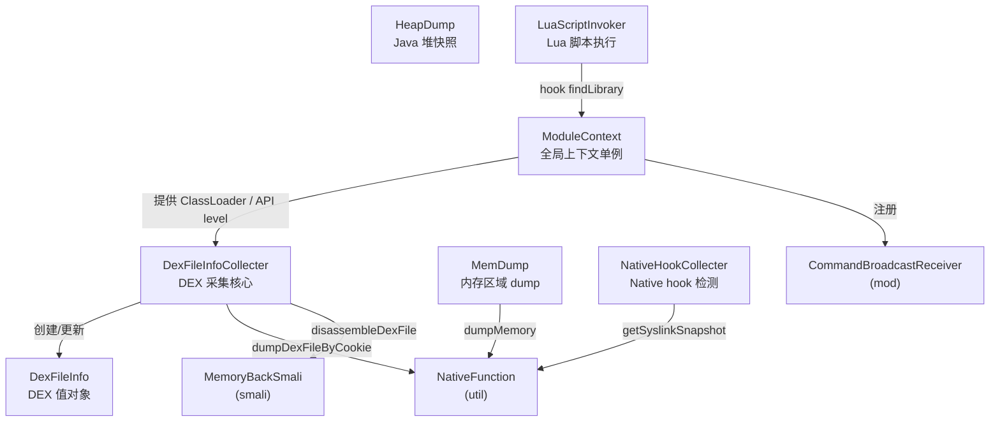

# 🧲 采集器层（collecter 包）

> `com.android.reverse.collecter` 是 ZjDroid 的**核心数据采集层**，承担 DEX 信息收集、内存 dump、Java 堆快照、native hook 检测和 Lua 脚本执行五大能力，是连接 hook 层与命令处理层的枢纽。

## 📋 包职责

collecter 包的职责可以概括为三个方向：

| 方向 | 说明 |
|------|------|
| **脱壳采集** | Hook Dalvik 底层方法，捕获所有 DEX 的 mCookie，实现内存 DEX dump 与 backsmali |
| **内存分析** | 按地址 dump 任意内存段（MemDump）或导出 Java 堆快照（HeapDump）|
| **扩展执行** | 在目标进程内运行 Lua 脚本，检测 native hook，提供动态分析脚本化能力 |

`ModuleContext` 作为全局单例贯穿整个包，为其他采集器提供 ClassLoader、API 级别、包名等基础上下文。

## 🗂️ 类清单

| 类名 | 简述 | 文档 |
|------|------|------|
| `ModuleContext` | 模块全局上下文单例，持有目标应用元信息，注册指令接收 Receiver | [查看](/source/collecter/ModuleContext) |
| `DexFileInfo` | 单个 DEX 的值对象，封装路径、mCookie、ClassLoader | [查看](/source/collecter/DexFileInfo) |
| `DexFileInfoCollecter` | DEX 采集核心，hook `openDexFileNative` 等，提供 dump/backsmali 接口 | [查看](/source/collecter/DexFileInfoCollecter) |
| `HeapDump` | Java 堆快照工具，封装 `Debug.dumpHprofData`，输出 HPROF 文件 | [查看](/source/collecter/HeapDump) |
| `MemDump` | 原始内存区域 dump，通过 JNI 读取任意虚拟地址段 | [查看](/source/collecter/MemDump) |
| `LuaScriptInvoker` | 在目标进程嵌入 Lua 运行时，执行字符串/文件脚本 | [查看](/source/collecter/LuaScriptInvoker) |
| `NativeHookCollecter` | 比对 PLT/GOT 快照，检测 native 层 hook 行为 | [查看](/source/collecter/NativeHookCollecter) |

## 🗺️ 在项目中的位置

```
com.android.reverse
├── mod/          ← Xposed 入口、广播接收
├── hook/         ← hook 框架适配层
├── collecter/    ← 本包：数据采集层 ★
├── request/      ← 命令处理层（CommandHandler）
├── smali/        ← backsmali 反编译实现
└── util/         ← 工具层（NativeFunction、RefInvoke、Logger…）
```

## 🔗 包内关系图



::: info 依赖核心
几乎所有采集器都依赖 [NativeFunction](/source/util/NativeFunction)——它是连接 Java 层与 `libdvmnative.so` 的 JNI 桥，提供 DEX dump、内存读取、syslink 快照等底层能力。
:::

::: tip 脱壳主链路
外部 adb 广播 → `CommandBroadcastReceiver` → `DumpDexCommandHandler` → **`DexFileInfoCollecter.dumpDexFile()`** → `NativeFunction.dumpDexFileByCookie()` → `libdvmnative.so` → 原始 DEX 字节写入文件。
:::
