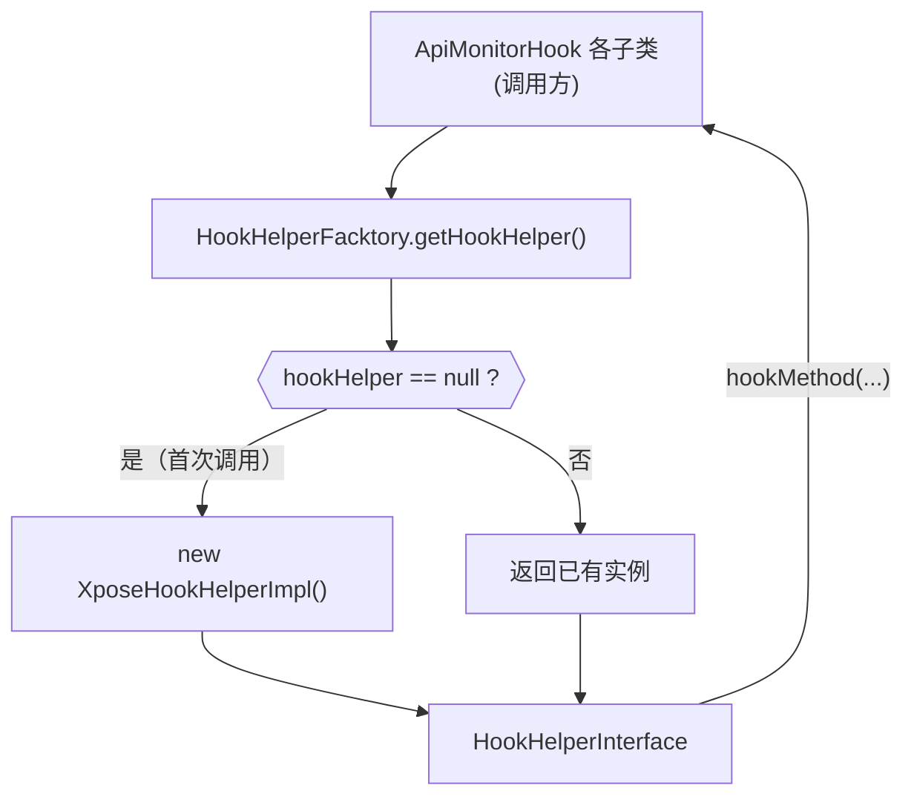

# 🏭 HookHelperFacktory

> 简单工厂类，以懒加载单例模式提供 `HookHelperInterface` 的唯一实现实例，是 hook 包的对外统一入口。

| 属性 | 值 |
|------|-----|
| 源码路径 | [HookHelperFacktory.java](https://github.com/android-security-engineer/ZjDroid-skills/blob/master/src/com/android/reverse/hook/HookHelperFacktory.java) |
| 类型 | 普通类（简单工厂） |
| 所在包 | `com.android.reverse.hook` |
| 关键依赖 | [HookHelperInterface](/source/hook/HookHelperInterface)、[XposeHookHelperImpl](/source/hook/XposeHookHelperImpl) |

## 🎯 职责

`HookHelperFacktory` 扮演 **对象提供者** 角色，职责单一：

- 持有 `HookHelperInterface` 的单一实例（`XposeHookHelperImpl`）
- 以懒加载方式在首次调用时初始化
- 向所有调用方隐藏"当前到底使用哪个 Hook 框架实现"这一细节

::: info 命名说明
类名中的 `Facktory` 是 `Factory` 的拼写错误（原始代码如此），精讲中照实记录，阅读源码时以实际拼写为准。
:::

## 🔍 关键字段与方法

| 名称 | 类型 | 说明 |
|------|------|------|
| `hookHelper` | `static HookHelperInterface` | 全局唯一的 Hook 帮助者实例（懒加载） |
| `getHookHelper()` | `static` 方法 | 获取（并在必要时创建）`HookHelperInterface` 实例 |

## 🧠 关键实现

### 工厂方法全文

```java
public class HookHelperFacktory {

    private static HookHelperInterface hookHelper;

    public static HookHelperInterface getHookHelper() {
        if (hookHelper == null)
            hookHelper = new XposeHookHelperImpl();
        return hookHelper;
    }
}
```

### 实现解析

::: warning 非线程安全的懒加载
当前实现没有 `synchronized` 或 `volatile` 修饰，在多线程并发首次调用时存在竞态条件，理论上可能创建多个 `XposeHookHelperImpl` 实例。

在 ZjDroid 的实际使用场景中，所有 Hook 初始化均在主线程的 `handleLoadPackage` 调用链中完成（单线程调用），因此此处不加锁是安全的。但如果未来在多线程场景中使用，需要改为以下形式：

```java
// 线程安全版本（DCL）
private static volatile HookHelperInterface hookHelper;

public static HookHelperInterface getHookHelper() {
    if (hookHelper == null) {
        synchronized (HookHelperFacktory.class) {
            if (hookHelper == null)
                hookHelper = new XposeHookHelperImpl();
        }
    }
    return hookHelper;
}
```
:::

### 调用示例

在 `apimonitor` 包的各个 Hook 类中，典型调用模式如下：

```java
// 获取 HookHelper（与具体实现无关）
HookHelperInterface helper = HookHelperFacktory.getHookHelper();

// 通过接口执行 Hook，无需感知 Xposed API
helper.hookMethod(targetMethod, new MethodHookCallBack() {
    @Override
    public void beforeHookedMethod(HookParam param) { /* ... */ }
    @Override
    public void afterHookedMethod(HookParam param)  { /* ... */ }
});
```

## 🔗 调用关系



## 📌 小结

`HookHelperFacktory` 是 hook 包的 **单一对外出口**。它以最少代码实现了工厂模式的核心价值：调用方只需 `HookHelperFacktory.getHookHelper()` 一行，即可获得一个可用的 Hook 帮助者，无需关心实现细节。若未来需要切换底层 Hook 框架，只需修改工厂中的一行 `new XposeHookHelperImpl()`，全部调用方零改动。
