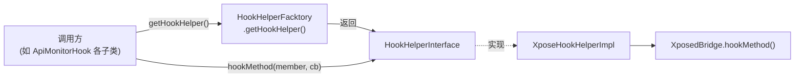

# 🔌 HookHelperInterface

> Hook 能力的抽象契约接口，将"对哪个方法 Hook、用什么回调"这一核心操作抽象为单一方法，使上层业务完全屏蔽 Xposed 细节。

| 属性 | 值 |
|------|-----|
| 源码路径 | [HookHelperInterface.java](https://github.com/android-security-engineer/ZjDroid-skills/blob/master/src/com/android/reverse/hook/HookHelperInterface.java) |
| 类型 | 接口（interface） |
| 所在包 | `com.android.reverse.hook` |
| 关键依赖 | `java.lang.reflect.Member`、[MethodHookCallBack](/source/hook/MethodHookCallBack) |

## 🎯 职责

`HookHelperInterface` 定义了 ZjDroid hook 子系统的 **最小公共契约**：只要能对一个 Java 方法（`Member`）注册一个回调（`MethodHookCallBack`），就算是一个合法的 Hook 帮助者。

通过这个接口：
- 上层调用者（如 `ApiMonitorHookManager` 中各 Hook 类）只依赖接口，不依赖 Xposed 具体类型
- 可以在不修改任何调用方代码的情况下，替换底层 Hook 框架（Xposed → Pine → Epic 等）

## 🔍 关键字段与方法

| 名称 | 类型 | 说明 |
|------|------|------|
| `hookMethod(Member, MethodHookCallBack)` | 抽象方法 | 对指定 `Member`（方法/构造器）注册 Hook 回调 |

## 🧠 关键实现

### 接口定义全文

```java
public interface HookHelperInterface {
    public abstract void hookMethod(Member method, MethodHookCallBack callback);
}
```

这是 ZjDroid 中最简洁的类之一，但其设计价值在于 **层次隔离**：

::: info 参数类型选择的深意

| 参数 | 类型 | 为什么不直接用 Xposed 类型？ |
|------|------|-----------------------------|
| `method` | `java.lang.reflect.Member` | `Member` 是 JDK 标准接口，`Method` 和 `Constructor` 均实现它，无需 Xposed 依赖 |
| `callback` | `MethodHookCallBack` | 项目自定义抽象类，内部包装了对 Xposed `XC_MethodHook` 的依赖（见 [MethodHookCallBack](/source/hook/MethodHookCallBack)） |

如果参数直接用 `XC_MethodHook`，则所有调用方都必须引入 Xposed 库，这正是接口设计要避免的。
:::

### 接口在层次中的角色

```
调用层（apimonitor / 各 Hook 类）
         ↓  只知道 HookHelperInterface
    HookHelperInterface.hookMethod()
         ↓  运行时由工厂注入具体实现
    XposeHookHelperImpl（唯一现有实现）
         ↓  直接调用
    XposedBridge.hookMethod()
```

## 🔗 调用关系



## 📌 小结

`HookHelperInterface` 是整个 hook 包的 **设计原点**。它仅含一个方法，却承载了"面向接口编程"的核心思想：上层业务代码对 Xposed 的依赖被压缩到零，所有与框架的绑定集中在实现类 [XposeHookHelperImpl](/source/hook/XposeHookHelperImpl) 中，而对象的获取则由 [HookHelperFacktory](/source/hook/HookHelperFacktory) 统一管理。
