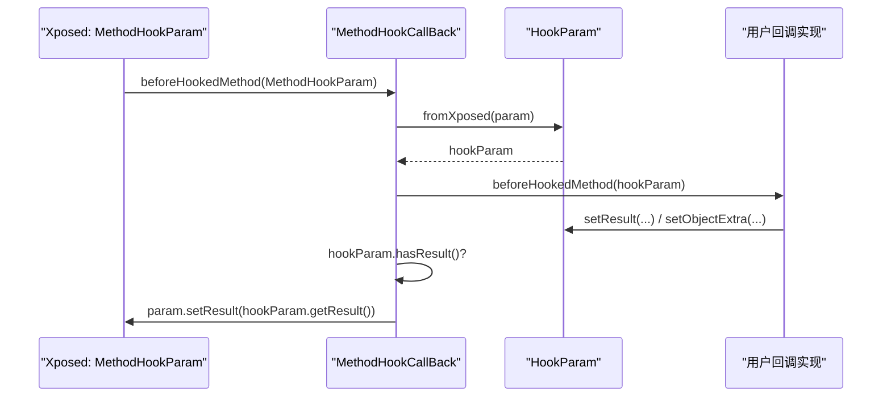

# 🎛️ HookParam

> 对 Xposed `MethodHookParam` 的项目内部封装，提供框架无关的方法 Hook 参数访问接口，并扩展了额外数据存储能力。

| 属性 | 值 |
|------|-----|
| 源码路径 | [HookParam.java](https://github.com/android-security-engineer/ZjDroid-skills/blob/master/src/com/android/reverse/hook/HookParam.java) |
| 类型 | 普通类（值对象） |
| 所在包 | `com.android.reverse.hook` |
| 关键依赖 | `XC_MethodHook.MethodHookParam`（仅在 `fromXposed` 中引用）、`java.lang.reflect.Member`、`java.lang.reflect.Method` |

## 🎯 职责

`HookParam` 是 Hook 回调函数中 **参数对象的内部表示**，封装了被 Hook 方法的所有上下文信息：

- 被 Hook 的方法本身（`method`）
- 被 Hook 方法的 `this` 引用（`thisObject`）
- 方法调用参数数组（`args`）
- 方法返回值（`mResult`）及其状态标志（`mHasResult`）
- 方法抛出的异常（`mThrowable`）及其状态标志（`mHasThrowable`）
- 额外键值存储（`mExtra`），用于在 before/after 两个回调阶段之间传递数据

## 🔍 关键字段与方法

| 名称 | 类型 | 说明 |
|------|------|------|
| `method` | `Member`（public） | 被 Hook 的方法或构造器 |
| `thisObject` | `Object`（public） | 被 Hook 方法的调用者对象（`static` 方法时为 `null`） |
| `args` | `Object[]`（public） | 方法调用的参数数组，可修改以改变实际参数 |
| `mResult` | `Object`（private） | 方法返回值（before 阶段设置可拦截调用） |
| `mHasResult` | `boolean`（private） | 标记是否已设置返回值 |
| `mThrowable` | `Throwable`（private） | 方法抛出的异常 |
| `mHasThrowable` | `boolean`（private） | 标记是否已设置异常 |
| `mExtra` | `Map<String, Object>`（private） | before/after 跨阶段数据存储 |
| `fromXposed(MethodHookParam)` | static 工厂 | 从 Xposed 参数对象构建 `HookParam` |
| `doesReturn(Class<?>)` | 实例方法 | 判断被 Hook 方法的返回值类型是否匹配 |
| `setResult(Object)` | 实例方法 | 设置返回值（若传入 Throwable 则转为异常） |
| `hasResult()` | 实例方法 | 是否已设置返回值 |
| `doesThrow(Class<?>)` | 实例方法 | 判断方法声明是否会抛出指定异常 |
| `setThrowable(Throwable)` | 实例方法 | 设置要抛出的异常 |
| `setObjectExtra(String, Object)` | 实例方法 | 在 Extra Map 中写入键值 |
| `getObjectExtra(String)` | 实例方法 | 从 Extra Map 读取键值 |

## 🧠 关键实现

### 工厂方法：从 Xposed 构建

```java
public static HookParam fromXposed(MethodHookParam param) {
    HookParam xparam = new HookParam();
    xparam.method      = param.method;
    xparam.thisObject  = param.thisObject;
    xparam.args        = param.args;
    xparam.mResult     = param.getResult();
    xparam.mThrowable  = param.getThrowable();
    return xparam;
}
```

::: info 构造函数私有
`private HookParam()` 强制所有外部代码通过 `fromXposed()` 创建实例，确保对象总是从合法的 Xposed 参数初始化，不存在"半构造"状态。
:::

### 返回值判断与设置

```java
public boolean doesReturn(Class<?> result) {
    if (this.method instanceof Method)
        return (((Method) this.method).getReturnType().equals(result));
    return false;
}

public void setResult(Object result) {
    if (result instanceof Throwable) {
        setThrowable((Throwable) result);  // 智能分流：Throwable 自动走异常通道
    } else {
        mResult = result;
        mHasResult = true;
    }
}
```

::: tip `setResult` 的智能分流设计
当调用者传入 `Throwable` 时，`setResult` 自动将其路由到 `setThrowable()`。这避免了调用者在"应该调用 `setResult` 还是 `setThrowable`"上产生困惑，同时保持了接口简洁。
:::

### 异常类型检查

```java
public boolean doesThrow(Class<?> ex) {
    if (this.method instanceof Method)
        for (Class<?> t : ((Method) this.method).getExceptionTypes())
            if (t.equals(ex))
                return true;
    return false;
}
```

通过反射读取方法的 `throws` 声明，用于在回调中动态判断是否可以安全抛出某种受检异常。

### 跨阶段数据传递

```java
public void setObjectExtra(String name, Object value) {
    if (mExtra == null)
        mExtra = new HashMap<String, Object>();  // 懒加载 Map
    mExtra.put(name, value);
}

public Object getObjectExtra(String name) {
    return (mExtra == null ? null : mExtra.get(name));
}
```

::: info 使用场景
`mExtra` 用于在 `beforeHookedMethod` 和 `afterHookedMethod` 之间传递中间状态。例如：

```java
@Override
public void beforeHookedMethod(HookParam param) {
    // 在 before 阶段记录调用开始时间
    param.setObjectExtra("startTime", System.currentTimeMillis());
}

@Override
public void afterHookedMethod(HookParam param) {
    // 在 after 阶段读取并计算耗时
    long start = (Long) param.getObjectExtra("startTime");
    Logger.log("耗时: " + (System.currentTimeMillis() - start) + "ms");
}
```
:::

## 🔗 调用关系



## 📌 小结

`HookParam` 是 hook 包的 **参数值对象**，承担了两个关键角色：一是将 Xposed 私有的 `MethodHookParam` 转换为无框架依赖的内部类型；二是通过 `mExtra` Map 为复杂 Hook 场景（需要在 before/after 两阶段共享状态）提供优雅的数据通道。其 `hasResult()`/`hasThrowable()` 的状态标志设计，避免了用 `null` 判断来区分"未设置"和"设置了 null 值"的歧义。
