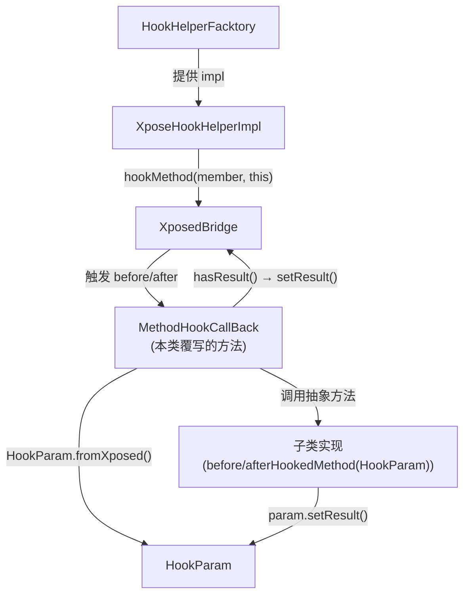

# 🪝 MethodHookCallBack

> 连接 Xposed 回调机制与项目内部 `HookParam` 体系的抽象适配器，将 `XC_MethodHook` 的 Xposed 风格 API 转换为框架无关的回调接口。

| 属性 | 值 |
|------|-----|
| 源码路径 | [MethodHookCallBack.java](https://github.com/android-security-engineer/ZjDroid-skills/blob/master/src/com/android/reverse/hook/MethodHookCallBack.java) |
| 类型 | 抽象类（extends `XC_MethodHook`） |
| 所在包 | `com.android.reverse.hook` |
| 关键依赖 | `XC_MethodHook`（Xposed API）、[HookParam](/source/hook/HookParam) |

## 🎯 职责

`MethodHookCallBack` 在整个 hook 封装层中扮演 **双重角色**：

1. **适配器（Adapter）**：继承 `XC_MethodHook` 使其可直接传给 `XposedBridge.hookMethod()`；同时在 `before/afterHookedMethod` 中将 Xposed 参数转换为 `HookParam`，并将结果反向写回
2. **模板方法（Template Method）**：定义了 `beforeHookedMethod(HookParam)` 和 `afterHookedMethod(HookParam)` 两个抽象方法，强制子类实现业务逻辑，框架胶水代码由本类统一处理

## 🔍 关键字段与方法

| 名称 | 类型 | 说明 |
|------|------|------|
| `beforeHookedMethod(MethodHookParam)` | 覆写（`protected`） | Xposed 在方法执行前调用，完成参数转换并委托给抽象方法 |
| `afterHookedMethod(MethodHookParam)` | 覆写（`protected`） | Xposed 在方法执行后调用，完成参数转换并委托给抽象方法 |
| `beforeHookedMethod(HookParam)` | **抽象方法**（`public`） | 子类实现：方法执行前的业务逻辑 |
| `afterHookedMethod(HookParam)` | **抽象方法**（`public`） | 子类实现：方法执行后的业务逻辑 |

## 🧠 关键实现

### before 阶段的完整流程

```java
@Override
protected void beforeHookedMethod(MethodHookParam param) throws Throwable {
    super.beforeHookedMethod(param);               // 调用 XC_MethodHook 父类逻辑
    HookParam hookParam = HookParam.fromXposed(param);  // ① 转换参数类型
    this.beforeHookedMethod(hookParam);            // ② 调用子类抽象方法
    if (hookParam.hasResult())                     // ③ 回写拦截结果
        param.setResult(hookParam.getResult());
}
```

### after 阶段的完整流程

```java
@Override
protected void afterHookedMethod(MethodHookParam param) throws Throwable {
    super.afterHookedMethod(param);
    HookParam hookParam = HookParam.fromXposed(param);
    this.afterHookedMethod(hookParam);
    if (hookParam.hasResult())
        param.setResult(hookParam.getResult());
}
```

::: tip 两段式设计的精妙之处
每个阶段的处理逻辑都是一致的三步：转换 → 调用子类 → 回写。这种对称设计让代码极易理解和维护。

关键在第 ③ 步：只有当子类在回调中显式调用 `hookParam.setResult(xxx)` 后，`hasResult()` 才返回 `true`，此时才将返回值写回 Xposed 的 `MethodHookParam`，从而实现对方法返回值的篡改。若子类不调用 `setResult()`，则原方法的返回值不受影响。
:::

### 类型继承关系与传递性

```
XC_MethodHook (Xposed API)
      ↑
MethodHookCallBack (本类，abstract)
      ↑
用户自定义 Hook 类（如 ActivityManagerHook.SomeHook）
```

因为 `MethodHookCallBack extends XC_MethodHook`，`XposeHookHelperImpl.hookMethod()` 可以将 `MethodHookCallBack` 直接传给 `XposedBridge.hookMethod(Member, XC_MethodHook)`，类型兼容由 Java 继承保证。

::: warning 注意：异常写回缺失
当前实现只回写了 `result`（`hasResult()` 分支），**没有回写 `throwable`**。若子类在 `HookParam` 上调用了 `setThrowable()`，该异常不会被写回给 Xposed，方法的异常行为不会被改变。

这是源码中的一个限制（原始代码如此），使用时需注意：`setResult` 和 `setThrowable` 的效果不对等，`setThrowable` 在当前实现中对 Xposed 层无效。
:::

### 子类实现示例

```java
// 以监控某个方法调用为例
class SomeMonitorHook extends MethodHookCallBack {
    @Override
    public void beforeHookedMethod(HookParam param) {
        // 读取调用参数
        String arg0 = (String) param.args[0];
        Logger.log("调用参数: " + arg0);
        // 如需拦截，直接返回伪造值：
        // param.setResult("fake_result");
    }

    @Override
    public void afterHookedMethod(HookParam param) {
        // 读取原始返回值
        Object result = param.getResult();
        Logger.log("返回值: " + result);
    }
}
```

## 🔗 调用关系



## 📌 小结

`MethodHookCallBack` 是 hook 包的 **核心胶水层**。它同时运用了两种经典设计模式：**适配器模式**（将 `XC_MethodHook` 的 Xposed API 适配为 `HookParam` API）和**模板方法模式**（定义 before/after 的处理骨架，将业务实现留给子类）。所有 apimonitor 包中的监控 Hook 类都应继承本类，而非直接继承 `XC_MethodHook`，从而保持与 Xposed 框架的解耦。
