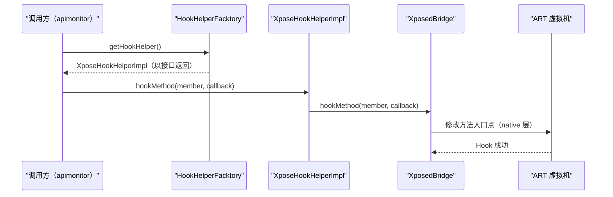

# ⚡ XposeHookHelperImpl

> `HookHelperInterface` 的 Xposed 实现，将接口调用直接委托给 `XposedBridge.hookMethod()`，是 ZjDroid 与 Xposed 框架的最后一道连接线。

| 属性 | 值 |
|------|-----|
| 源码路径 | [XposeHookHelperImpl.java](https://github.com/android-security-engineer/ZjDroid-skills/blob/master/src/com/android/reverse/hook/XposeHookHelperImpl.java) |
| 类型 | 普通类（implements `HookHelperInterface`） |
| 所在包 | `com.android.reverse.hook` |
| 关键依赖 | [HookHelperInterface](/source/hook/HookHelperInterface)、`XposedBridge`（Xposed API） |

## 🎯 职责

`XposeHookHelperImpl` 是整个 hook 抽象层中 **唯一直接依赖 Xposed 库** 的类。其职责极其单一：实现 `HookHelperInterface.hookMethod()` 接口，将调用透传给 `XposedBridge.hookMethod()`。

这种设计将 Xposed 框架的"污染范围"压缩到一个文件、一行代码，是依赖倒置原则（DIP）的典型应用。

## 🔍 关键字段与方法

| 名称 | 类型 | 说明 |
|------|------|------|
| `hookMethod(Member, MethodHookCallBack)` | 覆写方法 | 实现接口，直接调用 `XposedBridge.hookMethod()` |

## 🧠 关键实现

### 完整源码

```java
public class XposeHookHelperImpl implements HookHelperInterface {

    @Override
    public void hookMethod(Member method, MethodHookCallBack callback) {
        XposedBridge.hookMethod(method, callback);
    }
}
```

### 为什么 `MethodHookCallBack` 能直接传给 `XposedBridge.hookMethod()`？

```
XposedBridge.hookMethod(Member, XC_MethodHook)
                                ↑
                    MethodHookCallBack extends XC_MethodHook
                                ↑
                    所以 callback 是合法的 XC_MethodHook 子类
```

`MethodHookCallBack` 继承自 `XC_MethodHook`，因此可以直接作为第二个参数传入。类型上的兼容性由继承保证，接口层面看到的是项目自定义类型，实现层面则悄悄利用了继承关系完成适配。

::: tip 命名说明
类名 `XposeHookHelperImpl`（缺少 `d`）是原始代码的拼写，与 Xposed 官方名称（`Xposed`）不同。这是原作者的习惯用法，源码精讲照实记录。
:::

### 职责边界分析

| 职责 | 在此类？ | 实际承担者 |
|------|----------|-----------|
| 决定 Hook 哪个方法 | 否 | 调用方（如 apimonitor 各 Hook 类） |
| 提供回调逻辑 | 否 | `MethodHookCallBack` 子类 |
| 参数适配（内外类型转换） | 否 | `MethodHookCallBack` + `HookParam.fromXposed()` |
| 调用底层 Xposed API | **是** | 本类，且仅此一处 |

::: info 扩展点
若要替换 Xposed 为其他 Hook 框架（如 [Pine](https://github.com/canyie/pine) 或 [Epic](https://github.com/tiann/epic)），只需：
1. 新建一个 `PineHookHelperImpl implements HookHelperInterface`
2. 在 [HookHelperFacktory](/source/hook/HookHelperFacktory) 中将 `new XposeHookHelperImpl()` 替换为 `new PineHookHelperImpl()`

调用链其余部分无需任何修改。
:::

## 🔗 调用关系



## 📌 小结

`XposeHookHelperImpl` 是 hook 包中代码量最小、但位置最关键的类。它是 ZjDroid 与 Xposed 框架之间的 **唯一耦合点**，通过将这个耦合点收缩到单文件单方法，整个项目获得了极高的框架可替换性。阅读本类时应结合 [HookHelperInterface](/source/hook/HookHelperInterface) 理解接口契约，结合 [MethodHookCallBack](/source/hook/MethodHookCallBack) 理解参数如何跨越框架边界。
