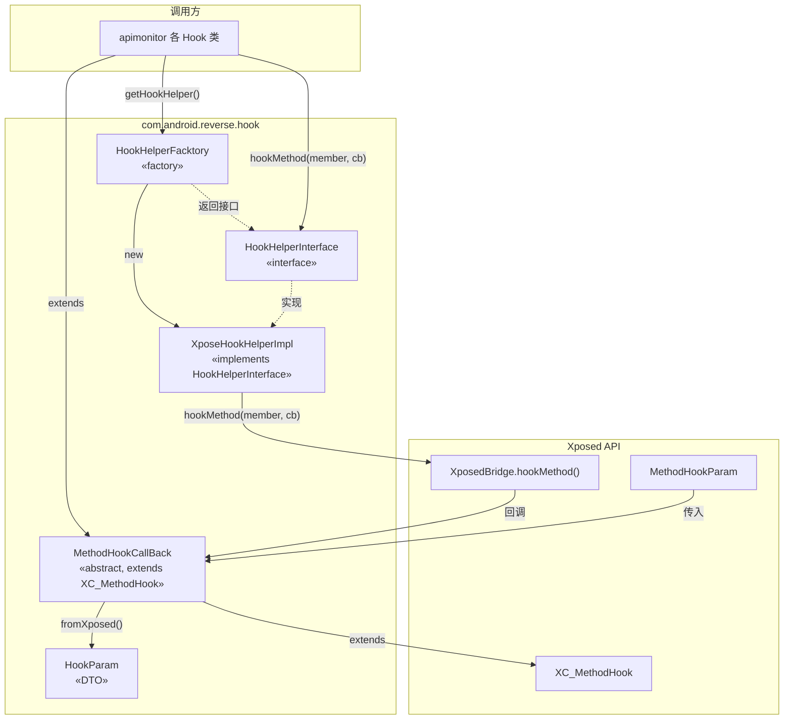
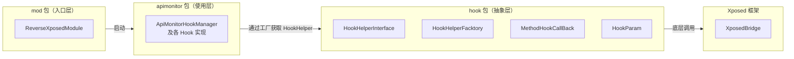

# 🪝 Hook 抽象层（hook 包）

`com.android.reverse.hook` 是 ZjDroid 的 **Hook 能力抽象层**，将 Xposed 框架的具体 API 封装在最小范围内，为上层业务（`apimonitor` 等）提供框架无关的 Hook 接口。

## 📋 包整体职责

| 职责 | 描述 |
|------|------|
| **接口定义** | 定义 `hookMethod(Member, MethodHookCallBack)` 统一契约 |
| **实现隔离** | 唯一 Xposed 依赖集中在 `XposeHookHelperImpl` 一个类 |
| **对象提供** | 工厂类 `HookHelperFacktory` 以懒加载单例方式提供实现 |
| **参数封装** | `HookParam` 封装回调参数，屏蔽 `MethodHookParam` 类型 |
| **回调适配** | `MethodHookCallBack` 桥接 Xposed 回调与内部 `HookParam` |

## 📁 类清单

| 类名 | 类型 | 一句话职责 |
|------|------|-----------|
| [HookHelperInterface](/source/hook/HookHelperInterface) | 接口 | Hook 能力的最小公共契约，定义 `hookMethod` |
| [HookHelperFacktory](/source/hook/HookHelperFacktory) | 工厂类 | 懒加载单例工厂，提供 `HookHelperInterface` 实例 |
| [XposeHookHelperImpl](/source/hook/XposeHookHelperImpl) | 实现类 | 唯一直接调用 `XposedBridge.hookMethod()` 的类 |
| [HookParam](/source/hook/HookParam) | DTO / 值对象 | Hook 回调参数的内部封装，含 result、throwable、extra |
| [MethodHookCallBack](/source/hook/MethodHookCallBack) | 抽象类 | 适配器 + 模板方法，桥接 Xposed 回调与 HookParam API |

## 🗺️ 包内关系图

## 🏛️ 在整个项目中的位置

::: tip 设计模式速览

本包综合运用了多种经典设计模式：

| 模式 | 体现在 |
|------|--------|
| **接口隔离（ISP）** | `HookHelperInterface` 只有一个方法 |
| **工厂模式** | `HookHelperFacktory.getHookHelper()` |
| **适配器模式** | `MethodHookCallBack` 适配 `XC_MethodHook` → `HookParam` |
| **模板方法模式** | `MethodHookCallBack` 定义骨架，子类实现业务 |
| **依赖倒置（DIP）** | 调用方依赖 `HookHelperInterface`，不依赖 `XposedBridge` |
:::

::: info 阅读建议
建议按接口 → 工厂 → 实现 → 参数 → 回调的顺序阅读：
1. [HookHelperInterface](/source/hook/HookHelperInterface) — 理解契约
2. [HookHelperFacktory](/source/hook/HookHelperFacktory) — 理解对象提供方式
3. [XposeHookHelperImpl](/source/hook/XposeHookHelperImpl) — 理解 Xposed 绑定
4. [HookParam](/source/hook/HookParam) — 理解参数模型
5. [MethodHookCallBack](/source/hook/MethodHookCallBack) — 理解回调适配
:::
