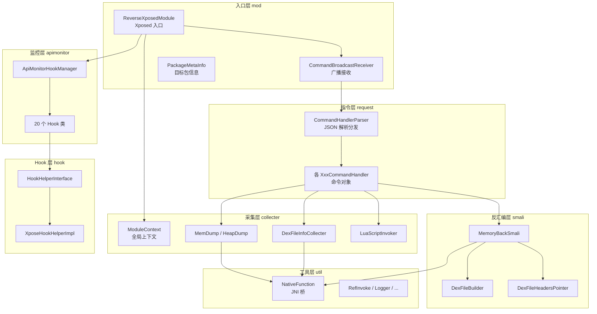

# 🧬 ZjDroid 源码精讲

本章对 ZjDroid **自身**的每一个 Java 类逐一精讲——共 **56 个类**，分布在 8 个子包中。每篇文档都基于真实源码，讲清该类的**职责、关键实现、调用关系**，让你只读文档就能建立对整个代码库的完整心智模型。

::: tip 读前须知
本章只覆盖 `com.android.reverse` 包（ZjDroid 自身代码）。内嵌的第三方工具链（baksmali / dexlib2 / smali / luajava）在 [内嵌工具链原理](/internals/) 单独讲解。
:::

## 📦 包结构全景

ZjDroid 的代码按"职责分层"组织，一条指令从进入到执行会依次穿过这些包：

## 🗂️ 子包速览

| 子包 | 类数 | 职责 | 精讲入口 |
|------|------|------|---------|
| **mod** | 3 | Xposed 模块入口、广播接收、目标包元信息 | [模块入口层](/source/mod/) |
| **request** | 10 | 指令解析与分发（命令模式） | [指令处理层](/source/request/) |
| **collecter** | 7 | 核心采集能力（DEX 信息、内存/堆 dump、Lua） | [采集器层](/source/collecter/) |
| **smali** | 3 | 内存 DEX 反汇编与重组（脱壳落地） | [反汇编重组层](/source/smali/) |
| **hook** | 5 | Hook 框架抽象（对 Xposed 的封装） | [Hook 框架层](/source/hook/) |
| **apimonitor** | 20 | 敏感 API 运行时监控 | [API 监控层](/source/apimonitor/) |
| **util** | 6 | JNI 桥、反射、日志、JSON 等工具 | [工具层](/source/util/) |
| **client** | 1 | 模块自身的占位 Activity | [客户端](/source/client/) |

## 🎯 三条主线

理解 ZjDroid，抓住三条贯穿代码的主线即可：

::: info 主线一：指令驱动
`adb 广播` → `CommandBroadcastReceiver` → `CommandHandlerParser` → 具体 `CommandHandler` → 采集器执行。
这是所有主动功能的统一入口，详见 [指令处理层](/source/request/)。
:::

::: info 主线二：脱壳落地
`DexFileInfoCollecter`（拿到内存 DEX 的 mCookie）→ `NativeFunction`（JNI 读内存）→ `MemoryBackSmali` + `DexFileBuilder`（反汇编重组）→ 落盘 `dexfile.dex`。
这是 ZjDroid 最核心的能力，详见 [反汇编重组层](/source/smali/)。
:::

::: info 主线三：被动监控
`ApiMonitorHookManager` 在模块加载时批量注册 20 个 Hook，运行时拦截敏感 API 调用并打日志。
无需指令，自动生效，详见 [API 监控层](/source/apimonitor/)。
:::

## 📖 如何使用本章

- **想通读**：按侧边栏顺序，从 `mod` 入口层往下读，跟着数据流走一遍。
- **想定位某功能**：先看 [功能原理](/features/dex-dump)，再点进对应类的源码精讲深挖细节。
- **想看全局关系**：先读 [架构与原理](/architecture/overview) 建立骨架，再回本章填充血肉。
