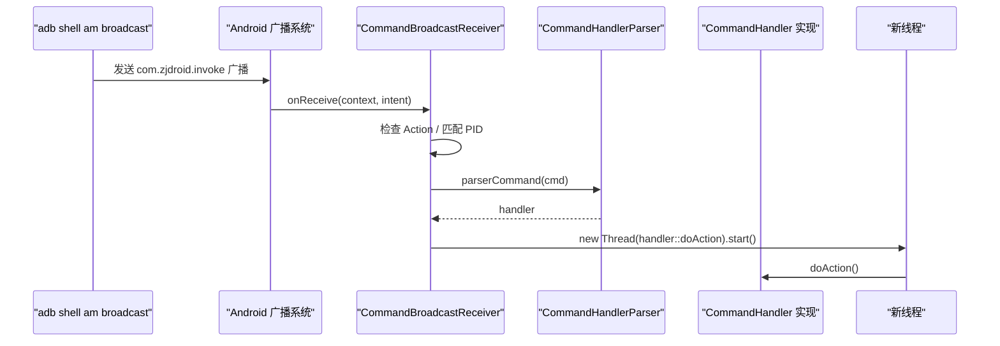

# 📡 CommandBroadcastReceiver

> 注入进目标进程的广播接收器，监听来自 adb 的 `com.zjdroid.invoke` 广播，按 PID 路由并在新线程异步执行命令。

| 属性 | 值 |
|------|-----|
| 源码路径 | [CommandBroadcastReceiver.java](https://github.com/android-security-engineer/ZjDroid-skills/blob/master/src/com/android/reverse/mod/CommandBroadcastReceiver.java) |
| 类型 | 普通类（extends `BroadcastReceiver`） |
| 所在包 | `com.android.reverse.mod` |
| 关键依赖 | `BroadcastReceiver`、`CommandHandlerParser`、`CommandHandler`、[Logger](/source/util/Logger) |

## 🎯 职责

`CommandBroadcastReceiver` 是 ZjDroid 的 **指令接收网关**。它被注册在目标 App 进程内，通过系统广播机制接收外部（如 adb shell）发送的控制指令，实现以下核心功能：

- **PID 鉴权**：只响应 `target` 字段与当前进程 PID 匹配的广播，避免误操作其他进程
- **命令解析委托**：将原始 JSON 字符串交给 `CommandHandlerParser` 解析
- **异步执行**：在独立线程中执行命令，避免阻塞广播主线程（ANR 风险）

## 🔍 关键字段与方法

| 名称 | 类型 | 说明 |
|------|------|------|
| `INTENT_ACTION` | `static String` | 监听的广播 Action：`com.zjdroid.invoke` |
| `TARGET_KEY` | `static String` | Intent Extra 键名：`"target"`，值为目标进程 PID（int） |
| `COMMAND_NAME_KEY` | `static String` | Intent Extra 键名：`"cmd"`，值为 JSON 命令字符串 |
| `onReceive(Context, Intent)` | 覆写方法 | 广播到来时的处理入口，包含 PID 匹配、解析、异步执行全流程 |

## 🧠 关键实现

### 完整的 onReceive 流程

```java
@Override
public void onReceive(final Context arg0, Intent arg1) {
    if (INTENT_ACTION.equals(arg1.getAction())) {
        try {
            // 1. 读取目标 PID
            int pid = arg1.getIntExtra(TARGET_KEY, 0);
            // 2. PID 鉴权：只处理发给自己的广播
            if (pid == android.os.Process.myPid()) {
                String cmd = arg1.getStringExtra(COMMAND_NAME_KEY);
                // 3. 委托解析器将 JSON 字符串转换为具体 CommandHandler
                final CommandHandler handler = CommandHandlerParser.parserCommand(cmd);
                if (handler != null) {
                    // 4. 新线程异步执行，防止阻塞广播分发
                    new Thread(new Runnable() {
                        @Override
                        public void run() {
                            handler.doAction();
                        }
                    }).start();
                } else {
                    Logger.log("the cmd is invalid");
                }
            }
        } catch (Exception e) {
            e.printStackTrace();
        }
    }
}
```

### 关键设计点分析

::: tip PID 路由的必要性
由于 ZjDroid 以 Xposed 方式注入**所有非系统进程**，设备上运行的每个 App 都包含一个 `CommandBroadcastReceiver` 实例。`adb shell am broadcast` 命令是全局广播，所有进程都能收到。因此必须用 PID 做精准路由，确保指令只在预期进程中生效。
:::

::: warning 异步执行的必要性
`BroadcastReceiver.onReceive()` 运行在主线程，且有 **10 秒**超时限制（超时触发 ANR）。逆向操作（如 DEX dump、内存扫描）耗时无法预估，必须通过 `new Thread` 卸载到后台执行。注意：此处直接 `new Thread` 是简单粗暴的方案，生产级别通常应使用线程池。
:::

### 外部触发方式（adb）

```bash
# 查找目标进程 PID
adb shell ps | grep com.target.app

# 发送指令（以 dumpDex 为例）
adb shell am broadcast \
  -a com.zjdroid.invoke \
  --ei target <PID> \
  --es cmd '{"action":"dumpDex"}'
```

::: info cmd 字段格式
`cmd` 是一个 JSON 字符串，其结构由 [CommandHandlerParser](/source/request/CommandHandlerParser) 定义并解析，最终映射到具体的 `CommandHandler` 实现类。
:::

## 🔗 调用关系



## 📌 小结

`CommandBroadcastReceiver` 是 ZjDroid 控制面板的 **最后一公里**。它以最小代价（广播接收器 + 新线程）实现了从外部指令到进程内部动作的完整通路：广播接收 → PID 过滤 → 命令解析 → 异步执行。这种设计将通信、路由、解析、执行四个关注点彻底分离，各层可独立演进。
