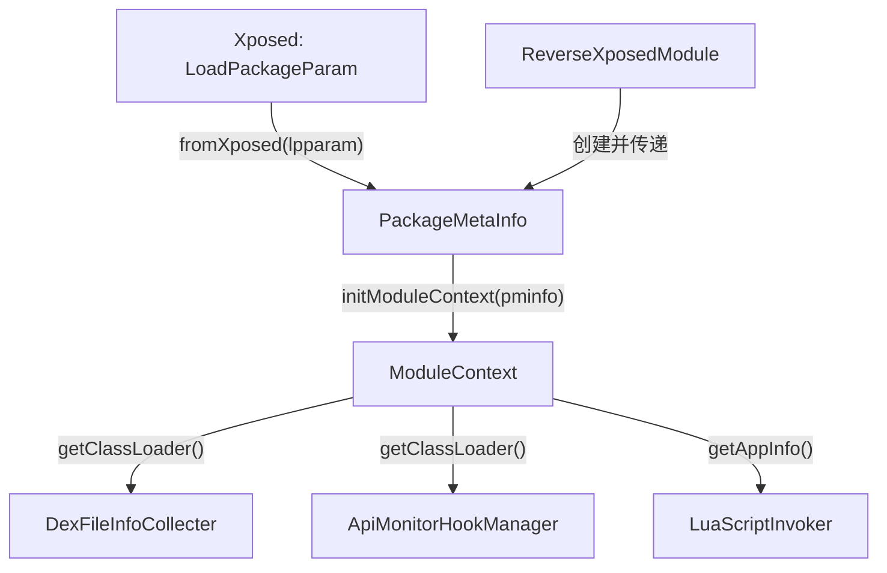

# 📦 PackageMetaInfo

> 将 Xposed 框架的 `LoadPackageParam` 转换为项目内部的目标包元信息 DTO，解耦框架依赖与业务逻辑。

| 属性 | 值 |
|------|-----|
| 源码路径 | [PackageMetaInfo.java](https://github.com/android-security-engineer/ZjDroid-skills/blob/master/src/com/android/reverse/mod/PackageMetaInfo.java) |
| 类型 | 普通类（数据传输对象 DTO） |
| 所在包 | `com.android.reverse.mod` |
| 关键依赖 | `LoadPackageParam`（Xposed API）、`ApplicationInfo`（Android API） |

## 🎯 职责

`PackageMetaInfo` 是一个纯粹的 **数据容器（DTO）**，封装了目标被 Hook 进程的所有关键元数据：

- 包名、进程名
- 目标进程的 `ClassLoader`（用于后续反射操作）
- `ApplicationInfo`（用于读取 App 的路径、标志等）
- 是否为主进程标志

通过静态工厂方法 `fromXposed()` 将 Xposed 框架类型一次性转换，后续整个系统只与 `PackageMetaInfo` 交互，**彻底隔离了对 Xposed API 的直接依赖**。

## 🔍 关键字段与方法

| 名称 | 类型 | 说明 |
|------|------|------|
| `packageName` | `String` | 目标 App 包名，如 `com.target.app` |
| `processName` | `String` | 目标进程名，多进程 App 可能与包名不同 |
| `classLoader` | `ClassLoader` | 目标 App 的类加载器，后续反射 Hook 的基础 |
| `appInfo` | `ApplicationInfo` | 目标 App 的应用信息（路径、UID、标志位等） |
| `isFirstApplication` | `boolean` | 是否为主进程 |
| `fromXposed(LoadPackageParam)` | `static` 工厂方法 | 从 Xposed 参数构建 `PackageMetaInfo` 的唯一入口 |
| `getPackageName()` | getter | 返回包名 |
| `getProcessName()` | getter | 返回进程名 |
| `getClassLoader()` | getter | 返回类加载器 |
| `getAppInfo()` | getter | 返回 ApplicationInfo |
| `isFirstApplication()` | getter | 返回是否主进程 |

## 🧠 关键实现

### 静态工厂方法

```java
public static PackageMetaInfo fromXposed(LoadPackageParam lpparam) {
    PackageMetaInfo pminfo = new PackageMetaInfo();
    pminfo.packageName       = lpparam.packageName;
    pminfo.processName       = lpparam.processName;
    pminfo.classLoader       = lpparam.classLoader;
    pminfo.appInfo           = lpparam.appInfo;
    pminfo.isFirstApplication = lpparam.isFirstApplication;
    return pminfo;
}
```

::: tip 为什么用静态工厂而不是构造函数？
1. **语义清晰**：`fromXposed()` 的命名明确表达了数据来源
2. **构造函数私有**（`private PackageMetaInfo()`）：强制调用者通过工厂，防止构造不完整的对象
3. **转换点集中**：Xposed API 到内部类型的转换只在此处发生一次，未来替换框架只需修改这一个方法
:::

### ClassLoader 的战略价值

```java
pminfo.classLoader = lpparam.classLoader;
```

这一行看似平淡，却是整个 Hook 框架的 **核心资产**。`lpparam.classLoader` 是目标 App 的 `PathClassLoader`，持有它意味着：

- 可以通过 `classLoader.loadClass("com.target.SomeClass")` 加载目标类
- 可以对目标类的方法进行反射操作
- `ApiMonitorHookManager`、`DexFileInfoCollecter` 等子系统均需通过此 ClassLoader 才能访问目标代码

::: warning 注意进程名与包名的差异
对于声明了 `android:process=":service"` 等多进程属性的 App，`processName` 会是 `com.target.app:service` 而非 `com.target.app`。在需要精确识别进程时应使用 `processName` 而非 `packageName`。
:::

## 🔗 调用关系



## 📌 小结

`PackageMetaInfo` 是一个极简的 **防腐层（Anti-Corruption Layer）** 数据对象。它将 Xposed 框架专有类型（`LoadPackageParam`）转换为框架无关的内部表示，使得项目核心逻辑可以在完全不引用 Xposed API 的情况下运行。尽管代码量很小，其架构价值却相当显著：它是 ZjDroid 业务层与 Xposed 框架之间唯一的数据桥梁。
